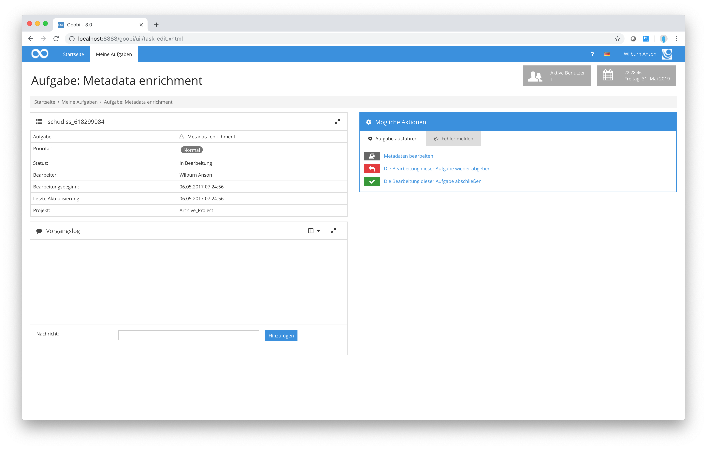

# Metadatenbearbeitung

Einer der Haupttätigkeitsbereiche für Nutzer mit bibliothekarischer Ausbildung im Bereich von Digitalisierungsprojekten besteht darin, dass die digitalisierten Objekte in ihrer umfassenden Tiefe erschlossen werden. Dies beinhaltet im Wesentlichen die Paginierung, die Strukturierung und die Metadatenerfassung. 

Mitarbeiter von Digitalisierungsprojekten, die in Benutzergruppen für eine solche Struktur- und Metadatenerfassung zuständig sind, erledigen ihre Aufgaben in Goobi in ähnlicher Weise wie die zuvor beschriebenen Benutzergruppen der Scanoperateure und der Qualitätskontrolle. 

Nach dem Einloggen klicken auch sie in der Menüleiste auf `Meine Aufgaben`. In der dort bereit gestellten Liste der Aufgaben wählen sie diejenige Aufgabe auf, die sie als nächstes bearbeiten möchten. Die Maske mit den Details zur ausgewählten Aufgabe unterscheidet sich nur unwesentlich von der Maske, die bei den Scanoperateuren oder den Personen der Qualitätskontrolle zuvor beschrieben wurde.  Auch hier erhält der Benutzer allgemeine Eigenschaften zur Aufgabe im linken Bereich und in dem Bereich darunter das `Vorgangslog` für allgemeine Anmerkungen zu dem aktuellen Vorgang.  
Innerhalb des Bereichs der `Möglichen Aktionen` steht hier allerdings eine zusätzliche Aktion zur Verfügung. Der Link `Metadaten bearbeiten` bietet dem Nutzer die Möglichkeit, in den Metadateneditor von Goobi zu gelangen. Die genaue Funktionsweise und Bedienung des Metadateneditors ist aufgrund seiner Komplexität innerhalb dieses Handbuchs in einem eigenen Kapitel beschrieben.

Die weiteren von Goobi angebotenen Aktionen entsprechen den gleichen, wie sie zuvor bei den Arbeitsschritten  und  beschrieben wurden. Der Link `Die Bearbeitung dieser Aufgabe abschließen` führt beim Abschließen eine Validierung der Struktur- und Metadaten durch. Ein vollständiger Abschluss der Aufgabe ist nur dann möglich, wenn gegen konfigurierte Regeln, die für die Struktur- und Metadaten festgelegt wurden, nicht verstoßen wird. 

Im Gegensatz zu den Scanoperateuren und den Mitarbeitern der Qualitätskontrolle arbeiten Benutzer im Bereich der Struktur- und Metadatenbearbeitung im Allgemeinen nicht direkt mit den Daten aus dem Dateisystem. Aus diesem Grund bietet Goobi an dieser Stelle keinen Zugriff auf die Digitalisate im Dateisystem innerhalb des Arbeitsverzeichnisses des Benutzers an. Auf Wunsch kann dies allerdings auch für Struktur- und Metadatenbearbeiter so konfiguriert werden, dass ein lesender Zugriff auf die Images zum Betrachten mit einem Programm für die Bildbetrachtung möglich ist. Beim Abschluss der Aufgabe würde in diesem Fall dann entsprechend das bereitgestellte Verzeichnis mit den Digitalisaten aus dem Arbeitsverzeichnis des Benutzers entfernt werden, um einen weiteren Zugriff auf die Digitalisate außerhalb des vorgesehenen Workflows zu verhindern.