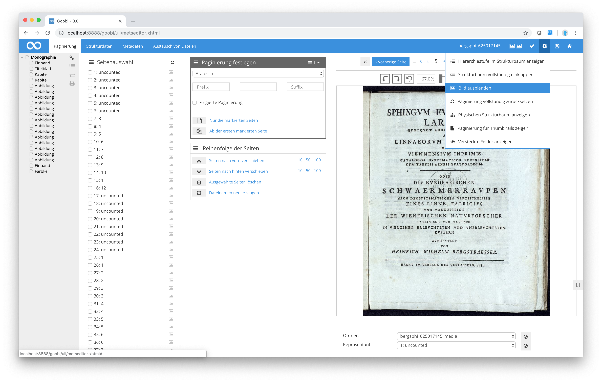
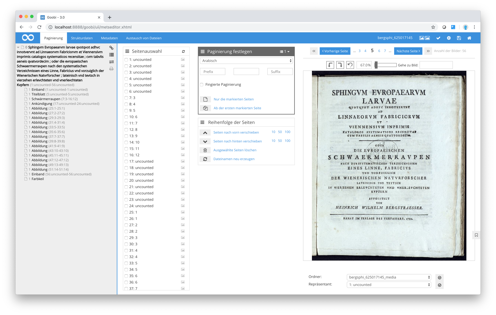

# Menüoptionen

In der oberen Menüleiste sowie im rechten Bereich des Strukturbaumes des Metadateneditors bietet Ihnen Goobi einige zahlreiche Funktionen zur Vereinfachung der Bearbeitung von Struktur- und Metadaten an.

## Funktionen innerhalb der oberen Menüleiste

Folgende Funktionen stehen Ihnen innerhalb der oberen Menüleiste zur Verfügung:

### Validierung

Die Option Validieren ermöglicht Ihnen, dass Sie auch während der Arbeit innerhalb des Metadateneditors jederzeit prüfen können, ob Sie gegen die durch Goobi bereitgestellten Reglementierungen für die Struktur- und Metadaten verstoßen. Diese Regeln werden von Ihrem Goobi-Administrator für einzelne Projekte individuell definiert. Vor dem Abschließen Ihres Arbeitsschrittes wird diese Validierung von Goobi ebenfalls erneut geprüft. Schlägt diese Validierung fehl, verwehrt Ihnen Goobi das Abschließen Ihres Arbeitsschrittes. Prüfen Sie daher während der Bearbeitung im Metadateneditor regelmäßig, ob Sie gegen keine der konfigurierten Regeln verstoßen. Für den Fall, dass Sie mit Ihren Struktur- und Metadaten noch keinen validen Zustand erreicht haben, weist Goobi Sie nach dem Klick auf Validieren mit aussagekräftigen Warnhinweisen auf diesen Zustand hin.

| Icon | Beschreibung |
| :--- | :--- |
|  | Validierung der Metadaten gegen den verwendeten Regelsatz |

### Bild fixieren

Diese Funktion ermöglicht, dass das dargestellte Bild auch bei langen Metadatenlisten oder während der Vergabe von Paginierungssequenzen nicht im Metadateneditor mitscrollt. Haben Sie diese Funktion aktiviert, so bleibt das ausgewählte Bild zusammen mit seiner Navigationsleiste und den Vergrößerungsoptionen im rechten Bereich fest stehen, auch wenn Sie im rechten Bereich des Metadateneditors scrollen.

| Icon | Beschreibung |
| :--- | :--- |
|  | Fixieren der Bildanzeige zur Vermeidung des Mitscrollens |

### Einstellungen

Hierbei handelt es sich um einen Menüpunkt mit mehreren Unterpunkten für weitergehende Einstellungen. Klicken Sie auf diesen Menüpunkt, um sich diese Funktionen anzeigen zu lassen.

| Icon | Beschreibung |
| :--- | :--- |
|  | Hinter diesem Menüpunkt verbirgt sich ein Menü mit weiteren Einstellungen |

### Speichern

Möchten Sie während der Bearbeitung der Metadaten pausieren oder Ihre Arbeiten sichern, klicken Sie einfach jederzeit auf diesen Menüpunkt, um Ihre Daten zu speichern.

| Icon | Beschreibung |
| :--- | :--- |
|  | Speichern der aktuellen Struktur- und Metadaten |

### METS-Editor verlassen

Möchten Sie den METS-Editor verlassen, klicken Sie einfach auf diesen Menüpunkt. Ihnen stehen anschließend zwei Optionen zur Verfügung.

Die Option Zurück verlässt den Metadateneditor ohne Ihre Bearbeitungen zu speichern. Beachten Sie daher stets vor dem Verlassen des Metadateneditors Ihre Daten zu speichern. Die Option Zurück gewährleistet Ihnen im Falle von unbeabsichtigten Löschungen oder anderen Veränderungen ein Verlassen des Metadateneditors ohne zuvor speichern zu müssen.

Die Option Speichern und Zurück speichert alle Ihre Bearbeitungen und schließt den Metadateneditor. Je nachdem wie Sie den Metadateneditor zuvor betreten haben, gelangen Sie an diese Stelle wieder zurück. Sind Sie aus dem Bereich Meine Aufgaben in den Metadateneditor gelangt, so befinden Sie sich anschließend wieder im Bereich Meine Aufgaben.

Haben Sie den Metadateneditor aus dem Bereich Vorgänge betreten, so gelangen Sie automatisch wieder an die gleiche Stelle im Bereich Vorgänge zurück.

| Icon | Beschreibung |
| :--- | :--- |
|  | Verlassen des METS-Editors mit oder ohne vorheriges Speichern |

## Weitere Einstellungen

Wenn Sie im oberen Menü den Menüpunkt Einstellungen gewählt haben, erhalten Sie Zugriff auf zahlreiche weitere Funktionen.

### Hierarchiestufe im Strukturbaum anzeigen

Klicken Sie auf diese Funktion, um im linken Strukturbaum eine Information über die Hierarchieebene eines jeden Strukturelements anzuzeigen. Diese Funktion ist insbesondere dann praktisch, wenn die Strukturbäume über eine sehr tiefe Hierarchie verfügen. Mit Hilfe der dargestellten Hierarchiestufe ist leichter ersichtlich, auf welcher Strukturebene Sie sich gerade befinden.

| Icon | Beschreibung |
| :--- | :--- |
|  | Hierachiestufe im Strukturbaum anzeigen |

### Strukturbaum vollständig ein-/ausklappen

Mit dieser Option können Sie innerhalb des Strukturbaums im linken Bereich des Metadateneditors jeweils zwischen der vollständig ausgeklappten und der vollständig eingeklappten Variante wechseln. Dies erlaubt Ihnen auch sehr umfangreiche Strukturbäume mit einem einfachen Klick vollständig auszuklappen ohne jeden einzelnen Unterknoten innerhalb des Strukturbaums einzeln anklicken zu müssen.

| Icon | Beschreibung |
| :--- | :--- |
|  | Strukturbaum vollständig ein-/ausklappen |

### Bild ausblenden / Bild anzeigen

Die Option Bild ausblenden ermöglicht Ihnen jederzeit die Anzeige des Bildes zu unterbinden. Mit der Funktion Bild anzeigen wird das Bild erneut eingeblendet.

| Icon | Beschreibung |
| :--- | :--- |
|  | Bild ausblenden / Bild anzeigen |

### Paginierung vollständig zurücksetzen

Möchten Sie mit der Paginierung noch einmal ganz von vorn beginnen, so bietet sich dazu an dieser Stelle die Möglichkeit. Klicken Sie auf diese Funktion, um sämtliche Angaben zur Paginierung zurückzusetzen und mit der Erschliessung der Paginierungssequenzen neu zu beginnen.

| Icon | Beschreibung |
| :--- | :--- |
|  | Paginierung vollständig zurücksetzen |

### Physischen Strukturbaum anzeigen / Logischen Strukturbaum anzeigen

Mittels dieser Funktion haben Sie die Möglichkeit, statt des logischen Strukturbaums ebenso den physischen Strukturbaum zu bearbeiten. Auf diese Weise ist es Ihnen z.B. möglich, Metadaten für einzelne Seiten zu erfassen oder auch Metadaten zu bearbeiten, die im Bereich der physischen Metadaten gespeichert werden.

| Icon | Beschreibung |
| :--- | :--- |
|  | Physischen Strukturbaum anzeigen / Logischen Strukturbaum anzeigen |

## Funktionen innerhalb des Menüs im rechten Bereich des Strukturbaums

Weitere Funktionen für die geänderte Anzeige des Strukturbaumes werden Ihnen im Bereich des Strukturbaums angeboten.

### Verlinkung des Bildes mit dem gewählten Strukturelement

Hier verfügen Sie über die Möglichkeit, den Strukturbaum auf der linken Seite des Metadateneditors mit der Bildanzeige zu verknüpfen. Ist diese Funktion aktiviert, wechselt die Bildanzeige jeweils auf die Startseite des in dem Strukturbaum gewählten Strukturelements.

| Icon | Beschreibung |
| :--- | :--- |
|  | Verknüpfung des ausgewählten Strukturelements mit der Bildanzeige |

### Haupttitel im Strukturbaum einblenden

Mit dieser Funktion ermöglichen Sie, dass im Strukturbaum die Titel, die für einzelne Strukturelemente vergeben wurden, direkt innerhalb des Strukturbaums angezeigt werden. Dies erlaubt unter Umständen eine bessere Übersicht, um z.B. Kapitel anhand ihrer Titel einfacher im Strukturbaum wiederzufinden.

| Icon | Beschreibung |
| :--- | :--- |
|  | Haupttitel im Strukturbaum einblenden |

### Seitenzuweisungen im Strukturbaum anzeigen

Mit Hilfe dieser Funktion wird Ihnen im Strukturbaum aufgelistet, welche Seitenbereiche den jeweiligen Strukturelementen zugewiesen wurden. Hinter jedem Strukturelement wird dadurch in Klammern jeweils die Start- und die Endseite aufgeführt. Die Anzeige der Seiten enthält dabei die Bildnummer sowie das Pagelabel.

| Icon | Beschreibung |
| :--- | :--- |
|  | Seitenzuweisungen im Strukturbaum anzeigen |

### Diese Seite ausdrucken

Möchten Sie den Strukturbaum ausdrucken, klicken Sie einfach auf diese Funktion.

| Icon | Beschreibung |
| :--- | :--- |
|  | Ausdrucken des Hierarchiebaums der Strukturelemente |

