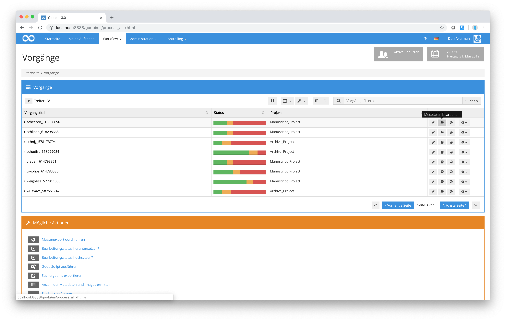
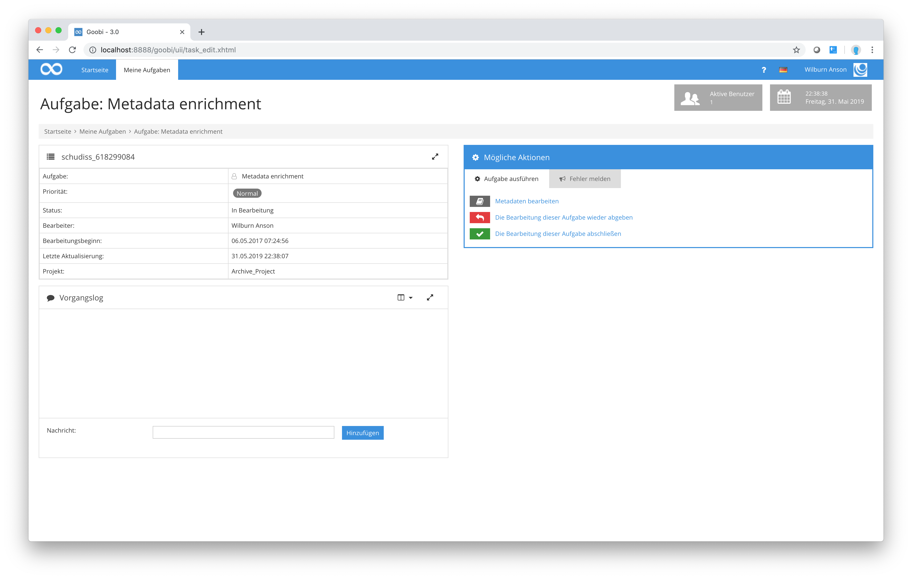

# Metadateneditor

Der Metadateneditor von Goobi ist eine der zentralen Komponenten, die im Kontext von Digitalisierungsprojekten Verwendung findet. Die Arbeiten innerhalb des Metadateneditors erfolgen dabei in den meisten Fällen durch ausgebildete Bibliothekare. In diesen Metadateneditor gelangt man auf zwei unterschiedliche Wege. Für Administratoren oder Benutzer innerhalb von Goobi, die mit der Projektleitung betraut sind, besteht die Möglichkeit, aus der Anzeige der Vorgänge zu jedem einzelnen Vorgang unabhängig vom derzeitigen Workflowstatus jederzeit in die Maske zur Bearbeitung der Struktur- und Metadaten zu gelangen.

Für Benutzer, die solche erweiterten Rechte in Goobi nicht besitzen, besteht die Möglichkeit, über den Bereich Meine Aufgaben nur zu denjenigen Arbeitsschritten in den Metadateneditor zu gelangen, für die sie als zuständiger Mitarbeiter eingetragen sind.

