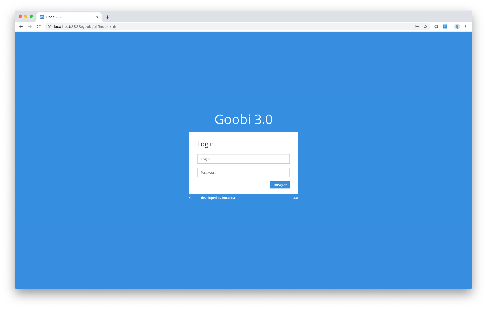
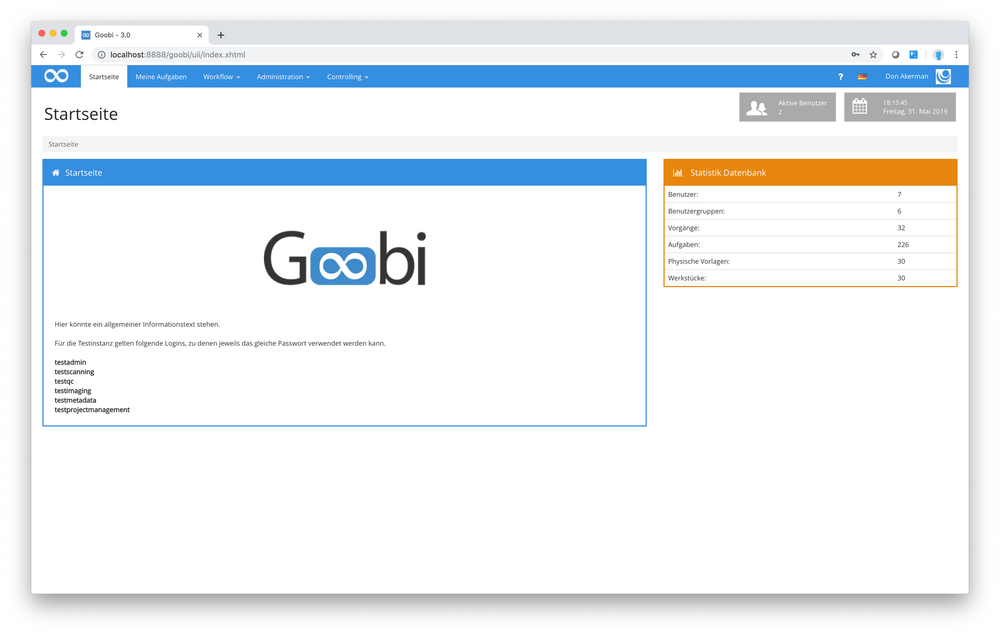

# Login

Um sich ich Goobi einzuloggen, müssen sie zunächst Login und Passwort angeben. Anschließend gelangen Sie zum Dashboard.

## Login-Bildschirm
Geben Sie hier Login und Passwort ein:

## Dashboard
Anschließend gelangen Sie zum Dashboard:

