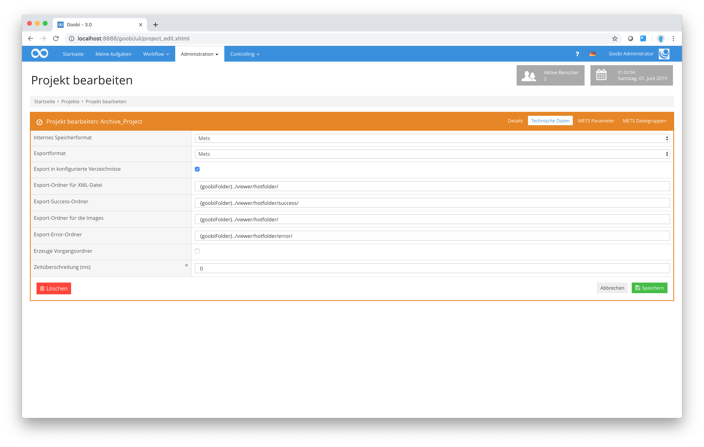

# Technische Daten

Die folgende Abbildung zeigt den Reiter `Technische Daten` aus den Goobi- Projekteinstellungen:

Die abgebildeten Konfigurationseinstellungen bedeuten folgendes:

## Auflistung der Parameter innerhalb der Projektkonfiguration zur Generierung von METS-Dateien

| Name**                      |  **Beispielwert**                   |  **Bedeutung**                                                                                                                                                                                                                                                                                                                                                                                                                                                   |
| ----------------------------- | ----------------------------------- | ---------------------------------------------------------------------------------------------------------------------------------------------------------------------------------------------------------------------------------------------------------------------------------------------------------------------------------------------------------------------------------------------------------------------------------------------------------------- |
| `DMS-Export-Images-Ordner`    | /opt/digiverso/viewer/hotfolder/    | Gibt den Ordner an, in den bei dem Export die Bilder geschrieben werden sollen.                                                                                                                                                                                                                                                                                                                                                                                  |
| `DMS-Export-Success-Ordner`   | /opt/digiverso/viewer/success/      | Definiert einen Ordner, in dem Goobi nach einer Erfolgsmeldung über das erfolgreiche Bearbeiten der exportierten XML-Datei suchen soll. Dieser Wert wird nur ausgewertet, wenn in der Konfigurationsdatei goobi_config.properties der Wert exportWithoutTimeLimit auf false gesetzt ist. Goobi kann an dieser Stelle mit nachgelagerten Systemen kommunizieren und so zum Beispiel herausfinden, ob ein Werk erfolgreich exportiert wurde.                      |
| `DMS-Export-Error-Ordner`     | /opt/digiverso/viewer/error_mets/  | Definiert einen Ordner, in dem Goobi nach einer Fehlermeldung suchen soll, wenn beim Bearbeiten der exportierten XML-Datei ein Fehler aufgetreten ist. Dieser Wert wird nur ausgewertet, wenn in der Konfigurationsdatei goobi_config.properties der Wert exportWithoutTimeLimit auf false gesetzt ist.                                                                                                                                                         |
| `Erzeuge Vorgangsordner`      | nein                                | Wenn diese Checkbox aktiviert ist, dann wird beim Export in den beiden Ordnern die unter DMS-Export-Ordner für XML-Datei und DMS-Export-Ordner für Images definiert wurden, ein Ordner angelegt, der den Goobi Vorgangstitel trägt. Die exportierten Dateien werden anschließend in diesen erzeugten Ordner gelegt. Ist diese Option nicht gesetzt, landen die Daten direkt in den definierten Ordnern. Der Standardwert für diese Checkbox ist: nicht aktiviert |
| `Zeitüberschreitung (ms)`     | 36000                               | Dieser Wert definiert das Zeitintervall in Millisekunden, bis Goobi die exportierten Dateien wieder aus dem Hotfolder entfernt. Dieser Wert wird nur ausgewertet, wenn in der Konfigurationsdatei goobi_config.properties der Wert exportWithoutTimeLimit auf false gesetzt ist. Der Standardwert ist 300000 (entspricht 5 Minuten).                                                                                                                            |