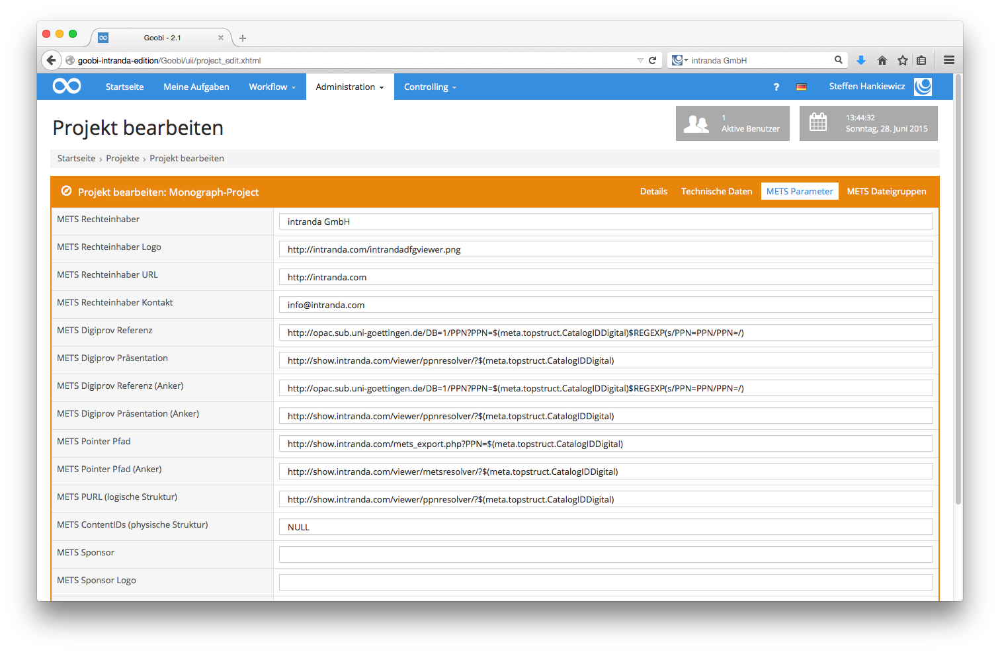
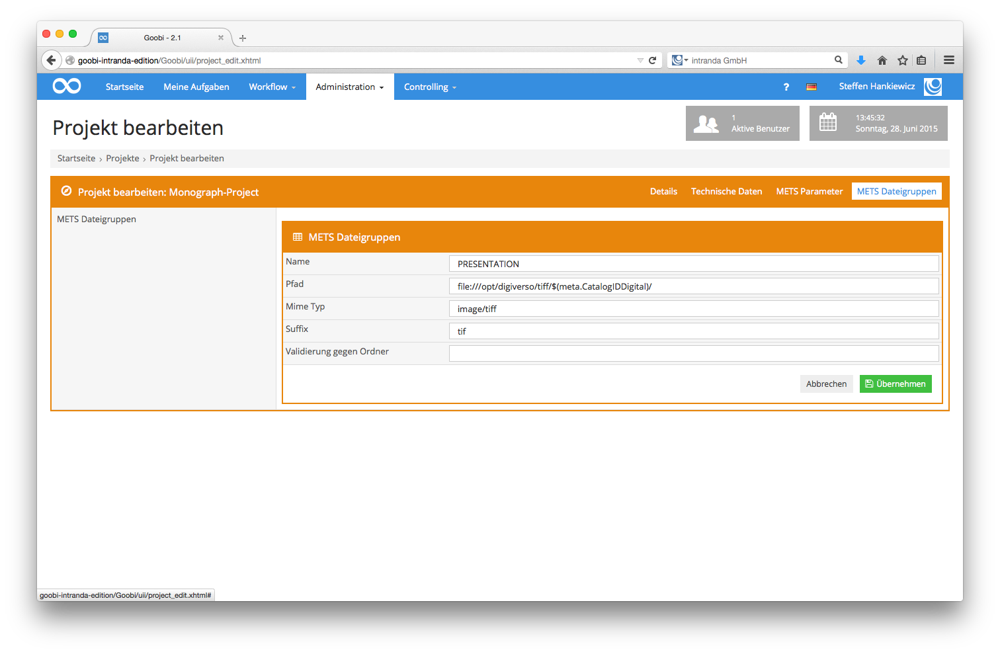

# Automatische Workflowschritte

Goobi bietet die Möglichkeit Workflowschritte als automatisch zu kennzeichnen. Diese Schritte werden automatisch geöffnet und ausgeführt, wenn der jeweils vorherige Schritt innerhalb des Workflows erfolgreich abgeschlossen wurde. Sobald im automatischen Workflowschritt ein Fehler auftritt, bleibt dieser Arbeitsschritt stehen und wird nicht weiter bearbeitet.

Um einen Workflowschritt als automatisch zu kennzeichnen, muss die Checkbox `Automatische Aufgabe` aktiviert sein. Diese befindet sich in den Aufgabendetails für eine Aufgabe, wie in der nachfolgenden Abbildung ersichtlich:

