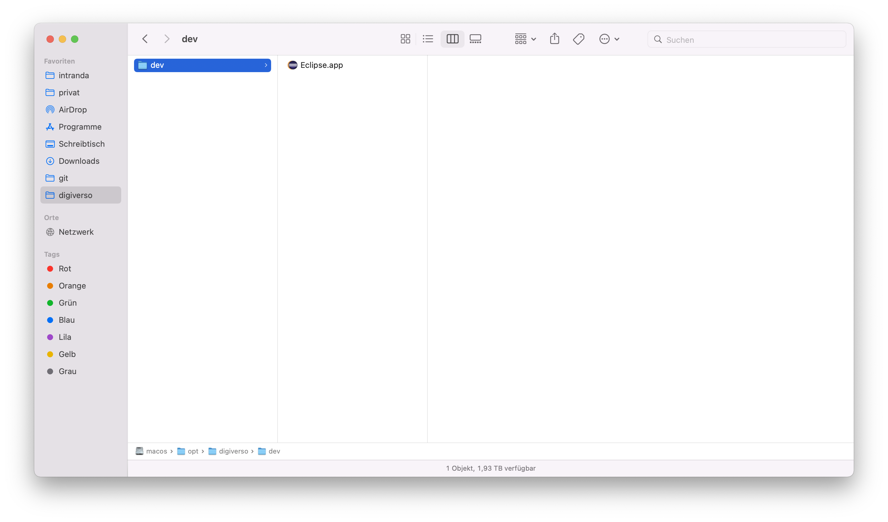
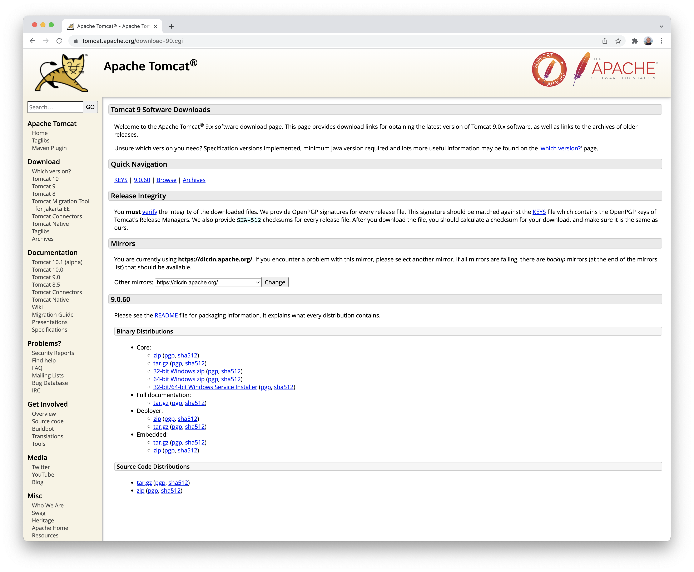

# Vorbereitende Arbeiten

## 1.1.1 Installation von Java 11
Eine Voraussetzung für die Entwicklung von Goobi workflow und auch für die Entwicklungsumgebung ist ein erfolgreich installiertes Java 11. Dieses kann je nach Betriebssystem unterschiedlich installiert werden.

### Installation unter Linux:
Die Installation unter Ubuntu Linux erfolgt per Kommandozeile wie folgt:

```bash
sudo apt install openjdk-11-jdk
```

### Installation unter Mac:
Die Installation unter Mac erfolgt am besten unter Nutzung von [Homebrew](https://brew.sh/index_de) aus dem Terminal:

```bash
brew tap adoptopenjdk/openjdk
brew install --cask adoptopenjdk11
```

### Installation unter Windows:
Für die Installation unter Windows kann man von hier geeignete Installer herunterladen: https://adoptopenjdk.net/releases.html


### Prüfen der Installation
Nach der erfolreichen Installation sollte auf dem Terminal mit dem Befehl `java -version` eine Ausgabe wie die folgende erscheinen:

```bash
$ java -version
openjdk version "11.0.11" 2021-04-20
OpenJDK Runtime Environment AdoptOpenJDK-11.0.11+9 (build 11.0.11+9)
OpenJDK 64-Bit Server VM AdoptOpenJDK-11.0.11+9 (build 11.0.11+9, mixed mode)
```

## 1.1.2. Installation von MariaDB
Für die Verwaltung der Daten verwendet Goobi workflow MariaDB. Dieses muss auf dem System entsprechend installiert werden.


### Installation unter Linux:
Die Installation unter Ubuntu Linux erfolgt per Kommandozeile wie folgt:

```bash
sudo apt install mariadb-server
```

Der Start und Stop der Datenbank kann so erfolgen:

```bash
## starten
systemctl start mariadb

## stoppen
systemctl stop mariadb
```


### Installation unter Mac:
Die Installation unter Mac erfolgt am besten unter Nutzung von [Homebrew](https://brew.sh/index_de) aus dem Terminal:

```bash
brew install mariadb
```

Der Start und Stop der Datenbank kann so erfolgen:

```bash
## starten
brew services start mariadb

## stoppen
brew services stop mariadb
```

### Installation unter Windows:
Die Installation unter Windows erfolgt analog.


### Erzeugen einer leeren Datenbank für Goobi workflow
Damit Goobi worklow über Daten verfügen kann, muss eine Datenbank angelegt werden. Dies kann mit den folgenden Kommandos erfolgen:

```bash
sudo mysql -e "CREATE DATABASE goobi;
USE goobi;
CREATE USER 'goobi'@'localhost' IDENTIFIED BY 'goobi';
GRANT ALL PRIVILEGES ON goobi.* TO 'goobi'@'localhost' WITH GRANT OPTION;
FLUSH PRIVILEGES;"
```

## 1.1.3 Vorbereitung eines Verzeichnisses
Wir arbeiten üblicherweise in dem Verzeichnis `/opt/digiverso/` für die Entwicklung von Goobi und auch für den Betrieb auf den Servern. Daher müssen die benötigten Ordner zunächst erzeugt werden, wenn sie nicht bereits existieren. Dies erfolgt unter Linux und Mac wie folgt:

```bash
sudo mkdir -p /opt/digiverso/dev/
sudo chown -R $(logname): /opt/digiverso
```


## 1.1.4 Download von Eclipse
Eclipse muss als Entwicklungsumgebung heruntergeladen und installiert werden. Dies erfolgt von dieser Webseite: [https://www.eclipse.org/downloads/packages/](https://www.eclipse.org/downloads/packages/)


Von dort wählt man das jeweils aktuelle Paket der `Eclipse IDE for Enterprise Java and Web Developers` für das eigene Betriebssystem und lädt es herunter. Anschließend kann dieses entspackt und in dem zuvor erzeugten Verzeichnis `/opt/digiverso/dev` gespeichert werden.

Das Verzeichnis sieht entsprechend so aus:




## 1.1.5 Download von Apache Tomcat
Für den Betrieb von Goobi workflow nutzen wir den Apache Tomcat in Version 9.x. Dieser kann von folgener Seite einfach als zip-Datei heruntergeladen werden, indem man aus dem Bereich `Core` der `Binary Distributions` der aktuellen Fassung die zip-Datei herunterlädt: [https://tomcat.apache.org/download-90.cgi](https://tomcat.apache.org/download-90.cgi)



Diese heruntergeladene zip-Datei kann anschließend entpackt und zusätzlich in das gleiche Verzeichnis wie Eclipse gespeichert werden:

```bash
/opt/digiverso/dev
```

Entsprechend sieht das Verzeichnis nun so aus:


## 1.1.6 Download von Demodaten
Um den Betrieb von Goobi workflow beginnen zu können, werden Konfigurationen, Daten, ein Datenbankdump sowie die benötigten Plugins in den richtigen Verzeichnissen benötigt. Ein vollständiger Datenbankdump findet sich auf GitHub. Der einfachste Weg ist es, wenn die dort bereitgestellten Skriptaufrufe kopiert und lokal ausgeführt werden:

[https://github.com/intranda/goobi-workflow-dev-data](https://github.com/intranda/goobi-workflow-dev-data)

Nach der Ausführung der Skripte sollte das Verzeichnis nun so aussehen:


Der folgende Befehl sollte dann die eingespielten Datenbanktabellen auflisten:

```bash
mysql -u goobi -pgoobi goobi -e "show tables"
```