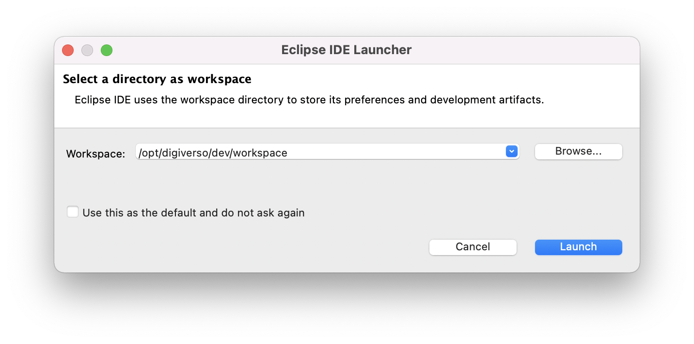
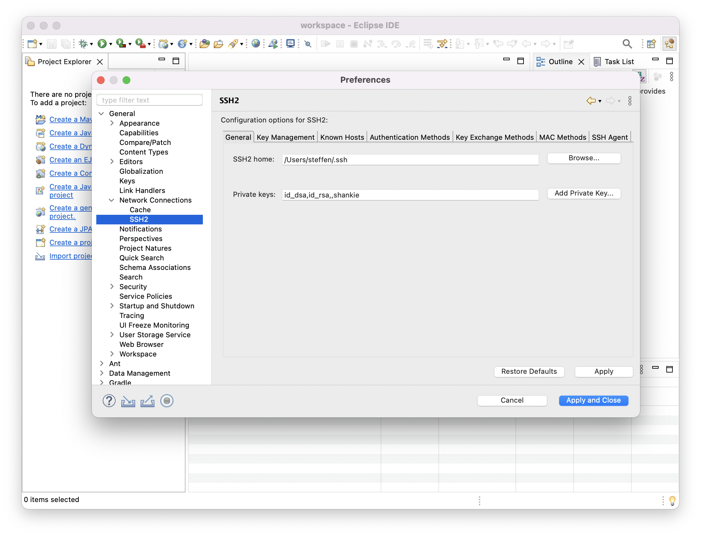
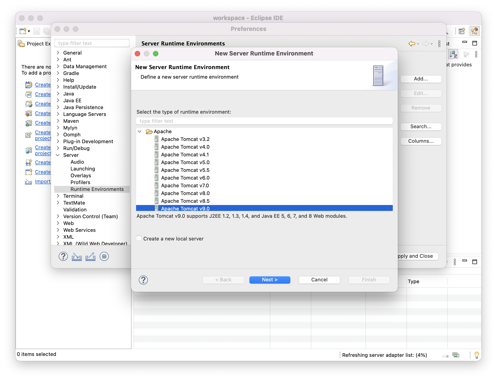
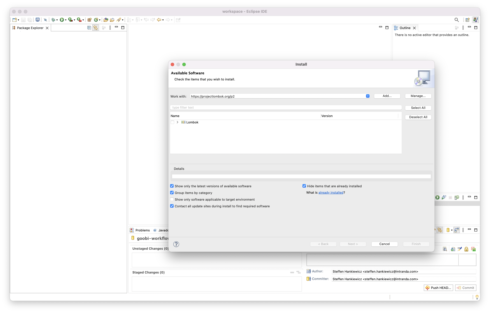
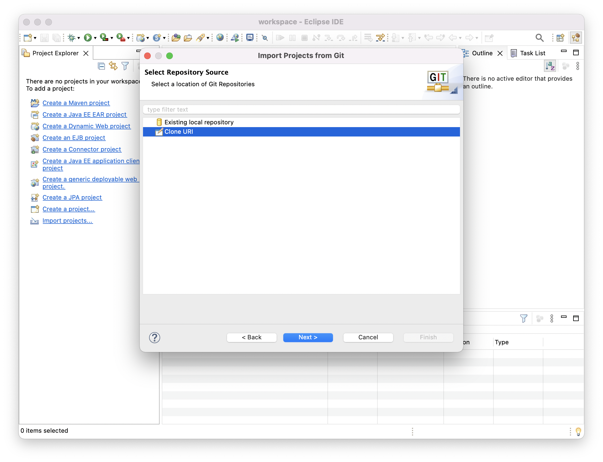
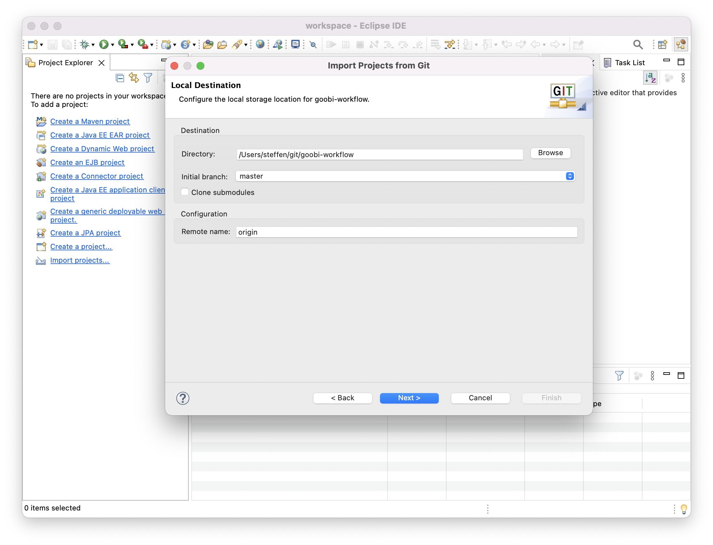
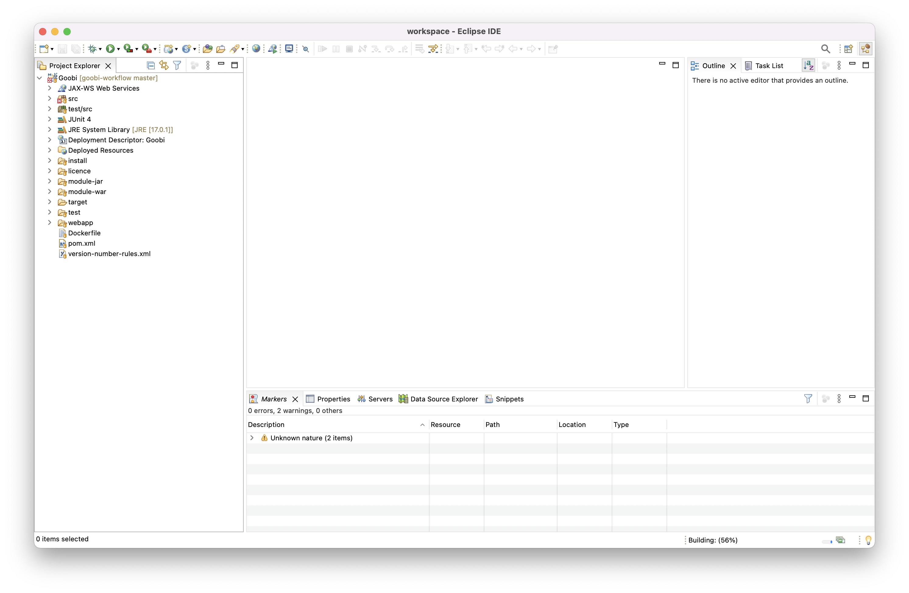
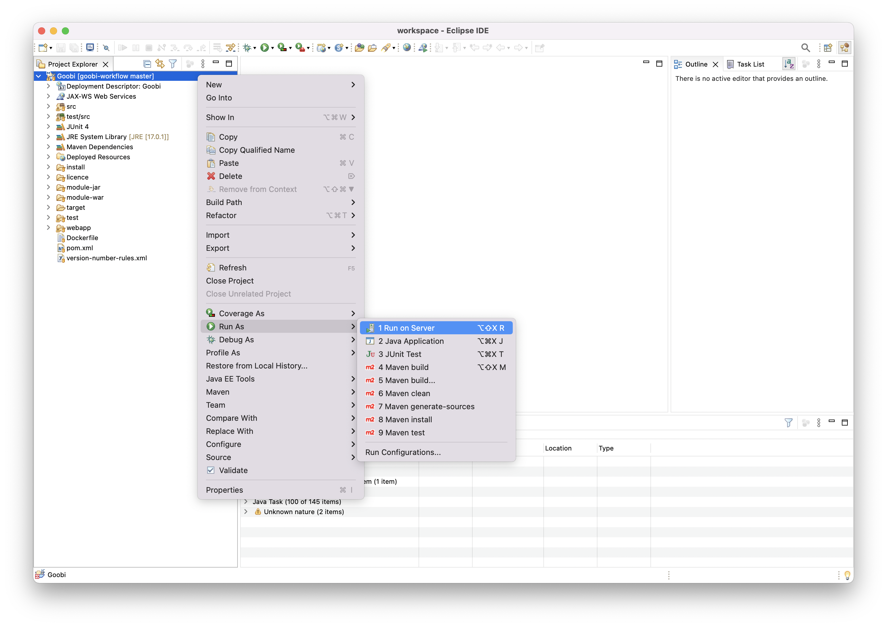
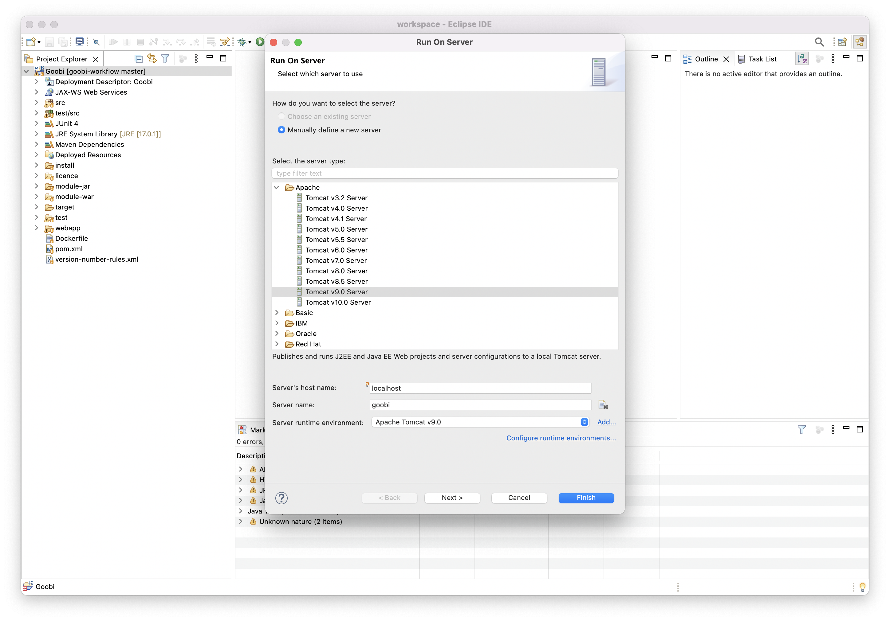
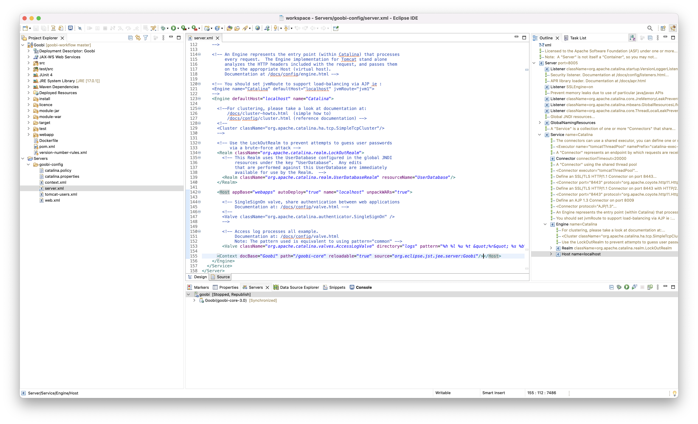

# Einrichtung von Eclipse

## 1.2.1 Start von Eclipse
Nach dem Herunterladen der benötigten Komponenten kann der Start von Eclipse erfolgen. Die ist je nach Betriebssystem üblicherweise per Doppelklick möglich. Bei der Frage nach dem Speicherort des Workspaces kann hier nun z.B. der folgende Pfad angegeben werden:

```bash
/opt/digiverso/dev/workspace/
```



Damit sieht das Installationsverzeichnis nun so aus:


## 1.2.2 Einrichtung von Eclipse

### SSH Key
Innerhalb von Eclipse sollte der eigene SSH-Key konfiguriert werden, um sich darüber mit den Git-Repositories zu authentifizieren. Dies erfolgt innerhalb der Eclipse Einstellungen in dem Dialogbereich `General` - `Network Connections` - `SSH2`. Dort kann ein privater SSH-Key hinzugefügt werden:




### Git-Eigenschaften
Ausserdem sollten für die Nutzung von Git die folgenden beiden Eigenschaften `email` und `user` korrekt konfiguriert sein. Dies kann innerhalb der Eclipse Einstellungen in dem Bereich `Version Control (Team)` - `Git` - `Configuration` erfolgen. Dort sollte die beiden Parameter `user.name` und `user.email` gesetzt werden.


### Tomcat Server einrichten
Innerhalb der Eigenschaften von Eclipse kann der bereits entpackte Apache Tomcat eingerichtet werden unter `Server` - `Runtime Environments`. Dort wird der installierte Tomcat ausgewählt.



Zu beachten ist, dass auch das richtige JRE ausgewählt wird:


## 1.2.3. Installation von Lombok für Eclipse
Wir verwenden innerhalb von Goobi workflow die Programmbibliothek `Lombok`. Diese muss zu Eclipse zusätzlich installiert werden. Hierfür gibt es zwei mögliche Wege:

### Installation aus Eclipse
Die Installation aus Eclipse heraus ist am einfachsten. Hierfür muss zunächst über das Menü `Help` - `Install New Software` der folgende Dialog geöffnet werden:



Hier muss nun bei dem Eingabefeld `Work with` die Installations-URL angegeben werden, von der das Plugin bezogen werden soll. Dafür wird die folgende URL verwendet:

```text
https://projectlombok.org/p2
```

Anschließend muss nur noch im unteren Bereich des Dialogfensters das Plugin `Lombok` ausgewählt werden. Auf den folgenden Seiten des Dialogs folgt noch einmal eine Sicherheitsabfrage bezüglich des Zertifikats, die bestätigt werden muss. Nach einem Neustart von Eclipse ist danach die Installation abgeschlossen.


### Manuelle Installation
Für die manuelle Installation muss Lobok zunächst von dieser URL heruntergeladen werden: https://projectlombok.org/download

Nach dem Download kann Lombok per Doppelklick gestartet werden. Sollte der Start über einen Doppelklick nicht möglich sein, ist auch ein Start über die Kommandozeile möglich:

```bash
cd ~/Downloads
java -jar lombok.jar
```

Nach dem Start kann nun das bereits installierte Eclipse dort hinzufügt werden, um anschließend Lobok in die Eclipse-Installation ergänzen zu lassen.


## 1.2.4 Auschecken von Goobi workflow aus dem Git Repository
Nach der Einrichtung von Eclipse, kann nun Goobi als Projekt ausgecheckt werden. Dazu kann einfach über den Menüpunkt `File` und dann `Import` der folgende Dialog geöffnet werden:


In den folgenden Dialogseiten wird Git als Quelle für den Import angegeben



Dort wird der Punkt `Clone URI` ausgewählt.


Anschließend kann die URL des Goobi workflow Git-Repositories angegeben werden. Für GitHub lautet die URL:

```text
git@github.com:intranda/goobi-workflow.git
```

Für die Nutzung des intranda Gitea Systemes lautet die URL:

```text
git@gitea.intranda.com:goobi-workflow/goobi-workflow.git
```

In beiden Fällen sollte die die URL so gewählt werden, dass eine Authentifizierung über einen SSH-Key erfolgen kann, der zuvor eingerichtet wurde. Natürlich müssen die jeweiligen Git-Systeme (GitHub bzw. Gitea) über den passenden öffentlichen SSH-Key verfügen. In dem zwischenzeitlichen Dialog muss die Verwendung des SSH-Keys beim ersten Auschecken noch einmal bestätigt werden. Anschließend kommt man zu den weiteren Dialogfenstern.



Auf dem vorletzten Dialogfenster kann nun ausgewählt werden, dass es sich um ein bestehendes Eclipse-Projekt handelt.

Nach dem letzen Dialogfenster ist das Projekt ausgecheckt und im Workspace von Eclipse sichtbar. Zunächst einmal wird das Projekt durch Eclipse noch kompiliert und eventuelle Abhängigkeiten geladen.



Sollten wie auf dem vorherigen Screenshot noch Abhängigkeiten fehlen, kann dies mittels Rechtsklick auf das Projekt behoben werden, indem dort auf die Menüpunkte `Maven` - `Update Project` geklickt wird.


## 1.2.5 Erster Start von Goobi workflow
Um Goobi workflow nun aus Eclipse zum ersten Mal zu starten, kann man im Kontextmenü des Projektes auf die Punkte `Run As` und `Run on Server` klicken.



Anschließend muss der richtige Server ausgewählt werden. Hier nehmen wir den zuvor bereits installierten Apache Tomcat und benennen ihn `goobi`



Auf der folgenden Seite wird die Anzeige lediglich bestätigt.


Goobi workflow startet nun automatisch und öffnet ein Browserfenster. Die Anbindung der Datenbank ist allerdings noch nicht korrekt. Daher erscheinen in der Console in Eclipse noch einige Fehlermeldungen.


Ein Wechsel auf den `Servers View` im unteren Bereich erlaubt es uns, den Server wieder zu stoppen (Rotes Icon).


Um die Datenbank-Anbindung noch richtig zu konfigurieren, wird nun im linken Bereich das Projekt `Servers` geöffnet und die Datei `servers.xml` betreten. Dort ist im unteren Bereich das automatisch hinzugefügte Element `Context` innerhalb von `Host` zu sehen:



Dieses Element ersetzen wir nun mit folgendem Inhalt:

```xml
<Context docBase="Goobi" path="/goobi" reloadable="true" source="org.eclipse.jst.jee.server:Goobi">

    	<Resources allowLinking="true">
    	    <PostResources className="org.apache.catalina.webresources.DirResourceSet"
            base="/opt/digiverso/goobi/plugins/GUI/"
            webAppMount="/WEB-INF/lib"/>
    	    <!--
			<PostResources className="org.apache.catalina.webresources.DirResourceSet"
            base="/opt/digiverso/goobi/lib"
            webAppMount="/WEB-INF/lib"/>
			-->
    	</Resources>

    	<Resource name="goobi"
    	    auth="Container"
    	    driverClassName="software.aws.rds.jdbc.mysql.Driver"
    	    username="goobi"
    	    password="goobi"
    	    removeAbandoned="true"
    	    logAbandoned="true"
    	    maxActive="100"
    	    maxIdle="30"
    	    maxWait="10000"
    	    type="javax.sql.DataSource"
    	    minIdle="4"
    	    testOnBorrow="true"
    	    testWhileIdle="true"
    	    validationQuery="SELECT SQL_NO_CACHE 1"
    	    removeAbandonedTimeout="600"
    	    url="jdbc:mysql://localhost/goobi?characterEncoding=UTF-8&amp;autoReconnect=true&amp;autoReconnectForPools=true" />
</Context>
```

Zu beachten ist, dass das schließende Tag von `Host` üblicherweise in der gleichen Zeile wie das vorherige Element `Context` stand (siehe vorherigen Screenshot). Dieses darf nicht versehentlich überschrieben werden. Anschließend sollte die Datei wie folgt aussehen.


## 1.2.6 Vollständiger Start von Goobi workflow
Alle Komponenten von Goobi workflow sind nun richtig eingerichtet. Innerhalb des `Servers View` kann der Tomcat Server nun neu gestartet werden (Grünes Icon). In der Konsole ist kein Fehler mehr ersichtlich. Der Webbrowser kann nun aufgerufen werden mit dieser URL:

```text
http://localhost:8080/goobi/
```

Ein Login ist nun auf der Startseite von Goobi workflow möglich mit dem Login `goobi` und dem Passwort `goobi`.

