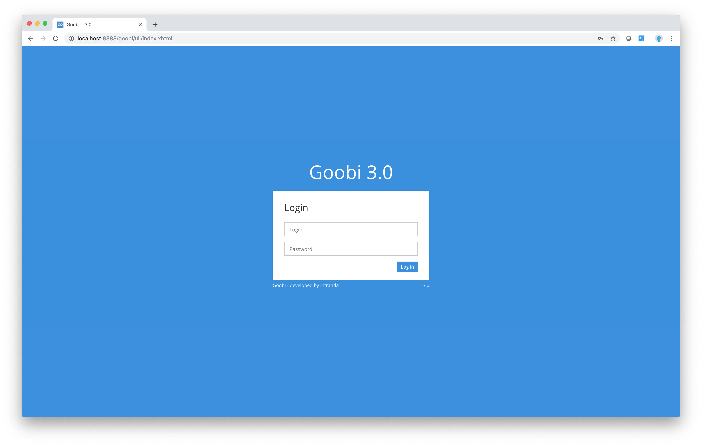

# null

# 2.1.  Logging in

To work with Goobi you will need a valid user name and password. You will usually receive these from your system administrator. In most case, they will be the same as those you were given for access to the operating system, for example. Please contact your system administrator or the Goobi support team at intranda GmbH if you have any problems with access or user authentication.

Once you have a valid user name and password, simply open the Goobi start page. Enter your user name and password and click `Log in.`

Once you have logged in, the Goobi screen will change. The menu bar will now contain a range of options for working with Goobi \(depending on your authorisation level\). Your screen will appear roughly the same as in the diagram below.

Your user name will appear at the right-hand edge of the menu bar when you are logged in. Click on your user name to display a menu with a `Settings` option. This will show you which user groups and projects you belong to. The other menu options available in the menu bar will vary depending on these user groups.