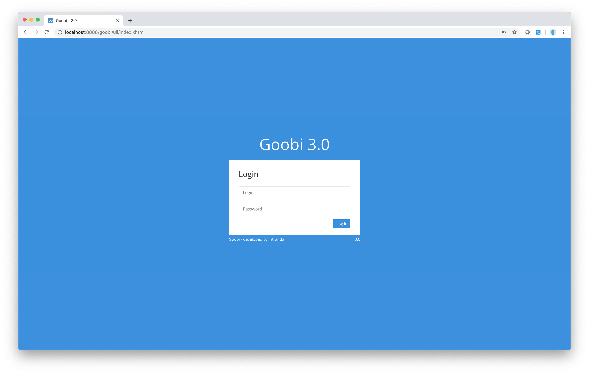

# The basics

Before we look in detail at the methodology of specific user groups, let us take a look at some basics. Any of the terms used in this section that may not be familiar to you can be found together with an explanation in the glossary.

To open Goobi for the first time, simply type the address of your local Goobi installation in your browser’s address bar, for example:

```text
http://workflow.goobi.io
```

The page displayed by your browser should be similar to the one below:

