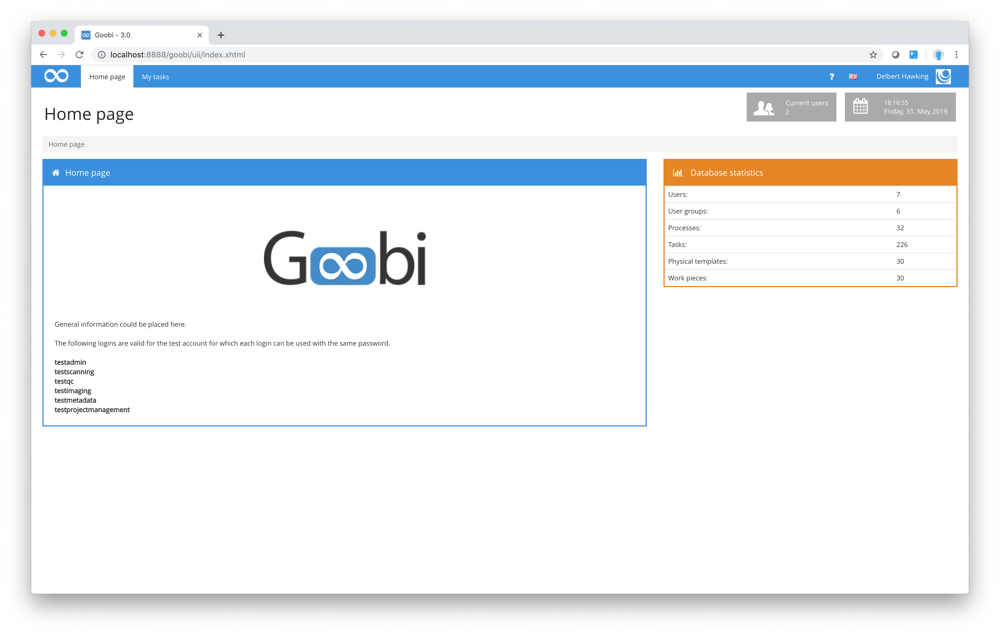

# Menu

As is usually the case for web applications, you will find a navigation menu. After logging in, users can select from a number of options depending on their level of authorisation. The diagrams below show what the menu bar can look like after login depending on the authorisation level of the user.

As the illustrations above show, access to the functions offered by Goobi varies considerably depending on the level of authorisation of the user. Whereas some members of the project team may only be able to view their specific work, e.g. as a scan operator, users with a higher level of authorisation can choose from a much wider range of functions.

Users with a higher level of authorisation can view details of all the source works covered by those projects to which they have been assigned. They can also add new source works to Goobi based on `Production templates`.

Users with administrator rights have access to the widest range of functions and can view processes for all projects, not just for those projects to which they belong. They are also authorised to make changes to processes and workflows, add users, define user groups and assign individual users to user groups and projects. In addition to these settings, administrators can draw on a range of additional functions allowing them to configure projects in detail, specify rulesets with their structural and metadata and define the authentication process.

This section focuses on topics for those project members who work with Goobi on a day-to-day basis, for the most part through the menu option `My tasks`.