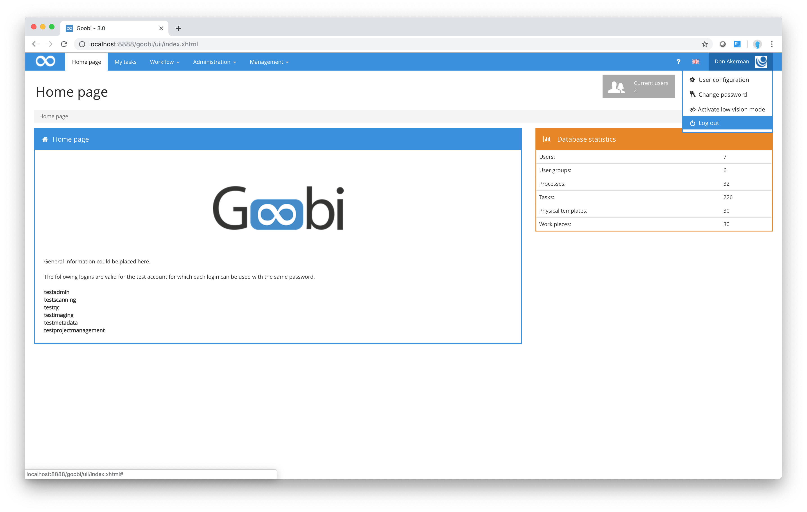

# null

# 2.3. Logging out

For security reasons, you should always log out of Goobi whenever you leave your work station. Depending on the configuration, Goobi will automatically log you out after a period of inactivity. To log out manually, simply click on your user name at the right-hand edge of the menu bar and select the `Log out` option from the drop-down sub-menu.

