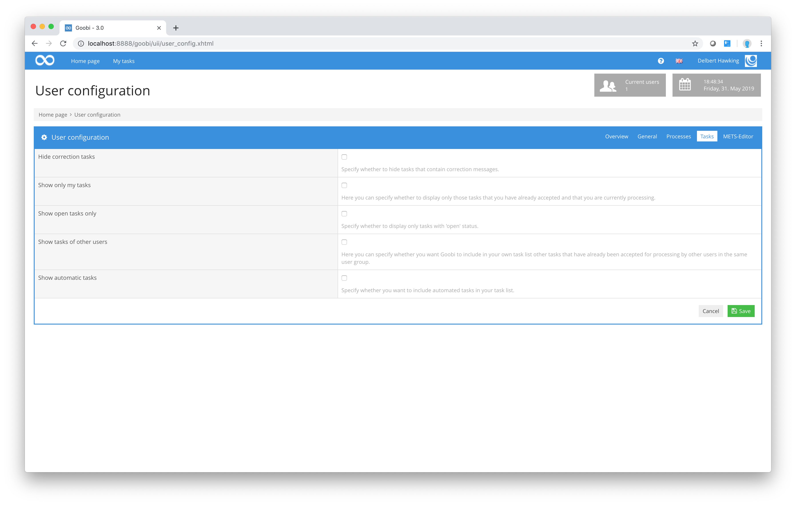

# Personal settings

Once you have logged in, you can choose a number of settings to create your own user profile. To do this, click on your user name in the menu bar and then on the sub-menu item `User configuration`. Goobi will then display a form in which you can specify your personal configuration details.

In `General` view, you can choose a number of settings for working with Goobi. The Automatic logout after `session timeout` option allows you to choose how long you want Goobi to wait before logging you out automatically after a period of inactivity. In the diagram above, for example, the user has chosen to set this option at 120 minutes.

The value you enter in the `Table size` field (in this example: 10) determines how many rows Goobi will list on each page in a table before having to scroll on to display additional data on the next page of the table.

The `Language for metadata` option allows you to define which language from the configured ruleset you want Goobi to use for the structure data and metadata when you are working with the integrated METS Editor. You do not have to choose the same language as the one selected for the Goobi user interface, although it must be configured in the ruleset. This setting allows you to specify particular languages for structure data and metadata regardless of the languages in which Goobi itself is available.

The last of these user configuration settings is the `Show process creation date` checkbox. If this checkbox is selected, Goobi will display an additional column in the `My tasks` area and in the `Processes` and `Production templates` areas showing the date on which the process was created.

In the Mail Notifications section, you can configure which emails you want to receive when status changes occur in Goobi. The first step is to define the language in which the emails are written. The projects in which the user is a member are listed below the language selection. As soon as one of the projects has been clicked, it will be expanded and the list of tasks will be listed that are unlocked for the user groups in which the user is a member.

Here you can select the tasks about which the user wants to be informed in case of a selected status change. This is possible for individual tasks as well as for all tasks.


You may need to make changes to your Goobi configuration in order to activate mail notifications and be able to use all its functions:

1. Create and modify the configuration file 
2. Set a `jwtSecret` in the file 
3. Unlock the mail deactivation endpoint in the  file


If the user has the user right `Notifications for all status changes`, all tasks are displayed instead of only those in which he himself is a member. In addition, notifications for further status changes can also be selected in this case, such as for error cases or the completion of processing.

For a detailed explanation of the other values you can enter in the user configuration section, simply click the Help icon on the menu bar. Goobi will display information about the options for each input field.

You will need to click `Save` in order for these settings to take effect.