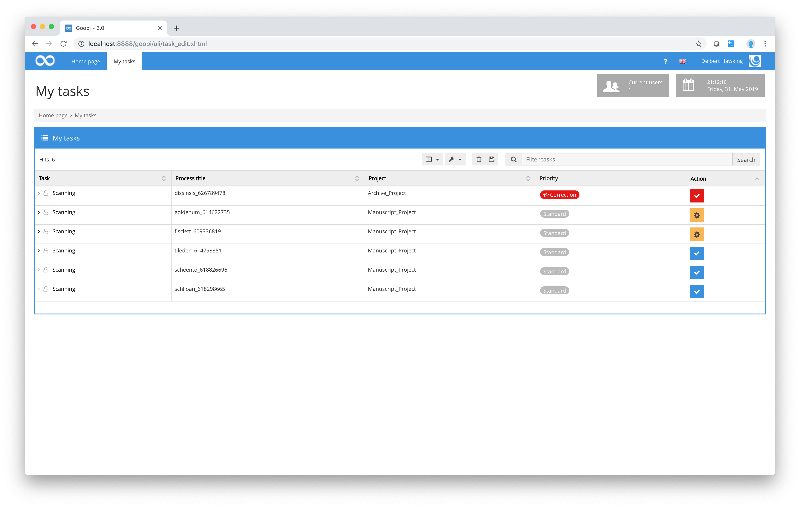
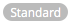
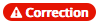
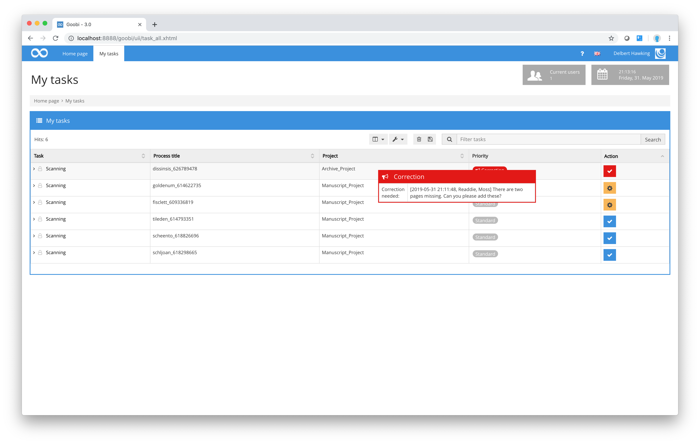
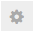
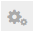
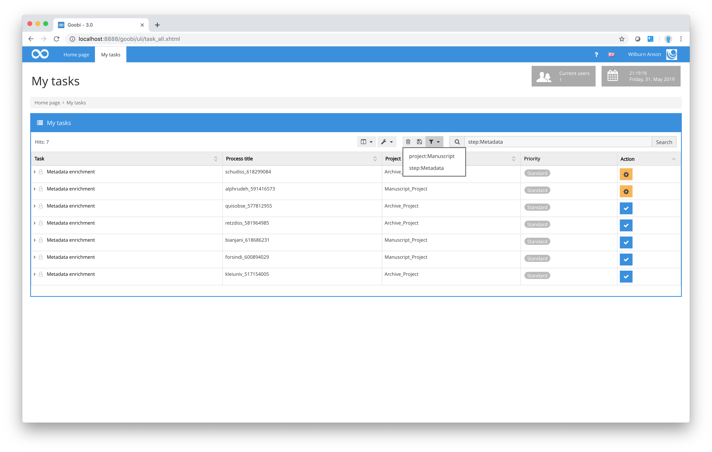
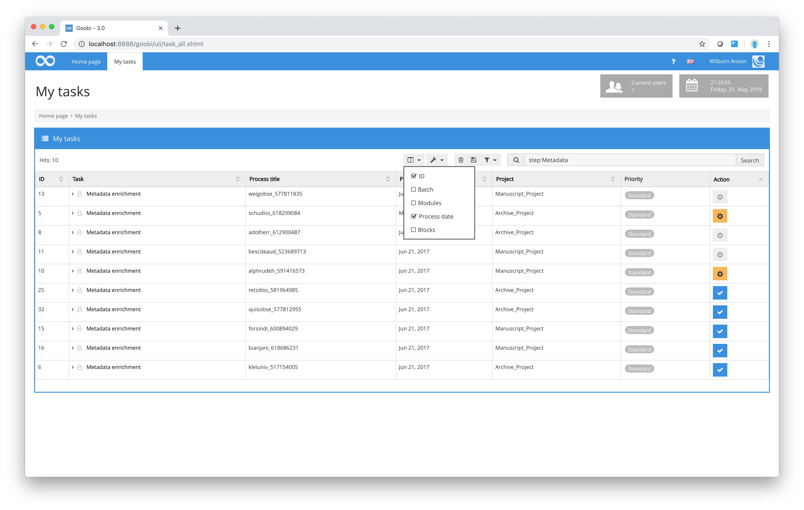

# My tasks

After logging in, most users continue with the menu option `My tasks` in the menu bar. This will display a screen similar to the one shown below:

In the `My tasks` list, you will only find those process tasks that form part of a project to which you have been assigned and which you are qualified to perform. In the diagram above, for example, a scan operator will only be shown tasks that are currently at the scanning stage of the overall workflow. The task name is shown in the `Task` column, while the name of the process to which the task belongs is shown in the `Process title` column.

The Project column displays the name of the corresponding project, and the `Priority` column provides a simple overview of the priority of the individual step. The priorities can be one of the following:

**Explanation of the symbols for the priorities of a workflow step**

| Priority | Meaning |
| :--- | :--- |
|  | The task priority level is normal. |
|  | The task has priority and should therefore be given preference. |
|  | The task has a high priority and should therefore be completed quickly. |
|  | The task has top priority and should therefore be completed urgently. |
|  | At least one correction message has been issued in relation to this task or other tasks in the process workflow. This task should therefore be given preference. |

Depending on your configuration and the process involved, you will also find additional information next to the status symbol that tells you how urgent the task is. If you see a priority symbol, this means that the project manager has prioritised this step. Tasks will always be shown in priority order regardless of which column you have chosen as the basis for sorting and listing your tasks.

As well as these priority indicators, there is an option to send error messages back from a later to an earlier point in the workflow. This means that errors detected at a later stage can be redirected backwards along with an error report. A red `Correction` button with a warning symbol in the `My tasks` list will immediately show the responsible person that the task listed in that row is one that was previously completed but that has now been found to contain an error. To display the error message, hold the cursor briefly over the red Correction button.

The status of each task can also be identified from the icon displayed in the `Actions` column. Within the `My tasks` area, you will come across the following Action symbols:

**Explanation of symbols used for indicating the status of a workflow step**

| Symbol | Meaning |
| :--- | :--- |
|  | This task is not currently being processed. Click on the icon to accept the task. |
|  | This icon indicates that you are already processing this task. Click on the icon to open the detailed view for this step. |
|  | This icon indicates that the task in question is already being processed by another user. Click on the icon to display the details of the task. You cannot work on this task unless it is first released by your Goobi administrator. |
|  | This task is part of a batch. It can be accepted and processed together with other tasks in the same batch. |
|  | This icon indicates that the task is a batch task that you have already accepted. |
|  | This icon indicates that the task is a batch task that has already been accepted by another user. Click on the icon to display the details of the task. You cannot work on this task unless it is first released by your Goobi administrator. |

If you wish to check the meaning of any of these symbols, simply hold the cursor over the symbol in question. In the `Actions` column, for example, this might show you which user is already working on that particular task.

If the number of hits is very large, you can choose to navigate between different pages of the table. To do this, click on the arrow symbols below the table to move forwards or backwards. If you click on the current page number for the table, this will display an input box where you can enter the number of the page you want to view. Once you confirm this with the `Enter` key, Goobi will take you directly to the page you requested.

There is some scope for changing the way the list of tasks is displayed under the heading `My tasks`. As a general rule, you can arrange the tasks in ascending or descending order for any of the columns. If too many tasks are displayed, you can use the menu options above the table to modify the display.

If you wish to modify the display, the following options are available:

**Options for customising the My tasks list**

| Option | Notes |
| :--- | :--- |
| Show automatic tasks | This option instructs Goobi to include tasks that are to be performed automatically rather than manually by a user. |
| Hide correction steps | This option hides any tasks in the table for which a correction message has been issued. |
| Show only my tasks | This option instructs Goobi to display only those tasks that have not yet been accepted by a user and therefore are not currently being processed. |
| Show only open tasks | This option instructs Goobi to display only those tasks that have not yet been accepted by a user and therefore are not currently being processed. |
| Show tasks of other users | This option allows you to display tasks that you would be authorised to carry out but that are already being performed by other users. |

As well as the check boxes that you can tick to restrict the range of tasks displayed, Goobi gives you the option to filter specific tasks from the overall list of those process tasks that have been assigned to your project team and that you are qualified to perform. To display only certain tasks, enter your filter term into the `Filter tasks` input box. You can find a description of possible filter terms in the section `Filtering processes`. You can also save your filters and make them available for all other Goobi users.

This way, even complex filter terms can be selected and applied at any time from a list of previously saved terms. To save a filter and include it in the list of predefined filters, simply click on the save symbol after entering the term. You can then select and apply it any time you wish from the list.

If you want Goobi to display more columns in the `My tasks` list, you can choose from the following:

**List of available columns that can be added to the task list**

| Column | Description of content |
| :--- | :--- |
| ID | The process `ID` for the step in question. |
| Process date | The `Process date` column tells you the date on which the process (of which the task forms part) was created in Goobi. |
| Module | The available `modules` and `plug-ins` that have been defined for that particular step in the workflow. These modules and plug-ins provide additional functionality to extend the scope of Goobi for specific tasks. |
| Locks | The `Locks` column lists the names of other users who have opened and are currently using Goobi’s internal METS Editor. Only one person at a time can use the METS editor to process structure data and metadata. Depending on your location and configuration, several people may be responsible for individual projects and tasks, and the Locks column allows you to see whether any of your colleagues is currently working on the metadata for specific processes. |
| Batch | The `Batch` column will display the batch ID for the process. This column will contain a value only if the corresponding process forms part of a batch with other processes, i.e. in cases where various processes are to be worked through at the same time. |

To adjust the column display, just select the column that you wish to add to the table display. To do so, tick the corresponding checkbox.