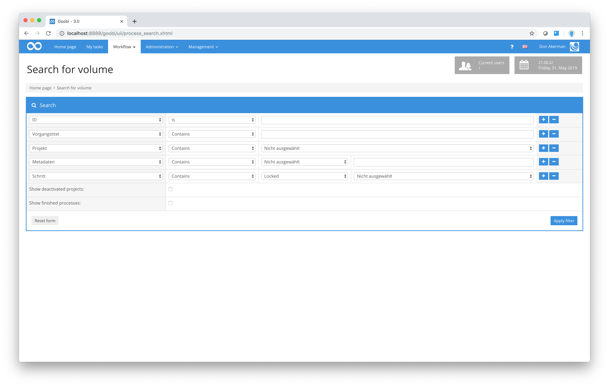
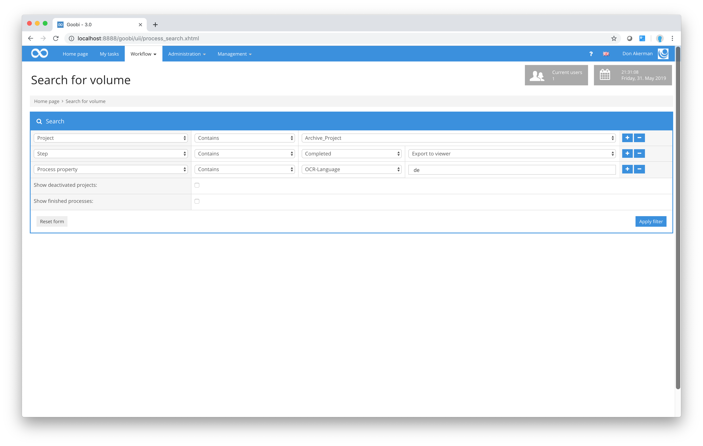

# How to find a process

If you want to search for a particular process, you can use Goobi’s straightforward search box. To do so, select the `Workflow - Search for volume` option from the menu bar.

The input box used to search for a process in Goobi allows you to combine as many search parameters as you like. When you first open the input box, it will display the fields for the most common search criteria.

Each row in the search box contains several fields. The first of these allows you to specify which field you wish to search. The remaining fields relate to the value of the field being searched. In some fields \(e.g. `Process title` and `ID`\) you can enter a text-based search. In others, however, such as `Project` and `Step`, Goobi will offer you a choice of the actual search options available.

If the default number of rows shown for combining fields in a complex search is not sufficient, you can add \(or remove\) rows at any time.