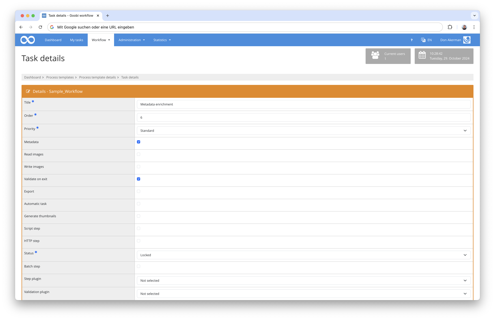

# Edit task details

On the page shown here, the details and plugins for tasks can be configured. The page does not differ significantly between tasks of process templates and those of existing processes. Differences are marked where appropriate.



## Title

The title of the task is specified in this field. This can be freely selected. However, it should be taken into account that GoobiScript calls, for example, use the respective task titles to automatically execute background tasks across many processes.

Therefore titles should be short, meaningful and unique. Spaces and special characters are allowed.

## Order

The position number is used to specify the position of a task in a process template or an existing process. Accordingly, an integer must be specified here.

On the one hand, the position number is used to display all tasks of a process in the correct processing sequence. On the other hand, when tasks are completed, those next tasks within a process that follow the sequence according to the current task are unlocked.

Several tasks can have the same position number. This then means for Goobi that the concerning tasks may be executed simultaneously. Parallel processing works with both automatic and manual tasks (for example, when several employees are working on a task in parallel).

If the task sequence of a process is configured with gaps (for example 1, 2, 3, 6), Goobi jumps directly to the task with the next highest number.

The order of tasks also plays an important role in GoobiScript calls. There, based on the number specified here, further administrative precautions can be taken.

## Allow parallel tasks

**This setting is only available when creating a new task within a process template.**

Furthermore, this setting is only relevant when new tasks are to be inserted between already existing tasks.

If this option is **set**, the position number is set directly when the task is created. It may happen that another task already exists with the same number and both tasks can be processed in parallel later.

If this option is **not set**, then in the case of a duplication of the sequence number with that of another already existing task, the sequence numbers of the other and all subsequent tasks are shifted back by exactly one number when saving. This ensures that the new task inserted in the process does not duplicate any existing position number and that the subsequent tasks can still retain their defined numbering relative to each other (including missing and duplicated numbers).

If it turns out afterwards that this option was wrongly selected when creating the task and all subsequent tasks have a "wrong" position number, there are two possible solutions: For small adjustments, the position number can be adjusted at any time in the task overview of the process template using the buttons available for this purpose. For large adjustments, or if tasks already exist for the current process template, it is recommended to write a GoobiScript so that it adjusts all "wrong" numbers and is executed on all incorrectly numbered tasks.

## Priority

In this list it is possible to select a priority for the current task. It should be noted that the priorities `Standard`, `Priority`, `High priority` and `Highest priority` are only intended to visually represent the importance of tasks. They have no further technical effect on the corresponding process.

The `Correction` option also has no effect on the task, but is automatically set if the final result in a task to be completed is not to be accepted and a correction message is sent.

## Metadata

This option can be activated if it is in the sense of the task to edit metadata.

If a task is marked with the `Metadata` property, additional icons and options are displayed at various places in the user interface to access metadata. For example, the button for calling the metadata editor is also displayed if a task has this property.

If metadata in a task is to be uploaded, downloaded, validated or used in any other way, this option must be selected.

## Read images

This option can be enabled if the user in this task should get read access to image files in his user folder (on the Goobi server). This may be the case, for example, when images are to be downloaded or displayed for quality checking.

## Write images

This option can be activated if the user in this task should get write access to image files in his user folder (on the Goobi server). This is required whenever images are to be uploaded or edited.

## Validate on exit

This option can be enabled to validate the metadata of the process when completing this task. This validation has nothing to do with the validation plugin (see below). The type of validation set here checks if all metadata, structure elements (DocStructs) and page counts have been applied according to the rule set.

## Export

This option can be enabled if it is in the sense of the task to export data for further processing with other systems. This can be, for example, other database formats, content management systems (CMS) or simply certain file formats. If this task is defined as an export task, an export plugin must be selected in the 'Step plugin' field. Export plugins usually start with the prefix `intranda_export_`.

If this task is an automatic task and an export task at the same time, the export will take place automatically. Regardless of this, the user will see an export button next to the corresponding task in the overview and can also export the dataset manually.

## Skip this task

This option can be selected if the task should be skipped in the process. If a task has this property, it will be closed automatically as soon as a user accepts it. If this task is an automatic task, it will also be skipped and closed automatically.

## Automatic task

Different types of tasks can be configured as automatic tasks. This allows, for example, plugins or GoobiSript calls to be executed either directly or in one of the available processing queues.

Specifically, the following types of tasks can be automated: Internal tasks (`intranda_step_*`), export tasks (`intranda_export_*`), script tasks, HTTP tasks and time delay tasks (`intranda_delay_*`). In each case, make sure that the appropriate plugin or script is selected as described in the corresponding chapter.

In order to use processing queues, they must first be enabled and set up in the corresponding configuration files (`goobi_config.properties` and `goobi_activemq.xml`). If this option is then activated, a drop-down menu appears below the checkbox from which the desired processing queue can be selected.

If the option `Don't execute in processing queue` is selected, the corresponding plugin or script will be executed directly as soon as the task is reached in the process. This option is recommended only for tasks that should be triggered by the user in real time, for example by completing the previous task.

The `Processing queue for fast jobs` and `Processing queue for slow jobs` options provide two independently operating processing queues that are normally the right choice for most automated tasks. The fast processing queue is intended for tasks that have a rather short execution time and should be completed promptly.

The slow processing queue, on the other hand, should be used for tasks that require a lot of processing time and for which it is not really relevant how quickly they are completed. For example, the slow processing queue can be used for large amounts of image exports, OCR analysis, 3D calculations, or other complex applications. As a result, this processing queue is also suitable for tasks that sometimes require a total computing time of hours, days or even longer over many thousands of processes.

However, by default, Goobi always prioritizes tasks that are being executed by users in real time and tasks that are in the fast processing queue. For example, if Goobi is busy during the day due to the work of many active employees and there is also a well-filled slow processing queue, it is therefore common for this to make its greatest progress at night.

In addition, there is an `In queue for external processing` option. This processing queue can be used by REST API requests. Suitable REST API requests are usually provided by plugins.

## Generate thumbnails

If the task is to be used to generate thumbnails, this checkbox must be selected. A text input field then appears, in which an example configuration for the generation of thumbnails is given. This should be adapted for the project's own needs.

The text input field includes several lines in which a YAML-compatible notation of key-value pairs is expected. Key-value pairs are separated by a colon (`:`) and each line may contain exactly one key-value pair. The first line contains the string `---` to indicate the beginning of the data set. Comments are marked with a hash (`#`) and may be placed in a separate line as well as at the end of a line used for content. They are ignored by the interpreter. Thus it is also possible to "comment out" certain parts in experimental configurations.

At the beginning the following example configuration is in the text input field:

```yaml
---
Master: false  #use master image directory 
Media: false  #use media image directory 
Img_directory: "" #set path to custom image directory 
Custom_script_command: "" #command to execute custom thumbnail generation script 
Sizes: #define thumbnail sizes 
- 800
```

The variables have the following meaning (details, see below):

| Variable                | Data type        | Default value | Meaning |
| ----------------------- | ---------------- | ------------- | ------- |
| `Master`                | `Boolean`        | `false`       | This value can be set to `true` to enable thumbnail generation for all image files in the `master` folder. |
| `Media`                 | `Boolean`        | `false`       | This value can be set to `true` to enable thumbnail generation for all image files in the `media` folder. |
| `Img_directory`         | `Text`           | `""`          | Here you can optionally specify another folder with image files.  |
| `Custom_script_command` | `Text`           | `""`          | Here you can optionally specify an alternative script or executable program to generate thumbnails. |
| `Sizes`                 | List of integers | `800`         | A list of image file sizes (in pixels) in which the images will be generated must be specified here. |

Note that `Sizes` accepts a list. Each line starts with the string `- ` and then contains an integer. The list entries must directly follow the line `Sizes:`. Text values must be enclosed in double quotes `"`. Boolean values can be used directly and can be set to either `true` or `false` to turn the feature on or off.

**Master**

Setting this value to `true` will generate thumbnails for all image files inside the `master` folder (usually `/opt/digiverso/goobi/metadata/{processId}/images/{processId}_master/`) and store them in the `thumbnails` folder (usually `/opt/digiverso/goobi/metadata/{processId}/images/thumbs/{processId}_master_{size}/`).

**Media**

Setting this value to `true` will generate thumbnails for all image files inside the `media` folder (usually `/opt/digiverso/goobi/metadata/{processId}/images/{processId}_media/`) and store them in the `thumbnails` folder (usually `/opt/digiverso/goobi/metadata/{processId}/images/thumbs/{processId}_media_{size}/`).

**Img_Directory**

At this point, a third, additional folder can be specified for the generation of the thumbnails. The generation behaves here in exactly the same way as with the `master` folder and the `media` folder. However, this folder must be specified as a full folder path, for example `/opt/digiverso/goobi/metadata/{processId}/images/{processId}_custom/`. The destination folder for generation would then be accordingly: `/opt/digiverso/goobi/metadata/{processId}/images/thumbs/{processId}_custom_{size}/`. If the folder path specified here is empty or the parameter is missing, this option will be ignored during generation.

**Custom_script_command**

A path to an individual script file or to an executable program that is to be used to generate the thumbnail files can be specified here. The script or program should be able to independently recognize the image files and use the correct process-related folder paths. If the field is left empty, Goobi will use internal Java libraries for generation.

**Note:** This option is not currently supported. All thumbnails are generated using special image processing Java libraries, regardless of any script or program specified here.

**Sizes**

At this point a list of image file sizes (in pixels) can be specified in which the thumbnails should be generated. This can be done by specifying one or more lines, each of which starts with the YAML list entry prefix (`- `) and then contains an integer. Note that each of the specified image file sizes will be used independently, and will always produce thumbnails that have the specified size on their longest side. For example, if the values `400` and `800` are specified, **both** thumbnails with a size of 400 pixels **and** thumbnails with a size of 800 pixels will be generated.

**Additional technical information**

* In the examples above, the placeholders `{processId}` stand for the respective process ID and `{size}` for the thumbnail size in pixels. These are inserted in folder names accordingly.
* All settings (except `Sizes`) can be omitted, in which case the default values given above will be used.
* If multiple thumbnail sizes are specified, all will be generated independently. All respective sizes are stored in their individually named folders (consisting of image size and source folder).
* All generated thumbnail images are JPG files using a default color profile of the image file processing Java library.
* Watermarks are not included in preview images.
* Spaces in filenames of original files are replaced by `%20` in thumbnail image file names for technical reasons.
* If the folders for the preview images do not exist, they will be created automatically.
* If the output folders including preview images already exist and if the source image files have not changed (measured by the `last-modified` value of all involved image files), the thumbnail images will not be regenerated.

## Script step

This option can be enabled to run one or more scripts on the server as part of the current process. For example, these can be Bash or Python scripts that perform background tasks or interact directly with the current task's dataset in the file system.

**The numeric return values of the scripts play an important role in workflow control. Therefore, they are documented in detail following this chapter and should be strictly observed.**

If the script step option is activated, a table appears below the checkbox in which up to five script files can be entered. For each script a name and a path can be entered, whereby the path is the absolute path (including script file name) in the server file system. The associated name can be freely selected and serves exclusively the simpler recognition for the user.

Any fields in the table can be filled in or left blank. If this task is executed later in a process, Goobi will execute all filled script path fields from top to bottom.

Care must be taken to ensure that the specified scripts are executable. Otherwise, error messages in the journal and server log files will indicate the cause of non-execution. Common causes of errors are for example missing execution rights, wrong environment variables (especially `PATH`), missing interpreters, wrong file paths or missing parameters. Parameters can easily be specified in the script field.

If another script language is to be used, an interpreter must be specified if necessary. In this case, the interpreter is the executed program and then executes the script file specified as a parameter.

The script lines read from the table (but not the script files themselves) will be searched again by the variable replacer in Goobi Workflow when executing the scripts in a process and any variables will be replaced. This can be used to insert metadata values into certain fields. For example, parameters for the scripts specified here can be written so that the parameter values correspond to the variables for the variable replacer.

A few examples of scripts:

```
/opt/digiverso/goobi/scripts/copyfiles.sh
bash /opt/digiverso/goobi/scripts/myExampleScript.sh --action convert
python /opt/digiverso/goobi/scripts/doAnything.py
/etc/python /opt/digiverso/goobi/scripts/convertImages.py --type *.jpg *.png
```

If the available script fields are not sufficient, a kind of meta script file can be written instead, which in turn executes several scripts and occupies only one field in the table.

**Return values of script files**

The respective return value of a script is used by Goobi Workflow to determine the current status of the corresponding task, especially between the processing of multiple scripts within one task. A distinction is made between `Success`, `Error`, `Reopen task` and `Continue task`.

The return value, for example 99, is specified in Bash scripts with the command `return 99` or in python with `sys.exit(99)` to the end of the script. This should properly handle any errors caught by `if` blocks or other situations, and in particular should not use `return` statements without return values.

The following table gives an overview of the respective behavior of Goobi:

| Return value | Status | Action of Goobi |
| ------------ | ------ | --------------- |
| `0` | Completed | Executes the next script of this task |
| `1` and all undefined values | Error | Cancels execution of this task |
| `98` | Open | Cancels execution and restarts the task |
| `99` | In process | Executes the next script of this task |

If a script outputs text in the error output stream (STDERR), this is also treated as an error condition (`1`). Errors are documented in the journal and server log files.

The input and output streams STDIN and STDOUT are currently not used.

**Combination of multiple scripts**

The value **0** can be used if a script is the only or last script in a task. If the script was successfully executed, the task is set to `Completed` status. If `0` is used and scripts follow afterwards, unwanted side effects may occur.

The value **1** (and all undefined values) can be used if a script fails. Goobi will then not execute any further scripts and set the current task directly to `Error` status. Error messages (STDERR output and goobi-internal errors) are logged in the journal and server log.

The value **98** can be used if a script could not be executed as desired and Goobi should be told to restart the whole task. Accordingly, the execution of the first defined script will be started again if it is an automatic task. The status of the task is set back to `Open` by the return value `98` and to `In process` in case of an automatic task. This return value can be used, for example, for situations when scripts perform error handling in their own error detection and then need to be re-executed to benefit from their own error corrections on the next execution attempt. Validation scripts can also be used at this point to detect errors from previous scripts and cause the task to restart accordingly.

The value **99** can be used if a script could be executed successfully and another script is to be executed afterwards. The status of the task is not yet set to `Completed` with `99` (in contrast to `0`), which makes sense if several scripts follow each other. The last script should then return `0` to complete the task.

If the provided script fields are not sufficient and multiple script calls are outsourced to an external script file, make sure that all return values are passed correctly and arrive back in Goobi to achieve the desired effects in task automation.

## HTTP step

This option can be selected if the current task is to perform an HTTP (or HTTPS) transaction with an API of another server. This application is mainly intended for `POST`, `PUT` and `PATCH` requests, i.e. for uploading data to the respective services. However, `GET` requests can also be sent conditionally to check the availability of resources. As soon as the corresponding checkbox is selected, several input fields appear in which the details of the request can be entered.

With the option `Close step after successful HTTP call, it can be configured whether the task should be closed automatically in case of a successful HTTP request. More details, see below.

First, the **HTTP method** must be selected. The method to use is determined by the API endpoint used (usually within a REST API) and must match the method specified in the associated specification. Otherwise, the accessed server can be expected to return an error message (`405 Method Not Allowed`, see below).

In general, APIs should adhere to the following request method conventions, although deviations are possible:

| HTTP method | URL or URI               | Action                | Request content |
| ----------- | ------------------------ | --------------------- | --------------- |
| `POST`      | Created target address   | Data set is created   | All properties to create |
| `PUT`\*     | Existing target address  | Data set is replaced  | All unchanged and changed properties |
| `PATCH`     | Existing target address  | Data set is changed   | Only changed properties |
| `GET`\*\*   | Requested target address | Data set is requested | - No content - |

\* If unchanged properties are omitted, this may lead to unintended deletion of the data in question, since the API endpoint assumes that the properties should be overwritten with "empty" data. Details on the specific behavior of the API should always be found in the associated specification.

\*\* Note that the `GET` method is only partially supported at this point. The received data is not stored or further processed. The `GET` method can be used to query the existence or accessibility of data.

The next step is to specify the **HTTP URL**. This is composed of the domain name or IP address of the server, optionally the port number, the API endpoint and the required URL parameters. If the default HTTP port '80' is used, this can be omitted.

Some examples of API request URLs:

```
http://localhost:8080/api/endpoint/delete?id=20&project=2
http://192.168.178.21:8888/api/endpoint/list
https://goobi.example.org/api/endpoint/list?project=1
```

After that the **HTTP body** is entered. This is only relevant if it is a `POST`, `PUT` or `PATCH` method. The content of the request depends on the API used and the corresponding API endpoint, so we cannot go into more detail here. However, if a REST API is used, data must always be entered in JSON format.

The specified data in the **HTTP body**, once the HTTP request is later performed for a process, will be post-processed by goobi's internal variable replacer. This makes it possible to use metadata field labels according to the variable translator's syntax rules in the request content. These are then replaced by the actual data in the respective process before the request is sent.

Additionally, the **Escape HTTP body as JSON** option can be selected. This modifies control characters (for example, line breaks or tabs) in the request content so that they are masked by backslashes (`\\`) and can be used correctly by the API endpoint if necessary. However, the exact handling of such control characters also depends on the API endpoint and must be read in the associated specification or requested from the provider.

This completes the settings for the request.

As soon as the request is sent later during the execution of the task within a process, the requested server responds with an **HTTP status code**. This is read by Goobi and decides whether to continue executing the process. In general, successfully answered requests lead to the completion of the respective task. If the next task in the process is an automatic task, it will be executed.

With the option `Close step after successful HTTP call`, it can be configured that the task is really closed if the HTTP call was successful. If this option is not choosed, the task will remain in the status `Open`.

If an error status code is returned, the task remains in an error status and manual intervention is required. Errors are logged in the journal and server log files.

In the realm of HTTP status codes, normally all status codes `< 400` are considered successes and all `>= 400` are considered errors.

The following is a listing of the most common status codes associated with REST APIs:

**Successful status codes:**

* `200 OK` - The request was processed successfully or the data set could be found
* `201 Created` - The resource was created successfully
* `204 No Content` - The request was processed successfully, the answer intentionally does not include data

**Error status codes**

* `400 Bad Request` - The request was not formatted correctly - The syntax should be checked
* `401 Unauthorized` - Authentication is required for this request (or the specified authentication is invalid)
* `403 Forbidden` - This resource exists, but may not be requested
* `404 Not Found` - The resource does not exist - possibly the URL or URI is incorrect
* `405 Method Not Allowed` - The wrong HTTP method was used (see above)
* `429 Too Many Requests` - Too many requests were sent within a certain period of time
* `500 Internal Server Error` - The server has detected an internal error for which the request is not directly responsible
* `501 Not Implemented` - The API endpoint does not exist - Possibly an incorrect API version is used

In addition, some further status codes can be returned. The respective meaning can be found in the relevant RFC standards. In case of special problems, however, the responsible support should be contacted.

## Status

In this drop-down menu, the status of the task can be set manually. Typically, in a process template, all tasks are set to `Locked` and the first one to `Open`, so that later in each process, editing can start at the first task. In the course of editing, Goobi sets all open tasks to `In queue` or `In process` and finished tasks to `Completed`. In case of an error, the task is automatically set to `Error`.

Additionally, there is an option `Deactivated` to deactivate a task completely. This will be skipped by Goobi when editing the process. The `Error` status can also be used manually to indicate that an edit has not taken place as desired and may need to be repeated.

When setting the status in a task in an already existing and edited process, care should be taken here to avoid unwanted side effects caused by automatic tasks being opened or closed manually, which are triggered by this intervention in the workflow.

## Batch step

This option can be enabled if the current task should be able to be grouped and executed together with similar tasks within a batch.

## Step plugin

In this drop-down menu, a plugin is selected that is to be used for the task currently being processed. There are different possibilities for what the plugin selected here can be used for. Different possibilities are described in more detail in other subchapters on this page.

Plugins can be used for automatic or semi-automatic tasks. In this case, time delay plugins (`intranda_delay_*`), validation plugins (`intranda_validation_*`), export plugins (`intranda_export_*`) or other types of plugins can be selected. Plugins that bring their own user interface and are not already described in one of the other categories on this page can also be selected here (e.g. `intranda_step_*`).

For tasks that should not use a plugin, this field is left empty.

## Validation plugin

A task can be configured to run a validation plugin upon completion. The corresponding plugin can be set in this field. Validation plugins usually start with the prefix `intranda_validation_`.

## Plugin for time delay

Time delay plugins can be included as tasks in the process to pause automatic processing for a certain time. If a task is to be used for time delay, this checkbox must be set and a corresponding plugin must be set.

The corresponding plugin is selected in the `Step plugin` field. Plugins that can be used for time delay usually start with the prefix `intranda_delay_`.

## Update metadata index when finishing

This option can be enabled if metadata has been modified by completing this task and the search index should be updated for the entire dataset of this process.

## Download the docket as PDF file

This option can be enabled to offer generating and downloading a docket PDF file for the current intermediate status of the corresponding process in the task overview. This can be handy to manually check the current technical status of the process.