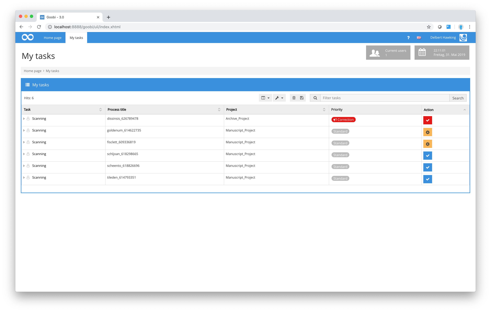
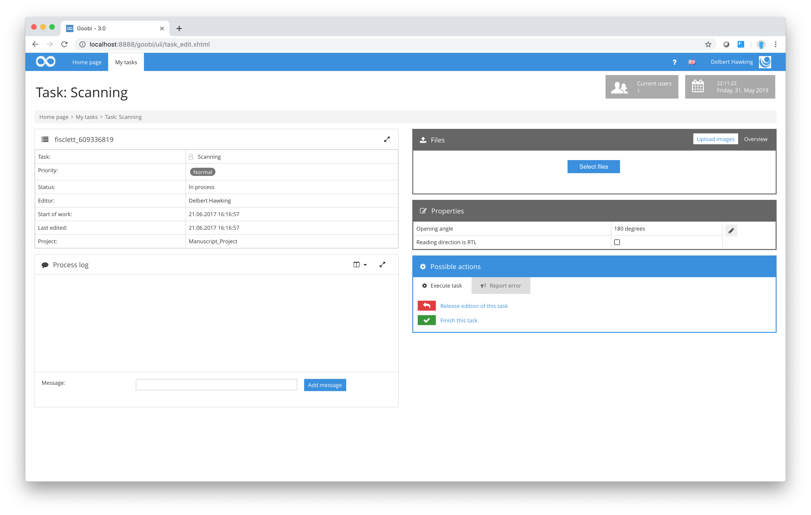

# Scanning

The methods used by scan operators working with Goobi on a daily basis do not vary substantially from those of other users with different qualifications or responsibilities. All users must first log in and select `My tasks` from the menu bar.

This list of tasks contains all the workflow steps that the scan operator is authorised to perform as a member of one or more projects and user groups. The symbols in the `Actions` columns indicate the current status of the workflow steps in those rows. As described above in [section My tasks](../2/2.md), each user can see immediately which tasks are still open and waiting to be processed and which are already `in progress`, i.e. being processed by that user or another user with the same level of authorisation and qualifications. The symbols in the column `Priority` indicate error messages or priorities.

From an individual user’s perspective, working with Goobi on a daily basis generally involves selecting a task from the list of those offered and then clicking on the corresponding `Actions` button at the end of the row to view full details of that task.

The top-left box in the `Details of the task` window contains some general information about the task selected and accepted for processing by the user. You can use the `Process log` box immediately below this to enter whatever information you wish. This information will be visible to all users who subsequently accept other tasks as part of the same process at a later stage of the workflow. Its purpose is therefore to act as an open area for communication between different users in the form of general notes or observations. It can be used, for example, to draw attention to the fact that the volume in question needs to be worked on with particular care on account of its properties, or to a particular feature of the process that users at other work stations at a later stage of the workflow need to be aware of. Comments entered by users manually in the `Process log` are usually displayed in green.

It is also possible to upload files for this process, which are then listed within the process log. In contrast to the digital copies, these files do not serve to describe the work itself, but can contain information about the work or the method of operation to be observed. For example, it can be used to upload routing slips or offers from restoration service providers. The files uploaded in this way are available for all subsequent workflow steps, as are the comments.

In addition, you can switch to the file area at the top of the process log. Here the files of the different directories of a process are listed. Depending on the respective user authorization, these files can also be downloaded and deleted there. In the lower part of the process log it is possible to select a file to upload. After selecting a file, an optional description can be added. It is also possible to specify whether the file should only be used internally or whether it should also be considered for later export.

Information that has been transferred by external applications or scripts to the currently displayed process is displayed in different colors within the process log. The colors used here have the following meanings:

**Colours in the Process log**

| Colours | Meaning |
| :--- | :--- |
| Grey | Messages containing detailed program information for debugging purposes. This information is intended primarily for more precise analysis and not so much for users. |
| Blue | Messages containing general information. |
| Orange | Alerts warning about a critical status. |
| Red | Error messages documenting errors that have arisen. |
| Green | Messages entered manually by users in the Goobi interface. |
| Black | Uploaded files |

To the right of the general properties box, you will find a number of extended task properties that can or in some cases must be entered by the user. These will depend on the configuration of your particular site, the process and the workflow step. In the screenshot shown above, for example, Goobi has been configured in such a way that the user must enter details of the opening angle and the scanning device.

Once a task has been accepted by the scan operator, Goobi will create a new folder within that operator’s work drive for storing the digitised files. Depending on the installation and configuration, users are generally allocated a network drive for use on the local work station computer. After a task has been accepted, that drive will contain an additional folder to which the scanned files can usually be saved directly.

Once a task has been completed, i.e. when all the required pages of the physical source have been scanned and saved in digital form in the folder provided by Goobi, the user needs to click on the `Fishish this task` link in the `Possible actions` area. This tells Goobi that the task has been completed. Goobi will then check for graphics files in the specified folder within the user’s work drive, check the names given to those files and end the task for the user. Goobi will also remove the folder provided for that specific process within the user’s work drive so the scan operator can no longer access it and the digitised material it contains. Whenever a user tries to close a task, Goobi will draw attention to any compulsory fields that need to be completed, e.g. the opening angle or the scanning device (see screenshot above). This means a task cannot be closed until all the required information has been entered in full by the user.

If, after accepting and starting a task, you decide that you do not want to work on the selected task, you can simply return it. Goobi will then reset that workflow step to its original `open` status. It is now available to any other authorised users or even to the same scan operator at a later stage. This arrangement can be useful if a task that has been selected involves too much work and cannot be completed, for example, on the last day before that user’s holiday, as it would otherwise remain unavailable to other users for a relatively long period.

While you are working on a task, if you notice an error that has been made at an earlier stage of the workflow that needs to be rectified before you can complete your work, you can send an error message to the work station responsible for that earlier task. This tends to be very rare in the case of scan operators. A description of such error messages can be found in [section Quality control](3.2.md).

Once you have closed a task, you will return automatically to the `My tasks` list. The completed task will no longer appear in the list. You can now continue with the next task from your list.