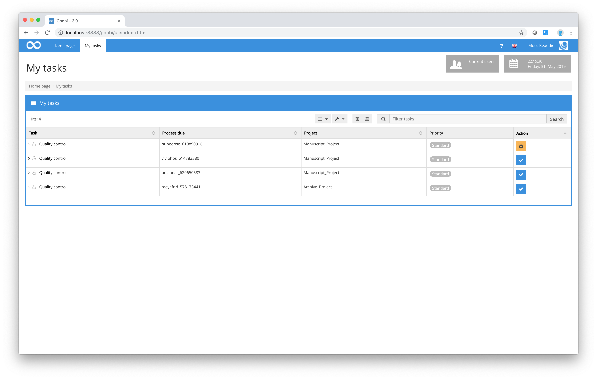
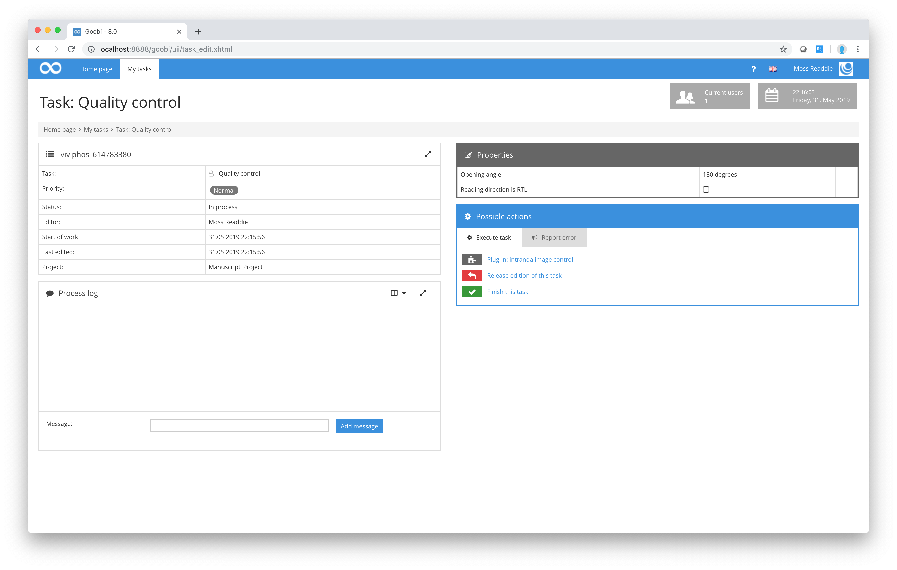

# Quality control

At many sites that work with Goobi, a manual check is made on the quality of the scanning work performed in earlier steps of the workflow. The methods used by the staff who conduct these quality checks are almost identical to those used by the original scan operators. As in [section Scanning](3.1.md), staff in the Quality Control user group first log in to Goobi and then select My tasks from the menu bar. Next, from the list of available completed tasks, they choose one to review. The choice will depend on the priority level and any error messages.

Once the reviewer has selected a task, Goobi will create a new folder within that user’s work drive (in the same way as it did for the scan operator) containing all the digitised material produced in an earlier step of the workflow (usually at the scanning stage).

In most cases, the workflow in Goobi is configured in such a way that quality control staff are not expected to make any changes within the new folder and have read-only access. Any general observations entered at an earlier stage are also visible to the reviewer in the `Process log` in the bottom left of the window. Any configured additional properties that users from this group need to enter or select during this task are shown next to the general properties. Using any standard image viewer, the user can now review each of the images in the new folder and check the quality of the digitised output.

If the quality matches project requirements, the reviewer will then click on the `Fishish this task` link to remove that task from the `My tasks list`. The new folder created by Goobi to allow the reviewer read-only access to the digitised material will then be removed automatically from that user’s work drive, thus preventing any further access to the data for that specific task within the specified workflow.

If a reviewer finds that the quality of individual files of digitised material is unsatisfactory, or that certain pages are missing or repeated, Goobi provides an option to send a correction message to a previous work station.

To do this, select the `Report error` tab in the `Possible actions` box. Goobi will display a list of all those tasks previously completed, together with details of the users responsible for those tasks. The reviewer can enter a description of the error found during quality control in the free text box below the selected task.

After the reviewer clicks on the link `Send correction message`, the incorrectly performed task will reappear in the `My tasks` list of the work station in question. The user will be able to view details of the error message by holding the cursor over the red warning message or by re-accepting the correction task. Having corrected the error, the user can then enter a description of the solution found. It is therefore possible to assign processes more than once within the workflow (in the event, for example, of an error).