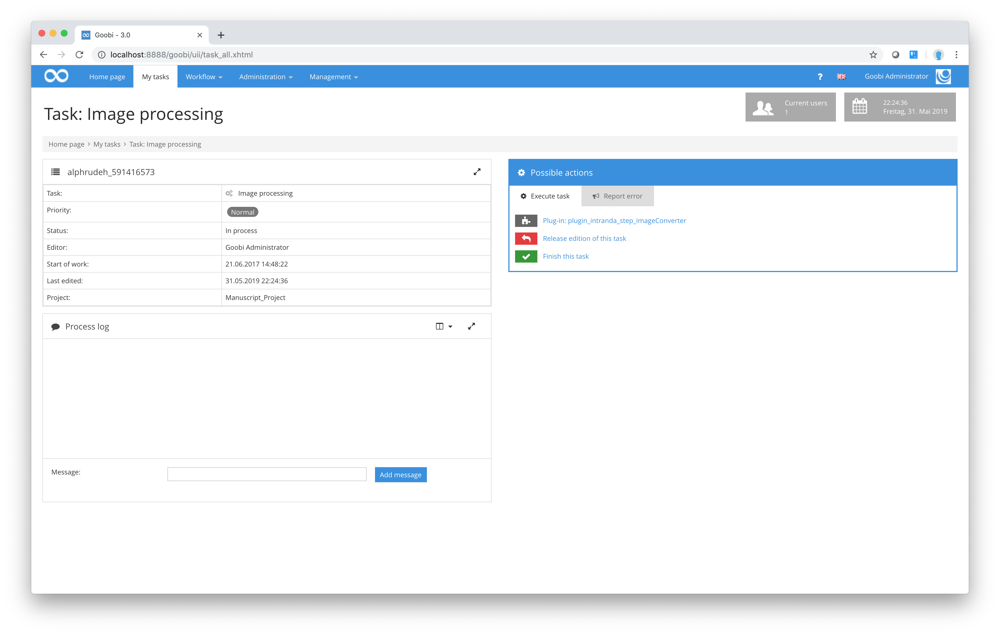

# Manual script steps and plugin steps

In addition to the tasks we have already described, it is possible to configure Goobi so that users can call up any external programs, scripts or plugins for specific purposes from within Goobi. To this end, Goobi provides an option to configure additional buttons in the `Possible actions` area for individual steps of the workflow. The names of these buttons are specified by the Goobi administrator when configuring the workflow. When they are activated, they call up one or more configured instructions on the server.

Based on the way Goobi has been configured by the Administrator, the user can decide whether the scripts are actually executed or not. The user simply needs to click on one or more of the proposed actions. Depending on the configuration, the user will receive a message to confirm that the server has executed the script correctly.