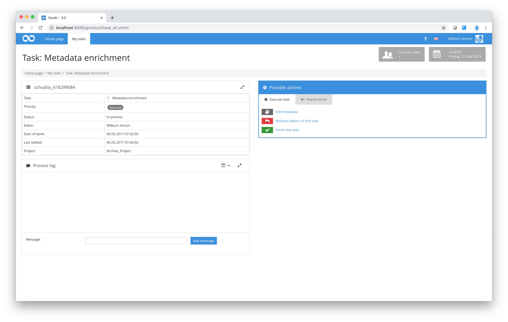

# Metadata processing

One of the main areas of work for those users with library training in the field of digitisation projects involves the comprehensive indexing of digitised objects. Basically, this covers pagination, structuring and the recording of metadata.

Those members of the digitisation project who are responsible within their user groups for recording structure data and metadata will complete their tasks in Goobi in a similar way to the other user groups described earlier (scan operators and quality control).

After logging in, they also need to click on `My tasks` in the menu bar and select the task they wish to process next from the list of tasks displayed. The screen containing the details of the selected task is very similar to that described above for scan operators and quality control users. Here, too, the user will find a box of general properties on the left and the `Process log` for general observations concerning the process. However, one additional action is available in the `Possible actions` area. The `Edit metadata` link allows the user to open Goobi’s Metadata Editor. The precise functions and user operation of the Metadata Editor are described in a separate section of this manual on account of its complexity.

The remaining actions offered by Goobi correspond to those described earlier for the workflow steps [Scanning](../01_scanning/01_scanning.md) and [Quality control](../02_qa/02_qa.md). When the user closes the task by clicking the `Finish this task` link, Goobi will validate the structure data and metadata. The task can only be closed completely if all the configured rules on structure data and metadata have been observed.

Unlike project members working as scan operators or in quality control, users involved in processing structure data and metadata do not generally work directly with data from the file system. Consequently, at this point Goobi does not provide access to the digitised material in the file system within the user’s work drive. If required, however, this can also be configured for users processing structure data and metadata to allow for read-only access to the images and allowing them to be displayed using an image viewer. In this case, when the task is closed, the folder containing the digitised material would be removed from the user’s work drive to prevent any further access to that material outside the authorised workflow.