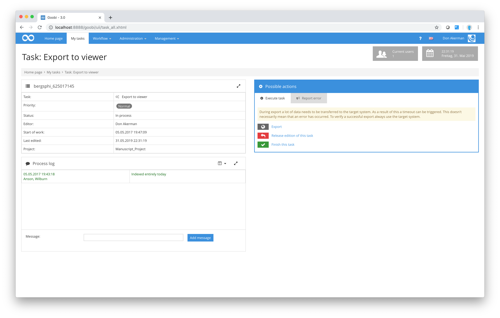

# Export to the DMS

One of the workflow steps frequently included in a wide range of digitisation projects at numerous establishments involves making the digitised material available to the public together with the corresponding structure data and metadata, obtaining which can sometimes require a considerable investment of time and effort. This digitised material can be made available in a range of systems independently of Goobi and can be used, for example, on completely different hardware from that required to run Goobi. In this step, Goobi will export the digitised material, together with the structure data and metadata in the form of a METS file, to a `Document Management System (DMS)`. This step can either be completely or partially automated, depending on the configuration.

If the procedure is only partially automated, the data is exported manually by the responsible person in the user group using roughly the same methods as those described earlier for the other user groups. After logging in and selecting a task from the `My task` list, the user will be shown a screen containing the details of that task. As in the previous examples, in addition to the task details, this screen contains a `Process log` for messages about the corresponding process. However, an additional button can be found in the `Possible actions` area. This button can be selected to launch the actual export to the external DMS system.

Please note that exporting the digitised material together with the corresponding structure data and metadata to an external DMS can take some time depending on the configuration and the volume of data. If Goobi has been configured to validate the export to the DMS, it will prevent any further work until the communication between Goobi and the DMS has been completed. You will not see any message to confirm that the export has taken place until this communication is over, and in the case of large volumes of data this can easily take several minutes. If the export fails, Goobi will display a detailed error message on the screen that was responsible for preventing the export. Such errors are usually caused by a failure to observe the rules within the structure data and metadata. As part of the DMS export task, Goobi can also (depending on the configuration) allow users access to the structure data and metadata through the Metadata Editor, so that they can resolve any such validation errors themselves immediately. In most cases, however, export errors lead to the sending of an error message to the responsible work station earlier in the workflow. A description of how to send error message to other work stations within the workflow can be found in [section Quality control](../02_qa/02_qa.md).

If Goobi has been configured by the system administrator in such a way that the user does not have to wait until communication with the DMS has ceased, it will display a positive message immediately (after the user clicks the `Export to DMS` link) to indicate that the export process is now running in the background. The results of the export are still validated in the background (even though validation is not displayed on the user screen) and are stored with details of system events in the form of log files. This means that the user does not have to wait and can continue to work with Goobi immediately by clicking the `Finish this task` link. The task is then removed automatically from that user’s `My tasks` list.

From Version 1.9 of Goobi onwards, users have been able to perform a fully automated DMS export in addition to the manual option. In this case, DMS export tasks will only appear in a user’s task list if an error has occurred during the export process. Assuming that Goobi has been correctly configured, the validation of earlier workflow results should ensure that the automatic export is successful. In such cases, the export process is fully automatic within the workflow and will on completion activate the next task in the workflow.

In Goobi 2.0, the Export function has been updated so that users can integrate various plugins at this point allowing them to respond flexibly to the requirements of different presentation environments. If you wish to use this plugin-based export function, the workflow step must be configured with the `Export DMS` setting. However, you will also need to enter the plugin that has been provided. If the special plugin-based export function has not been configured for that workflow step, Goobi will use the default export function.