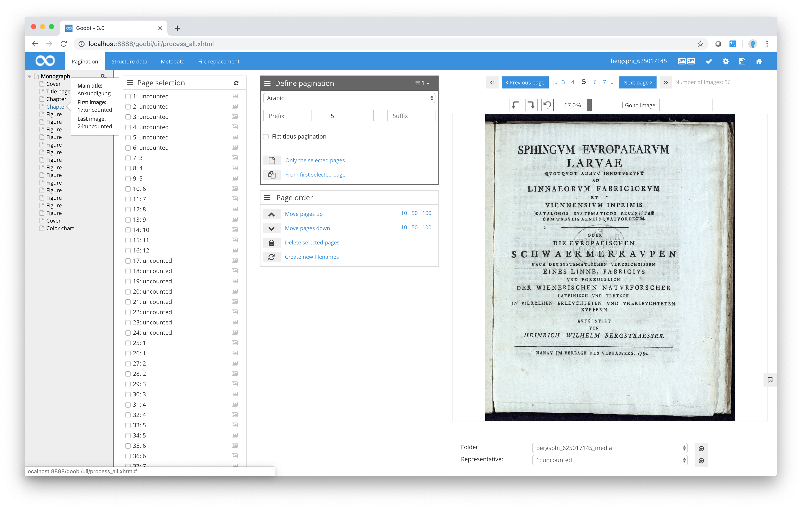

# Structure tree

The grey-shaded area on the left of the screen contains the structure tree, where you can see in hierarchical form all the structure elements that have already been obtained from the source material. When you select a structure element, it will appear in bold in the tree view. For each structure element, the descriptor is based on the type chosen for that element.

| Icon | Description |
| :--- | :--- |
|  | Symbol for collapsing and expanding the structure element hierarchy |

Click on the icon just in front of the structure element to expand or collapse individual sections of the structure tree. If you hold the cursor over the small symbol next to each structure element, you will see a pop-up with further details of that structure element without having to open it.

