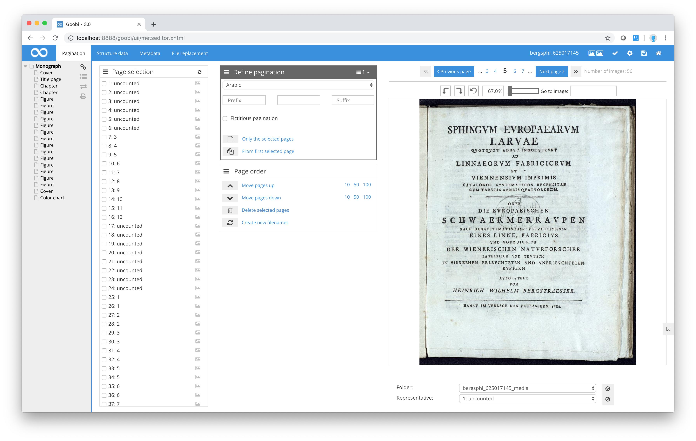

# User interface

Once you have opened the Metadata Editor, you have full access to all the editing options relating to the pagination, structure data and metadata of the digitised material. The Metadata Editor is divided into a number of sections.

