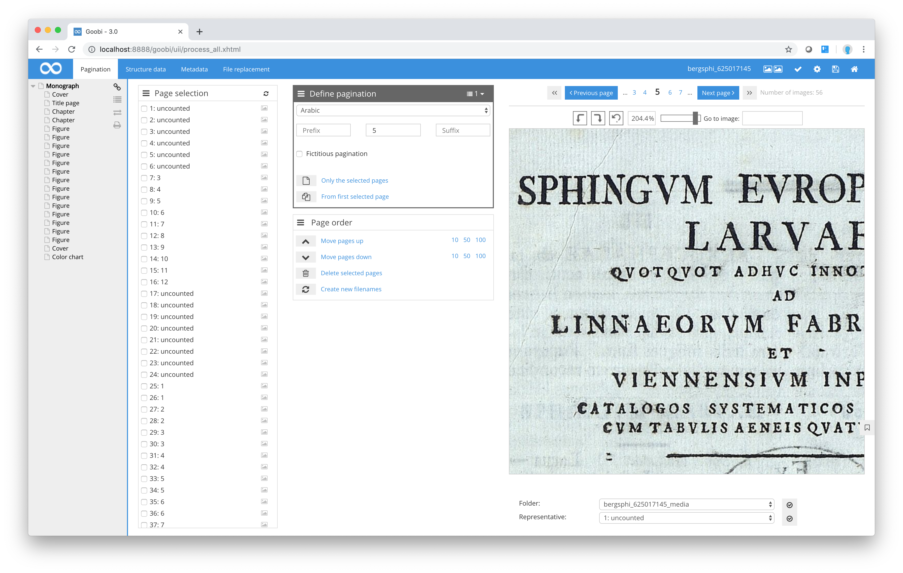
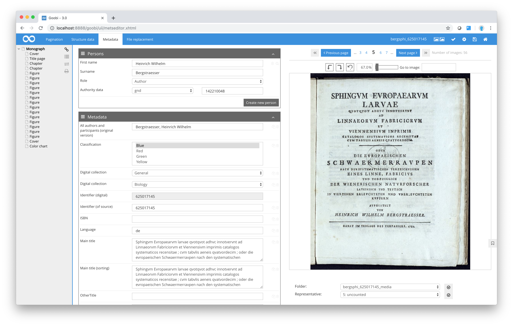

# Page display

The right-hand side of the Metadata Editor gives you an overview of the individual digital images that form part of the current process together with the number of pages, the current magnification level, the currently displayed image number and information about which derivative of the available digitised material you are currently viewing.

## Page navigation

You can move between individual pages using the `Forward` and `Previous` links just above the image. You can also move quickly to the previous and next images by selecting them directly.

The current page is shown in the middle of the page range with the previous and next two pages on each side \(provided they are available for display\). Clicking on any of the pages will take you directly to the corresponding scanned image. Goobi also features a number of keyboard combinations for repeated navigation between different pages of the source material.

**Keyboard combination for navigating between images in the Metadata Editor**

| **Keyboard combination** | Description of function |
| :--- | :--- |
| `Ctrl` + `Shift` + `Cursor left` | Move to previous image |
| `Ctrl` + `Shift` + `Cursor right` | Move to next image |
| `Ctrl` + `Shift` + `Cursor up` | Move 20 images forward |
| `Ctrl` + `Shift` + `Cursor down` | Move 20 images back |
| `Ctrl` + `Shift` + `Pos 1` | Move to first image |
| `Ctrl` + `Shift` + `End` | Move to last image |

Using these keyboard combinations allows you to move quickly and easily through the digitised material, even over large areas. Another navigation option allows you to move directly to a specific image by entering that image number in the `Go to image` box and pressing return. Goobi will then automatically display the requested image.

## Zoom

In addition to all the above navigation options, you can also change the way Goobi displays the scanned image. To do so, just click on either magnifying glass symbol below the page navigation bar to increase or reduce the magnification/zoom level. The current magnification is shown between the two magnifying glass symbols. If you want to select a particular level of zoom, simply click between the two magnifying glass symbols, enter a figure and press the Enter key to confirm.



## Rotation

Goobi also allows you to rotate the image in 90 degree stages to view information that can only be read in landscape format. To do so, just click on the arrow pointing to the right to rotate the image clockwise and on the arrow pointing left to rotate the image anti-clockwise.

| Icon | Description |
| :--- | :--- |
|  | Rotate the displayed image 90 degrees to the left or right |

## Selecting the image folder

Underneath the image you will find an option to select from different derivatives of the image \(where available\). In the drop-down list entitled Folder, Goobi lists all the image folders linked to the currently selected process. For example, if you already have a number of derivative images for a specific process \(e.g. master images, scaled or compressed versions of images or derivatives with a different tone such as bitonal images\), you can switch between these derivative images simply by selecting the corresponding folder.

## Choosing representative image

Within the METS Editor you can specify a particular image that can be used to represent the entire work. This is usually the title page. Most digitisation portals \(e.g. Europeana, ZVDD, VD18\) and the Goobi viewer use the first image in the METS file as the representative image, unless a different image has been specifically chosen for that purpose.



In order to specify the representative image, first select the required image from the available list. Click on the corresponding icon make this the representative image. Within the METS file, the selected image will now have the attribute `USE=“banner“`.

```markup
<mets:file ID="FILE_0002_PRESENTATION" MIMETYPE="image/tiff" USE="banner">
     <mets:FLocat LOCTYPE="URL"     
     xlink:href="file:///opt/digiverso/viewer/media/BV041228853/00000003.tif"/>
</mets:file>
```