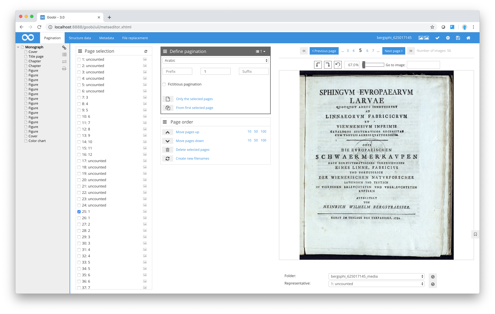
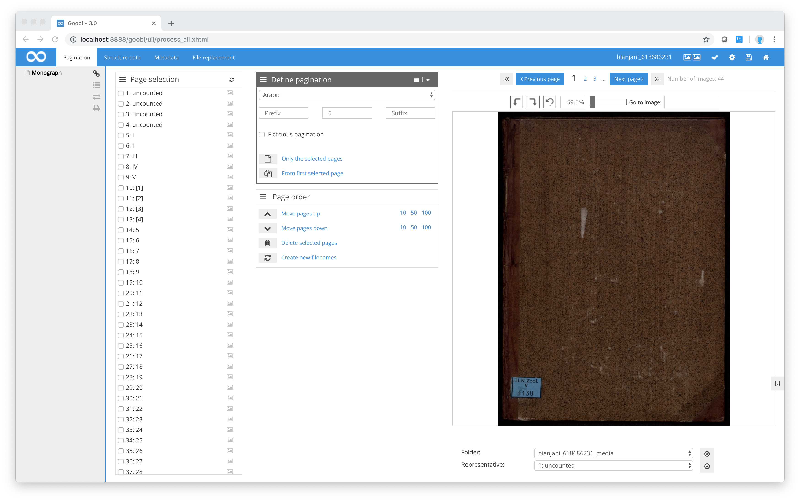

# Pagination

Pagination is a key element of digitisation projects. It involves matching `page labels` (printed page numbers in the source material) to the scanned images. In older works, the page numbering often changes within the actual source text. Often, there is no printed page number, or the same page number is used more than once, and sometimes the pagination can change several times within a single work. A typical example of altered pagination occurs when the preface or introduction makes use of Roman numerals only to be replaced by Arabic numerals after the index.

To edit the pagination for the source work, open the pagination area in the Metadata Editor by clicking on the option in the navigation bar. Goobi will calculate the number of images in the current process folder and produce a vertical list. The box immediately to the right is used to allocate a pagination number to each image. As you can see below in the box entitled `Page selection`, Goobi has initially determined that all the pages should be numbered consecutively using Arabic numerals, beginning with the number 1.

Using either the keyboard combinations or the image navigation bar above the scanned image, you can now navigate through the entire set of images to obtain the printed page number for each image. In most cases, the first few pages of books do not contain a page number. Click the first checkbox for image 1 in the `Page selection` box. Next, in the `Define pagination` box, select `unnumbered` from the drop-down list and then click on the link `From first selected page`. For pagination purposes, you have now told Goobi to treat the volume as though it did not contain any printed page numbers. Next, move to the first image that shows a printed page number.


**Tip:** While you are navigating through the images, if you come across a page where the pagination changes, just click on the image. This will automatically select the corresponding checkbox in the `Page selection` list. To actually mark the checkbox, press the space bar on your keyboard. Alternatively, you can of course identify the corresponding image in the `Page selection` list and then mark the checkbox using your mouse.


When you are selecting pages, please remember that you must go by the image number and not by the printed page number in the source. In Goobi, you can always tell which is the image number. Two numbers are always shown for each image, separated by a colon. The number on the left is the number of the file within the file system, i.e. the image number. The number to the right of the colon is the printed page number in the source, known as the page label. You should always take the image number (to the left of the colon) as your guide to avoid accidentally choosing the wrong pages. It is worth noting that in some source material the same printed page number (page label) can occasionally be used more than once.

Once you have identified the page where the pagination of the source material changes and marked the corresponding checkbox, choose the required pagination type in the `Define pagination` box. Next, enter the current page number/label and click once again on the link `From first selected page`. This will instruct Goobi to allocate the required page number to each image, beginning consecutively with the page you have selected.

Sometimes, the pagination of the source material can change more than once. Pages without a page number and repeated instances of the same page number occur frequently. Pages on which a new structure element begins (e.g. new chapters) but that do not contain a printed page number (although page numbering is continued on subsequent pages) are marked with a simulated pagination. This simulated pagination can be recognised in that a logical numbering is assumed despite the absence of a page number, and consequently the assumed page number is shown in brackets.


**Example:** If a chapter starts on a page without a printed page number and the next page contains the printed page number `4` you would give the first page of the chapter a simulated (i.e. assumed) page number, in this case a number 3. Simulated page numbers are based accordingly on an interpretation derived from the missing page identifier and the available page identifiers on subsequent pages of the source. Simulated page numbers are shown in square brackets. In this example, the designation used for the first page of the chapter would therefore be `3`.


For efficient pagination, use the keyboard combinations described in [section Overview of the keyboard combinations](../../05_shortcuts/05_shortcuts.md). Especially if the source is particularly large and you cannot or do not wish to check every page, you can ensure that your pagination is actually correct by checking a selection. In most cases, it is relatively easy to detect mismatches in the pagination. To do so, use the keyboard combinations to navigate 20 pages at a time through the set of images, comparing the printed page number on your selected page with the pagination numbers allocated through the automatic consecutive numbering option. You can identify mismatches where the pagination sequence no longer coincides with the sequence of printed page numbers.

Alternatively, you can at any time click the icon next to the page number in the `Page selection` box to display the corresponding image in the image display area on the right.

| Icon | Description |
| :--- | :--- |
|  | Display image for the selected page |

Goobi supports different page numbering methods for pagination purposes. As well as allocating Arabic and simulated Arabic page numbers, Roman and simulated Roman page numbers, free text and unnumbered pages, you can also specify the sequence to be used for consecutive numbering. Using the symbols in the `Define pagination` box, you can determine how the page sequence in the book should actually appear.

| Icon | Description |
| :--- | :--- |
|  | Selection of pagination type |

Goobi supports the following page sequences:

**Pagination types supported by the Metadata Editor**

| Pagination type | Description of pagination type |
| :--- | :--- |
| Page numbering | A page number is printed on each page. |
| Column numbering | Each page contains two individually numbered columns. Accordingly, each page will have two pages numbers. In the `Page selection` box, you will notice that in such cases the consecutive numbering advances in twos, since each column on each page is allocated a number. |
| Sheet numbering | In the case of sheet numbering, each physical sheet in the book is given a sheet number. Unlike the page numbering method, no distinction is made between verso and recto. Accordingly, page numbers are not allocated per image. Automatic consecutive numbering is based on every second image. Two images are allocated to each page number before adding the next page/sheet number in the sequence. |
| Recto/verso sheet numbering | Using this method, page numbers are allocated as for `sheet numbering`, except that each page number is followed by an r for recto or v for verso. |
| Recto/verso page numbering | Here, pages are allocated as for page numbering (see above) with the addition of an `r` for recto or `v` for verso after the number. |


**Tip:** If you want to make a change within an existing pagination sequence, you can use one of Goobi’s features that that does not automatically overwrite all the subsequent pages using automatic numbering. To do so, select one or more pages in the `Page selection` _\*\*_box, enter the required numbering and pagination type and then clink on the link entitled `Only the selected pages`. In this way, only the selected pages will be affected by the change.
