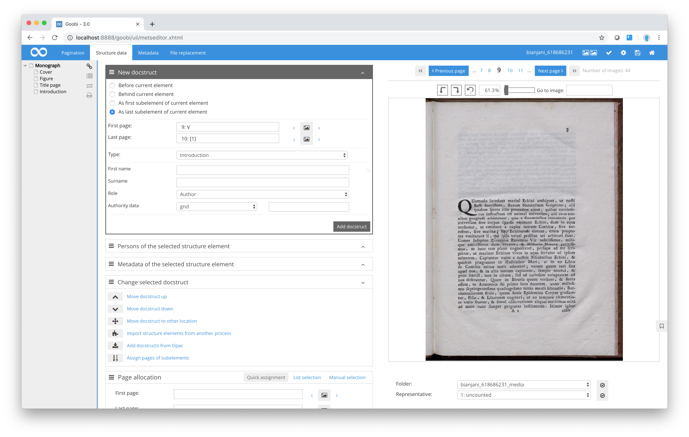
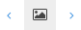

# Create new structure element

The list of elements from which you can select in the New structure element box will vary depending on which structure element has been activated. You can choose the position where you want to insert the new structure element from the following options:

**Positions for new structure elements**

| Position | Description of position for the new structure element |
| :--- | :--- |
| Before current element | Choose `Before current element` to insert a structure element immediately before the currently selected element. |
| After current element | Choose `After current element` to insert the new structure element on the same hierarchical level directly after the current element. |
| As first sub-element | Choose `As first sub-element` to insert the new structure element as a sub-element within the hierarchy before any other sub-elements that are already in place within the currently selected structure element. |
| As last sub-element | Choose `As last sub-element` to insert the new structure element as a sub-element of the current element. The new structure element will be inserted after any other elements that are already in place. |

The list of structure elements from which you can select will vary depending which of the four position options you choose. The range of elements available for selection depends on how the Goobi administrator has specifically defined the system for the current project using the freely configurable rulesets. Within certain structure elements, this means that structure data and metadata can be specified that are admissible within a given hierarchy. For example, within the structure element `Monograph` it is not possible to assign the structure element `Periodical article`, although you could assign a `Chapter`, which is a perfectly normal component of a monograph. Depending on this configuration, the list display will be based on the structure element currently selected in the left-hand navigation tree.

The fastest way of adding new structure elements in Goobi is to choose the option `As last sub-element` As last sub-element `First page` input box. Move forward until you come to the last page for the structure element you wish to add, and this time click on the image symbol next to the `Last page` input box. Clicking the image symbols instructs Goobi to apply the page number currently selected on the right of the image display. Using the little arrows on either side of the image icon, you can enter the page number for the preceding or following page. This allows you to allocate pages without spending an inordinate length of time moving between pages in the image display section. Next, click on `Add structure element` to insert this new structure element as the last sub-element within the current structure element. This is an efficient method of adding structure elements.

| Icon | Description |
| :--- | :--- |
|  | Menu item to help users navigate to and select the first or last page of a new structure element |
|  | Set the current image as the first or last page |
|  | Set the previous image as the first or last page |
|  | Set the next image as the first or last page |

If you want to create additional sub-elements as part of a structure element that you have already added, first select the existing element to which you want them to belong. You can now use the same method as described above by adding each new structure element as the last sub-element.

This single step of the workflow therefore involves providing two important pieces of information. As well as identifying and recording the digital structure of the source material (to reflect its logical structure in the form of chapters, sub-chapters, forewords, afterwords, indices and any other structure elements that can be configured individually in your Goobi installation), when you add structure elements you are also providing the corresponding page ranges for each one of those elements.

Clicking on the small arrow symbols next to the `First page` and `Last page` text boxes instructs Goobi to set these as the beginning and end pages for that structure element. As the metadata file grows in the background, it will eventually be perfectly clear which page ranges correspond to which structure elements. If the digitised material is later made available for viewing, e.g. on a website, researchers will then be able to display all the pages corresponding to a particular sub-element, and sub-chapters downloaded in pdf format will always contain the correctly allocated pages.

For some structure elements, Goobi will display input fields below the selected type so that metadata can be allocated directly to the structure element. Which fields are displayed (e.g. main title, keywords) will depend on the structure type that has been selected and on the ruleset configurations in Goobi.