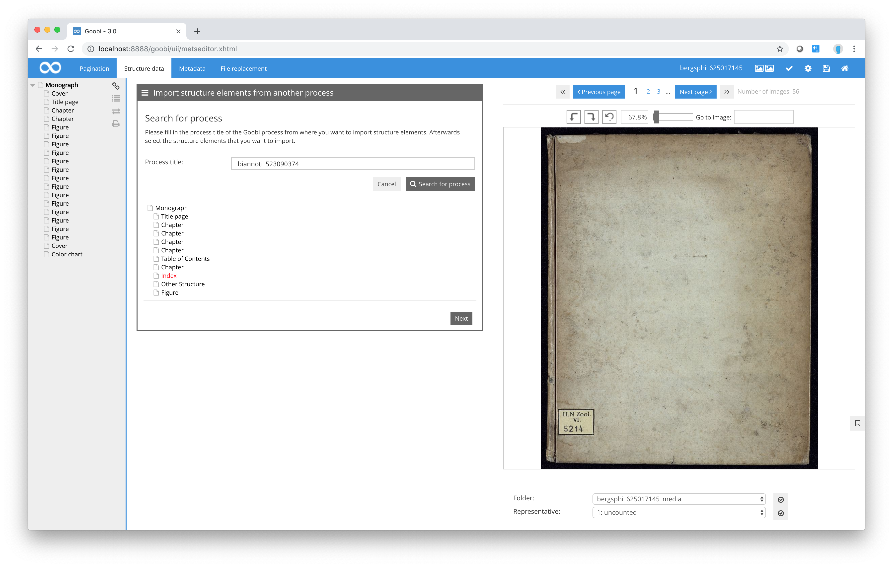
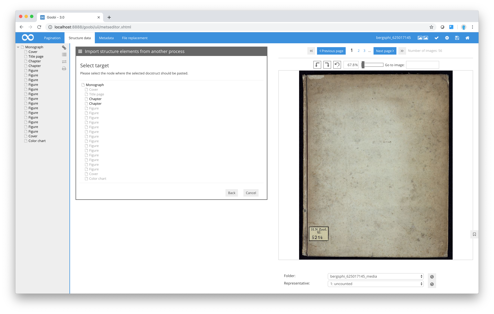

# Copying structure elements from other processes

Goobi allows you to copy structure elements from the METS file of one process to another process. To do this, in the `Selected docstruct` box, select the function `Import structure elements from another process`. Goobi will display a tree view from which you can copy the required structure. You can then specify the target location within the current METS file.

First enter the name of the process from which you want to obtain the data, then click `Search for process`.

You can now choose one or more structure elements from the selected process by clicking on them. Once you have selected the required elements, click on the `Next` button to return to the structure tree for the process you are currently working on.

In this view, you can now select the structure element into which you want to insert the structure elements you have just copied from the other process. Please note that you can only select a target structure element that is allowed by the ruleset to contain the copied elements. Also, this function allows you to copy only logical structure elements from another process. This means that you cannot use this function to copy images and page allocations.