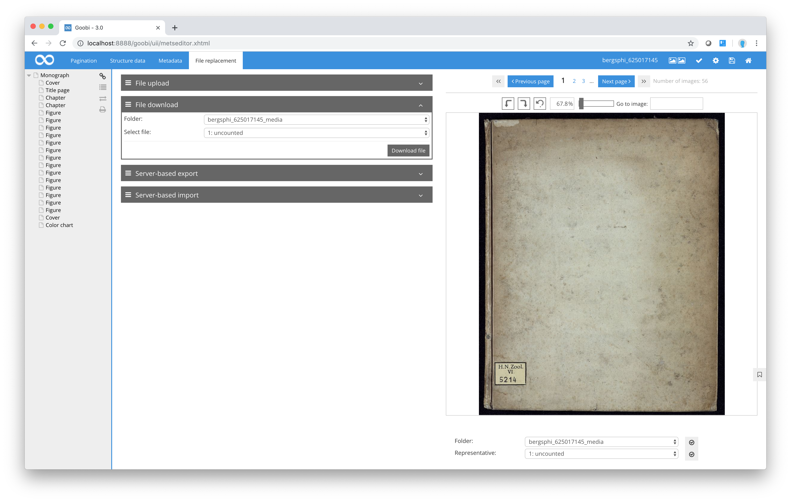

# Downloading files

This function can be used to download a file from the current process folder to the user’s own computer. The user can select the file to be stored locally using the computer’s file browser.

