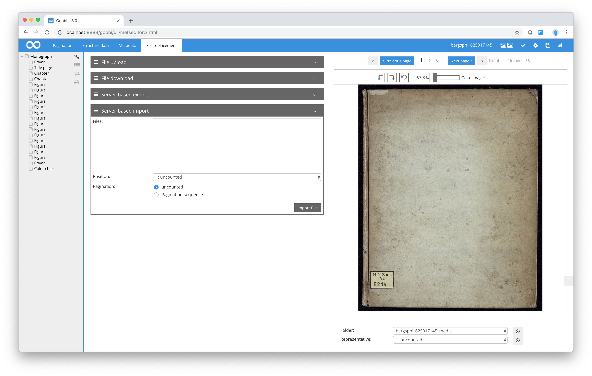

# Server-based imports

Provided that the server-based target folder is not empty, you can use the `Server-based import` box to select a folder from which previously exported images can now be imported into the current process.

In order to do this, you will need to specify the point in the pagination sequence where you want to insert the new file. You can then choose whether the new files are to be inserted as `uncounted` pages or whether they are to be integrated into the existing pagination.

For every subfolder in the target folder, Goobi will then search for a counterpart in the current process folder. The selected files are then imported to this folder. Once the files have been successfully imported, the subfolder in the target folder is deleted.