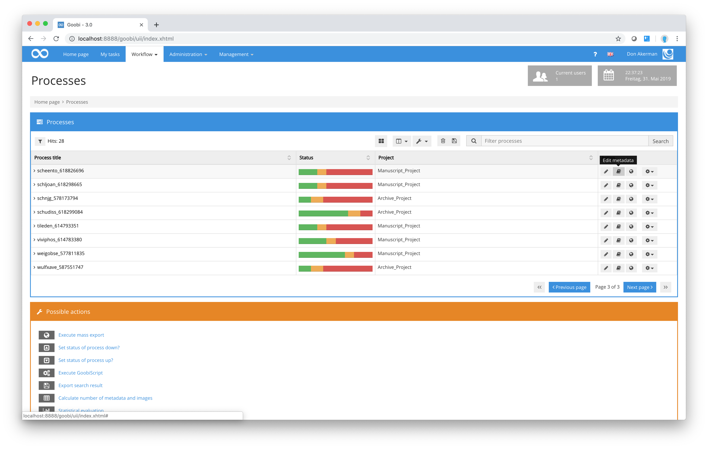
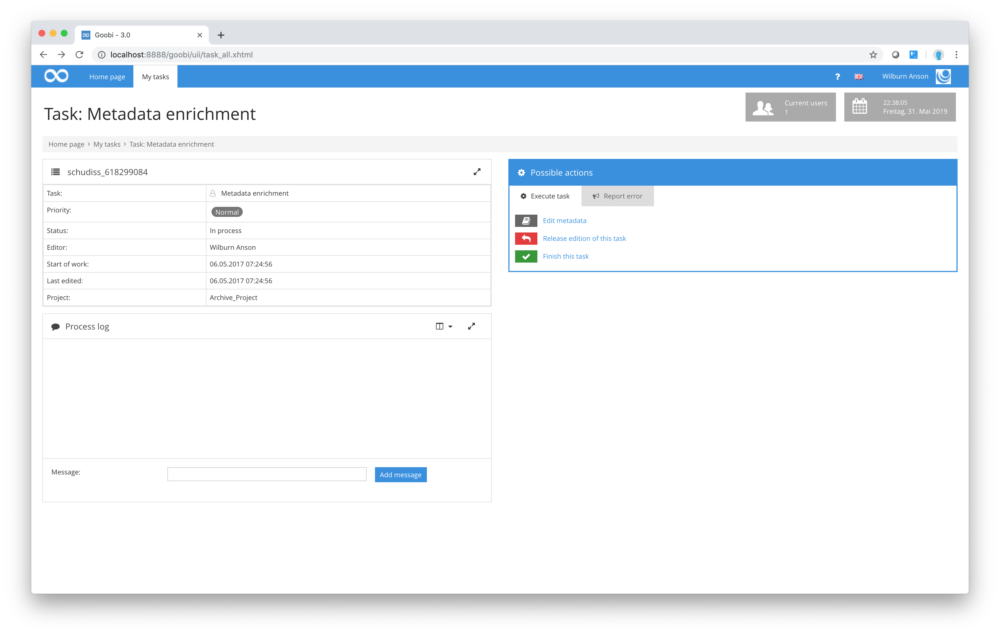

# Metadata Editor

Goobi’s Metadata Editor is one of the core elements of digitisation projects. Most work involving the Metadata Editor is performed by trained librarians. There are two ways to open the Metadata Editor. Administrators and project managers can open the screen for processing structure data and metadata at any time from any individual process listed in the process view page, regardless of its workflow status.

Users with a more restricted level of authorisation can access the Metadata Editor through the `My tasks` area but can only perform those workflow steps for which they have been designated as the responsible user.

