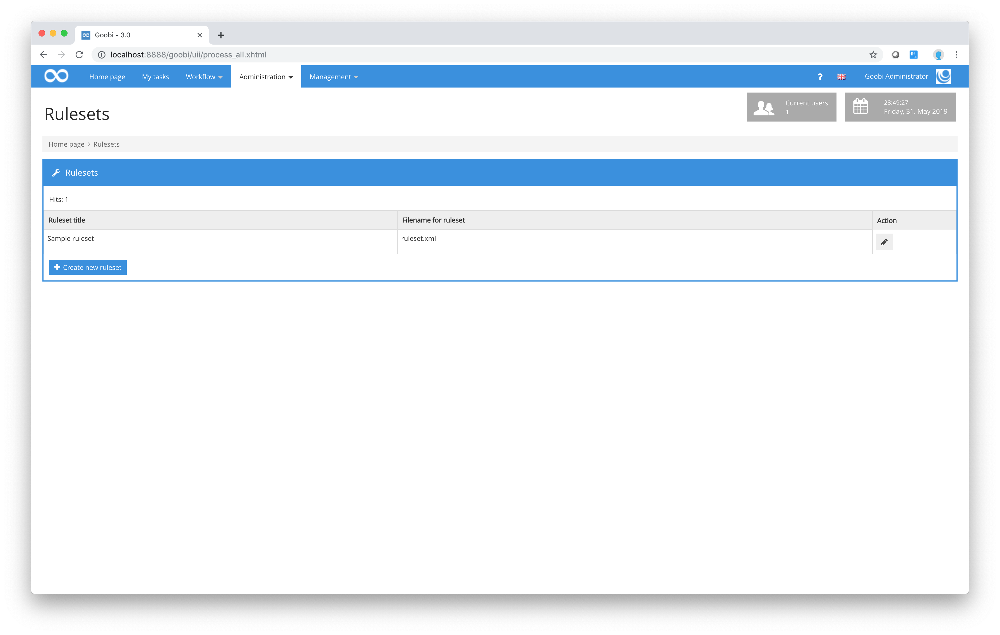
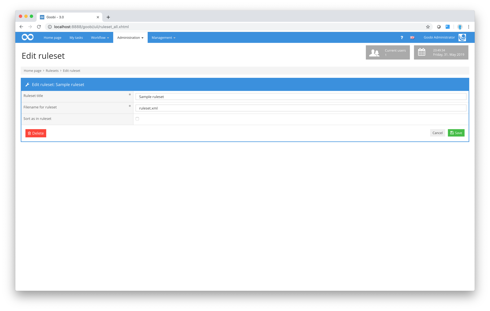

# Rulesets

One of the fundamental aspects of Goobi is that all structure data and metadata to be recorded as part of a digitisation project can be specified on the basis of a flexible system of rulesets. Before the project actually begins, the project management team can decide which structure elements and which metadata elements should be admitted for that project. The collection of these structure data and metadata, the user authorisations governing how and how often they may be used and the associated translations for the interfaces are specified in the ruleset files.

A detailed description of how to create a ruleset file can be found in a separate document. This documentation can be found here:

[https://docs.goobi.io/ugh-en/](https://docs.goobi.io/ugh-en/)

This section explains how you can work with rulesets in Goobi. To do this, click the menu item `Administration` in the top menu bar and choose `Rulesets` from the drop-down menu. This action will display a list of the rulesets that have already been defined.



If you click on the `Create new ruleset` link, Goobi will display a dialog box allowing you to create an additional ruleset.

| Icon                                                   | Description           |
| ------------------------------------------------------ | --------------------- |
|  | Create new ruleset    |
|  | Edit existing ruleset |

You will need to enter a meaningful name that you wish to use when allocating project tasks. For the ruleset file, you must choose the actual name it has been given in the file system.



In the ruleset dialogue box, as well as choosing the title and file name of the ruleset, you can stipulate the order in which data from that ruleset are displayed in Goobi. The default setting is alphabetical. This means that all lists of structure element names and metadata fields will be sorted in alphabetical order in the Goobi METS Editor. However, if instead you activate the checkbox `Sort as in ruleset` in the dialogue box, the order will change. For the configured ruleset in question, the structure data and metadata will now be shown in the order they appear within the ruleset. This can be useful, for example, if you specifically want to make a manual change to the order in which Goobi displays the structure data and metadata. To save the changes you have made in the dialogue box, simply click the `Save` button. To delete the selected ruleset, click on the `Delete` button. When entering the file name, please ensure that the specified file actually exists in the configured ruleset. The default path that Goobi expects you to use when saving your rulesets is:

```bash
/opt/digiverso/goobi/rulesets/
```

In the figure above, for example, the file `archive.xml` must exist in the rulesets folder in order for Goobi to use it:

```bash
/opt/digiverso/goobi/rulesets/archive.xml
```


Please note that a newly defined ruleset must not only exist in the file system and be made known in Goobi workflow. It must also be assigned within the details of the process templates used. Otherwise it will not be applied.
