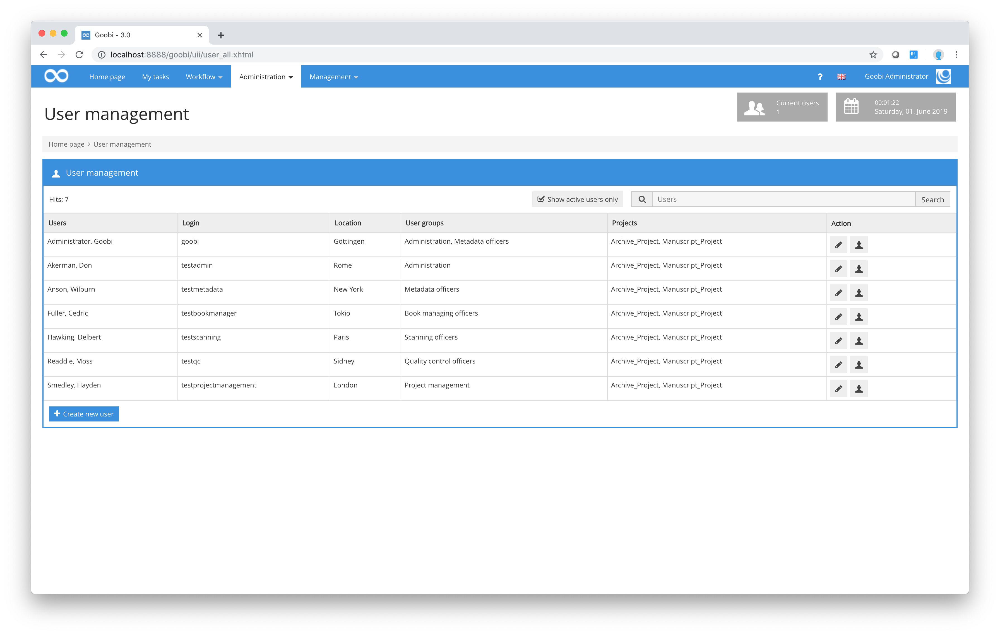
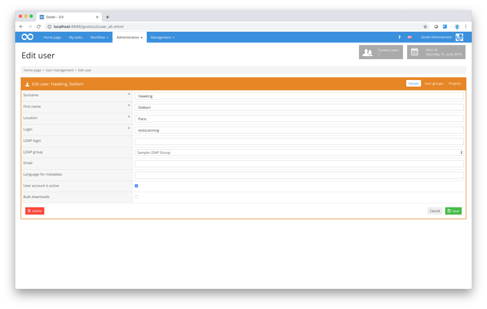
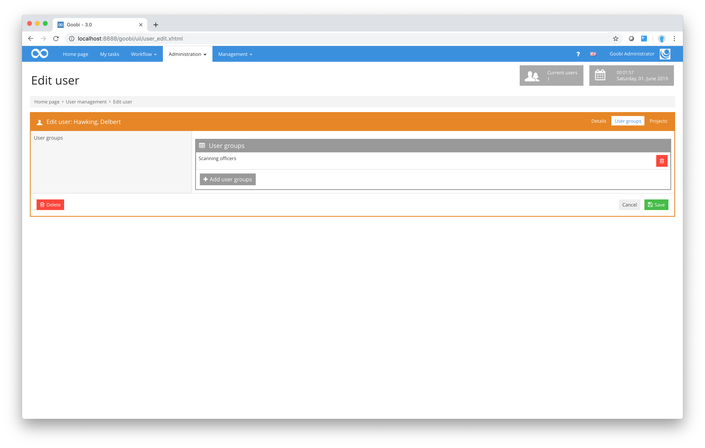
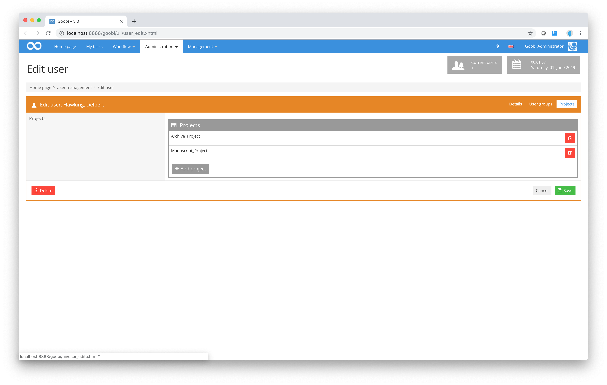

# Users

In order to specify and manage the users that you want to be able to work with your Goobi installation, first select the menu item `Administration - Users` from the menu. This will display a list of all the users currently entered in Goobi. In the `Users` column, you will see the first name and surname of each registered user. The `Location` column tells you the establishment or town where the user is based. The User groups column shows you the user groups to which that user belongs. In the Projects column, you can see which projects each user has been assigned to.

Finally, in the `Actions` column, you can edit the details for each user. As an administrator, you now have an option to select a user and switch to that users role.

| Icon | Description |
| :--- | :--- |
|  | Create new user |
|  | Edit existing user |
|  | Switch to users role |

To do so, click on the icon to the right in the `Actions` column. This will switch your own authorisation level and role as an administrator to those of the selected user, allowing you for test purposes to check how Goobi behaves for a specific user. This can be particularly useful if individual users have reported problems that cannot otherwise be traced. By switching to the authorisation level and role of a specific user, you can see exactly how the interface appears to that user without that person having to give you his/her user name and password.

Just above the list of users, you will find an option that allows you to display inactive users as well as active users. To do so, click on the checkbox `Only show active users`. This will remove the tick and deactivate the default setting which restricts the display to active users.

You can also use the filter above the table to search for a specific user from a large list. Simply enter part of that user’s first name or surname and press the enter key to conduct the search.



To add a new user, click on the `Create new user` link below the table. To edit the details for an existing user, click on the first icon in the `Actions` column for that user.



The `Edit user` dialogue box allows you to change the details already stored in Goobi for that person. As well as the `Surname`, `First name` and `Location`, you can also assign a Goobi `Login` and `Password`.

If Goobi has been instructed at the main configuration stage to authenticate each user against a configured LDAP, you will at this point need to specify for each person which server is to be used for authentication.

In the `Metadata language` input field, you can use a language code in free text form. Please ensure that the language code you use matches exactly the code defined in the ruleset with which users will be working in the METS Editor. In the example given below, the rulesets must contain a localised form of the metadata and structure data descriptors (`language`) for English with the language code `en`. If the field is left empty, the language set in the browser is used in the metadata editor.

**Localisation of the metadata item 'logicalPageNumber' for various languages within a ruleset**

```xml
<MetadataType>
    <Name>logicalPageNumber</Name>
    <language name="de">logische Seitenzahl (gedruckte Seitenzahl)</language>
    <language name="en">logical page number</language>
    <language name="es">número de página lógico</language>
</MetadataType>
```

You can specify in the `Edit user` dialogue box whether the user’s Goobi account should be active or inactive. This means you can configure Goobi in such a way that existing user accounts remain in place even though the corresponding users are no longer authorised to access those accounts. This is particularly important to avoid any potential loss of existing information from source material that has already been processed or any difficulties conducting statistical searches that might otherwise be caused by the removal of individual users from the database. It also ensures that information about source material whose workflow was completed some time ago can be analysed precisely and that project managers or administrators can identify which person performed which tasks and when. This can be particularly useful in the event of an error.

By activating the `batch download` checkbox, you can allow individual users to display a more extensive list of tasks of possible actions underneath the `My tasks` list. These enable the user to accept several tasks at the same time and to work on them all together, e.g. in an automated batch process to optimise image quality. Once tasks such as these are completed, the source work images corresponding to the process will be stored in the folder provided by Goobi for batch upload on that user’s work drive. This folder is often called 'Ready', 'Done' or similar. This can be configured individually for each Goobi installation. Placing more than one folder of related tasks in the batch upload folder allows users to close all finished tasks for which there is a related folder in the batch upload folder by means of a single click in the `Possible actions` area. This method enables users to accept and close a large number of tasks simultaneously.

Thanks to its comprehensive system of user authorisations, Goobi ensures that each person can be assigned not only to different projects but also to different roles. Furthermore, every user can perform more than one role at the same time. In this context, roles can also be understood as levels of qualification or as skills. These roles can be assigned in the `User groups` area. To assign additional roles to a specific user, simply click on the `Add user groups` button for that user.



In the `User group` window, select all the user groups to which you want to assign the user and then click on the Save button to confirm your selection. You will find that the selected user has now been assigned to those user groups. You can follow the same process to assign users to projects.



To remove a person from a particular user group or project, click on the symbol for deletion next to that user group or project. Next, to apply permanently any changes you have made, click on the `Save` button.


If you have added any new users whose login details need to be authenticated by the configured LDAP server, you will need to open their details again in the `Edit user` dialogue box after first entering them. The additional icon next to the LDAP group configuration will not be visible to the user until that user has been stored and the corresponding details re-opened in the dialogue box. Click on this symbol to re-enter the user’s details in the configured LDAP. Once this step is completed, the user will be able to log in.



In order to set a user as a super administrator, a super administrator must already exist so that this super administrator can set further super administrators. If no super administrator has been set so far, the following command must be issued within the database:

```sql
update benutzer set superadmin = true where BenutzerID=123456;
```
