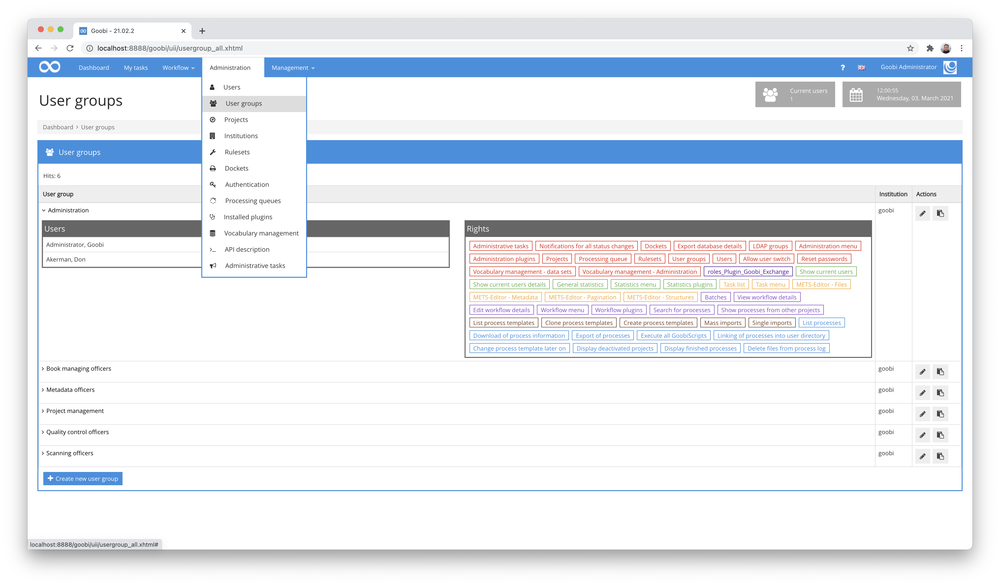
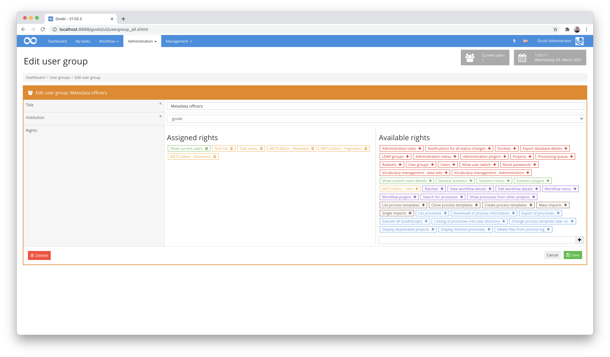
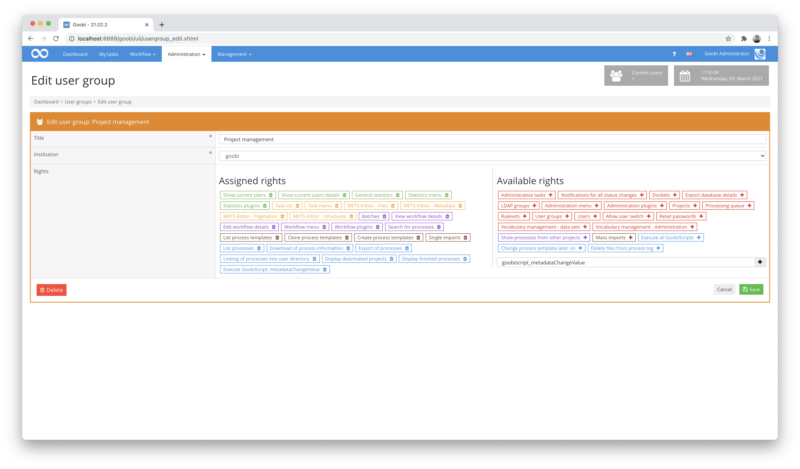

# User groups

In order to ensure flexibility in the handling of freely configurable workflows and the corresponding users, you will need to define a number of user groups. These user groups can be understood as the roles, activities or skills of individual users within the workflow. By way of example, user groups can be created for scan operators, metadata editors and administrators. You are free to define these groups as you wish in Goobi and then assign individual users to them. To open the list of existing user groups, click on the menu item `Administration - User groups` in the menu. Goobi will display a list of all the user groups that have already been defined. For each of these user groups, you can also display a list of all the users assigned to that group. To show this list, simply click on the little symbol to the left of the user group name.

To create additional user groups, click on the Create new user group link. To edit existing user groups, however, you need to click on the Edit symbol in the Actions column.

| Icon | Description |
| :--- | :--- |
|  | Create new user group |
|  | Edit existing user group |

Within the editing mask, a title must always be assigned to a user group. This can be freely selected. Please make sure that you select this title as descriptively as possible to give you and other administrators in Goobi a better overview.

Very granular permissions can now be assigned to each defined user group. These can be added in the right area of the form by simply clicking on an authorization. A click on an authorization in the left area removes it from the user group.

The following authorizations are available for selection:

## Authorizations at administrative level

### Administration menu

This permission allows the user to view and use menu items in the Administration menu.

### Administrative Tasks

This permission allows access to the administrative area, in which a message can be sent to all logged in users.

### Dockets

This authorization allows you to list and edit dockets.

### LDAP groups

This permission allows you to list and edit LDAP groups.

### Administration plugins

This authorization allows the execution of administration plug-ins, as long as they are installed and do not require special individual rights.

### Projects

This authorization allows you to list and edit projects.

### Rulesets

This authorization allows you to list and edit rulesets.

### User Groups

This authorization allows you to list and edit user groups and their authorizations.

### User

This authorization allows you to list and edit users.

### Allow user switch

This authorisation allows you to switch to the user account of another Goobi user without having to use their login data. A precondition for this is, however, that the User authorization and the Administration menu are also available.

### Show current users

This authorization allows you to display information on how many users are currently actively working in Goobi.

### See current users details

This authorization allows you to display the number of active users in Goobi as well as a detailed list of exactly which users are involved and when they last showed activity.

### Delete files from process log

With this permission the user has the possibility to delete files that have been uploaded for a process within the process log or in one of the directories `import/`, `export/` or `source/`.

### Notifications for all status changes

Users with this permission can configure for which status changes they want to be notified. Within the user settings of each user, there are fields available that define the notification for status changes by mail. A notification is possible for the status change of tasks in the following cases:

* When tasks are ready for editing
* When tasks are accepted for processing by a user
* When tasks have been completed
* When tasks reach an error status

## Authorizations for Statistics

### Statistics menu

This permission allows the user to view statistics and use menu items in the menu.

### General Statistics

This authorization guarantees access to the standard statistics available within Goobi.

### Statistics plugins

This authorization allows additionally installed statistics plug-ins to be called.

## Authorizations for Tasks

### Task menu

This permission allows the user of the My Tasks menu to view and work with My Tasks.

### Task List

This permission allows you to view and work with the user's own task list.

### METS Editor - Pagination

This authorization determines whether users with access to the internal metadata editor are allowed to work with the Pagination area.

### METS Editor - Structural Data

This authorization determines whether users with access to the internal metadata editor are allowed to work with the Structure Data area.

### METS Editor - Metadata

This authorization determines whether users with access to the internal metadata editor are allowed to work with the Metadata area.

### METS Editor - Files

This authorization determines whether users with access to the internal metadata editor are allowed to work with the Files area.

## Authorizations for Workflows

### Workflow menu

This permission allows the user to see and use menu items in the Workflow menu.

### Search for processes

This authorization controls whether the user may use the search mask to search for processes.

### Show processes from other projects

This authorization determines whether a user may also see processes in which he himself is not a member.

### Batches

This authorization determines whether the user may group processes into batches or modify existing batches.

### View workflow details

This permission determines whether a user is allowed to see the details of a process.

### Edit workflow details

This permission determines whether a user can see and edit the details of a process.

### Workflow plugins

This authorization allows additionally installed workflow plug-ins to be called.

## Authorizations for Production Templates

### List of process templates

This authorization controls whether a user has access to the list of process templates.

### Clone process templates

This authorization determines whether a user may clone an existing process template in order to create a new process template.

### Creating process templates

This authorization determines whether a user can create new process templates.

### Single imports

This authorization enables the user to create new processes individually on the basis of existing process templates.

### Mass imports

This authorization enables the user to create new operations on the basis of existing process templates by carrying out a mass import.

## Authorizations for operations

### List processes

With this authorization, the user has the option of having processes listed.

### Change process template later on

With this authorization, the user has the option of subsequently changing the process template to be used for an existing process.

### Download of process information

With this authorization, the user has the option of downloading process information as an XML file.

### Export of processes

With this authorization the user is able to perform a tabular export of a process list.

### Linking of processes in home directory

This authorization can be used to determine whether a user may create a link to the data in his home directory for a desired process.

### Display deactivated projects

This permission can be used to determine whether a user can also see processes from deactivated projects.

### Display finished processes

This authorization can be used to specify whether a user is to be given access to finished processes.

### Run all GoobiScripts

This permission gives the user the rights to apply all GoobiScripts over a number of operations.

## Individual GoobiScripts

It is possible for user groups to be given specific rights to execute selected GoobiScripts. For this purpose, the assignment of the permission is not done by clicking on one of the indicated rights in the right area. Instead, the GoobiScript to be allowed is named in the right input field and is accepted by clicking on the button with the plus icon. The assignment of the permission is done in such a way that `goobiscript_` is entered followed by the name of the concrete GoobiScript.

Accordingly, the following authorizations can be assigned as examples:

| Name of GoobiScript | Assigning the GoobiScript as a permission |
| :--- | :--- |
| addStep | `goobiscript_addStep` |
| metadataChangeValue | `goobiscript_metadataChangeValue` |
| setStepProperty | `goobiscript_setStepProperty` |