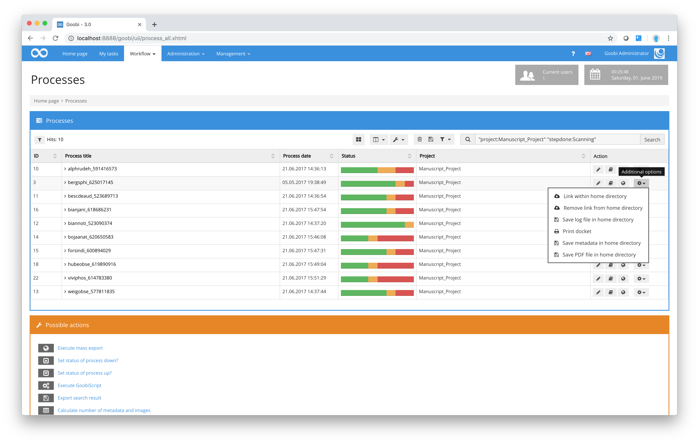

# Activity

If you need even more detailed information about a process, click on the first symbol in the `Actions` column for that process. This will open the detailed view window for that process with a number of options for specific purposes. You can also perform other actions for each process. Details of these possible actions can be found in the `Actions` column for each process. Some of the possible action symbols will not be activated if the status of the process does not yet permit that action to be performed. You cannot, for example, generate a pdf for a process if it does not yet contain any images. In such cases, the `Generate PDF` symbol will be deactivated.

The following options are available for each process in the `Actions` column:

## Possible actions for individual processes

|**Icon | Description of action for the selected process**|
| :--- | :--- |
|  | Open detailed view for the process and edit workflow steps, physical source, workpiece and associated properties. |
|  | Open the METS Editor for the selected process to amend the structure data, metadata and pagination. |
|  | `Generate a link on the current user’s work drive`: This involves creating a link for the selected process on your own work drive that permits you to access the images for that process. This allows the administrator to access the associated process files at any time regardless of the current status of the process, in order, for example, to review or amend them.|
|  | `Remove link from work drive`: Once you have finished editing or viewing the data for a specific process, any link can be removed from the user’s work drive to prevent any further access to the process data.|
|  | `Generate docket`: A docket is generated whenever a process is first created. Should it be necessary to generate another docket at a later stage, this can be done here at any time. If you click on this symbol, Goobi will prompt you to download a pdf file that you can print out and use for whatever purposes may be required. |
|  | `Generate METS file`: This option allows you to generate a full METS file for a specific process outside the normal workflow. When you click on the symbol, Goobi will create and store a METS file on your work drive. |
|  | `Generate PDF`: This option allows you to create a pdf file for a specific process. Depending on your configuration, Goobi will either store the pdf directly on your work drive or prompt you to download it. Depending on the status of the process, a pdf file generated in this context will contain either just the images entered for that process or may also contain structural information. If structure data and metadata have already been recorded for that process using the METS Editor, they will also be included in the pdf. In such cases, the pdf file generated by Goobi will contain a linked index of contents. |
|  | `Export to the Document Management system`: Using this symbol you can re-export a specific process to the configured presentation system regardless of its workflow status. This involves exporting the assigned digital objects (mostly images) and the METS file to a designated directory within the project that is responsible for transfers to the presentation system. Once you have completed the export process, Goobi will display a message to indicate that the export has been successful (or failed) with information about the status of the export. |

It is important to note that all of the possible actions offered by Goobi can be performed for individual processes or a number of processes together regardless of their current status. This allows users with manager-level or administrator-level authorisation to access and if necessary amend the data for specific processes at any time.