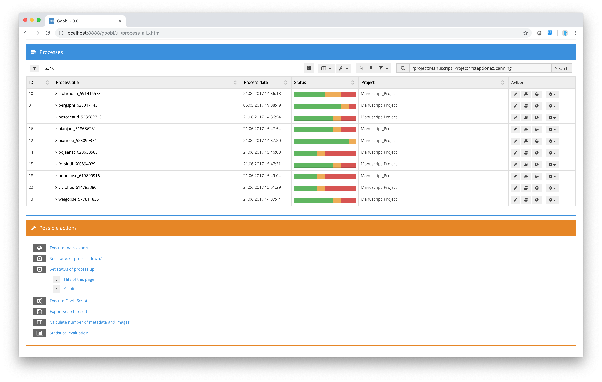

# Activities for hit lists

As well as the options described above allowing users to edit or amend each volume independently of the current status of the workflow and to process its structure data or metadata or re-export the data to the presentation system, with Goobi you can also apply different actions to a whole group of processes. These actions are applied to all of the processes displayed in the table. If you want to restrict the change or action to a particular selection of processes, you will need to filter the list accordingly. To do so, simply use the `Filter processes` box, the list of predefined filters or Goobi’s search function to list only those processes you wish to edit.

Once you have adjusted the list of processes to meet your requirements, you can apply the available actions \(shown underneath the process table\) to that list. For each action, you can also choose whether to apply the action to the entire set of matches \(i.e. all the filtered processes\) or just to the processes listed on the page of the table that is currently being displayed. You will be prompted to make this selection when you click on one of the available actions.

The table below contains a description of each possible action.

_**Description of actions that can be applied to a group of processes**_

| **Icon** | **Description** |
| :--- | :--- |
|  | **Export metadata to Document Management System \(DMS\)**: Click this action if you want to export the filtered processes to the presentation system. Please note that this export can take much longer because of the huge volume of data that your selection may contain. When you export data in this way, Goobi will copy both the images and the METS file to the target location configured for the project. |
|  | **Set status of processes up:** Select this action to change the workflow status of a group of processes. Every time you click this action, the status of each of the processes in the group will be advanced by one level for the current workflow step. For example, steps that already have the status `In progress` will be set to `Completed` and the next tasks in the workflow will move from `Locked` to `Open`. Every time you click this action, you are therefore moving the workflow forward by one step. |
|  | **Set status of processes down:** This action changes the workflow status in the same way as the action `Set status of processes up` \(see above\). The workflow status of all the individual process tasks will be reversed \(i.e. set back\) by one level compared to their previous status. This allows you to edit the status of a large number of processes at the same time. |
|  | **Execute GoobiScript:** If you click on the action `Execute GoobiScript`, you will be shown a list of different scripts that can be applied to the group of processes you have selected. A detailed description of the possible GoobiScripts is given in [section GoobiScript](7.4.md). |
|  | **Export search results:** This action opens a further area in which you can save the results of a search and the actual search. In each case, you can specify the information you want to include in the search results. The results can be saved as an Excel, Word, rich text or PDF file. You can use Goobi’s central configuration file to specify the columns to be made available in each case. |
|  | **Calculate number of metadata and images:** Click on this action if you want to instruct Goobi to calculate how many structure data, metadata and images are already present in the system for the filtered volumes. Goobi will display a listing of the processes in both graphical and numerical form indicating their size. The listing will also contain a summary table containing average and total figures. |
|  | **Statistical analysis:** Clicking on this action instructs Goobi to generate different statistical analyses based on the filtered processes. You can select from a wide range of statistics. |