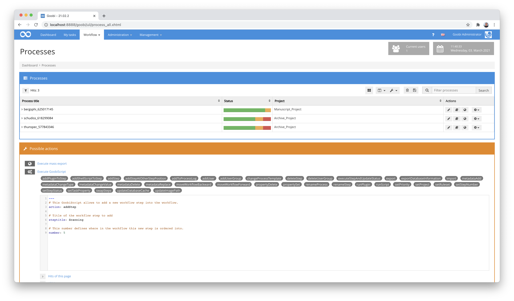
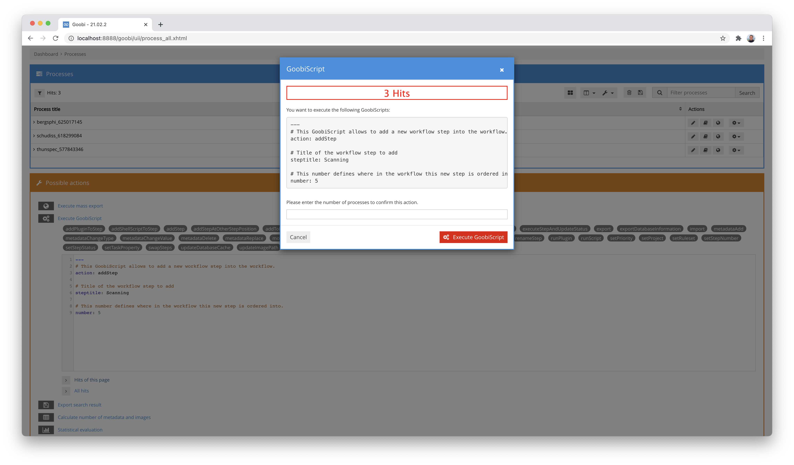
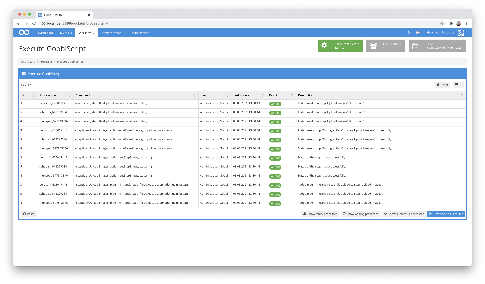

# GoobiScript

When you apply an action to a group of processes, you also have an option to run Goobi scripts within that action. To do so, click on the button `Execute GoobiScript` in the `Possible actions` box. Goobi will display an overview of all the scripts that can be applied to the entire list of processes, to the processes listed on the current page or just to a selection of processes.

For every GoobiScript, you need to enter the name of the script you wish to run as well as the corresponding parameters. These parameters are shown when you click on the script in the list. Replace the parameters shown as examples with your desired settings.



After completing the GoobiScript, you can now apply it to selected hits or the entire hit list. Before the execution, however, a security query appears in which the number of operations to which the GoobiScript should be applied must first be confirmed again.




Please note that you may not have access to all the GoobiScripts that Goobi offers. Some of the GoobiScripts may be hidden. Your user group may also not have been granted access to all GoobiScripts. A more detailed explanation of how to assign permissions to GoobiScripts can be found here:

[https://docs.goobi.io/goobi-workflow-en/manager/6\#individual-goobiscripts](https://docs.goobi.io/goobi-workflow-en/manager/6#individual-goobiscripts)


## Syntax

The syntax for using GoobiScript is based on the [markup language YAML](https://en.wikipedia.org/wiki/YAML). This allows each GoobiScript to have built-in documentation with small help texts and the individual parameters are visually clear with syntax highlighting. Each parameter is placed on its own line and separated from its value by a colon and a space. Contrary to earlier versions of Goobi, values for parameters containing spaces are now also possible within GoobiScript without having to enclose them in quotes. A simple GoobiScript is structured exemplarily like this:

```yaml
---
# This GoobiScript allows to add a new workflow step into the workflow.
action: addStep

# Title of the workflow step to add
steptitle: Upload images

# This number defines where in the workflow this new step is ordered into.
order: 3
```

The lines starting with a hash `#` form comments for help purposes. They can also be omitted before submitting the GoobiScript. Accordingly, the GoobiScript is a bit more compact afterwards:

```yaml
---
action: addStep
steptitle: Upload images
order: 3
```

## Run multiple GoobiScripts together

Thanks to the change to the new syntax, it is now also relatively unproblematic to have several GoobiScripts started together. Note that each GoobiScript is separated from the previous GoobiScript by the `---` character. This way you can easily combine several commands and start them together. This could look like this, for example:

```yaml
---
# This GoobiScript allows to add a new workflow step into the workflow.
action: addStep

# Title of the workflow step to add
steptitle: Upload images

# This number defines where in the workflow this new step is ordered into.
order: 3

---
# This GoobiScript allows to assign a user group to an existing workflow step.
action: addUserGroup

# Title of the workflow step to be edited
steptitle: Upload images

# Use the name of the user group to be assigned to the selected workflow step.
group: Photographers

---
# This GoobiScript allows to change the current status of a specific step in the workflow.
action: setStepStatus

# Title of the workflow step to be changed
steptitle: Upload images

# Value of the status. Possible values are `0` (locked), `1` (open), `2` (in work), `3` (done), `4` (error), `5` (deactivated)
status: 1

---
# This GoobiScript allows to add a plugin to a defined workflow step
action: addPluginToStep

# Title of the step to adapt
steptitle: Upload images

# Name of the plugin to be assigned to the workflow step
plugin: intranda_step_fileUpload
```

Here, too, the commas can be omitted accordingly for a shortened application, so that the entire call becomes clearer:

```yaml
---
action: addStep
steptitle: Upload images
orderorder: 3
---
action: addUserGroup
steptitle: Upload images
group: Photographers
---
action: setStepStatus
steptitle: Upload images
status: 1
---
action: addPluginToStep
steptitle: Upload images
plugin: intranda_step_fileUpload
```


The processing of such multiple GoobiScripts takes place after sending in the order of the naming in each case over all affected processes. Related to this example this means, if 3 processes are concerned the following processing:




Please avoid starting additional GoobiScripts unless other GoobiScripts are already being processed. Otherwise, the processing of Goobi scripts may be interrupted. This limitation will be fixed in future versions of Goobi workflow.


## Available GoobiScripts
You can choose from the following Goobi scripts:


### GoobiScript: addUser
The GoobiScript `addUser` allows you to add a new user to a specific workflow step. Before you apply this Goobi script, you should ensure that you have the correct login name for the user you wish to add to that step. You also need to check the exact name of the step to which you want to add a new user. For the parameter `steptitle` you should select the name of the step to which you want to add the new user.


### GoobiScript: addUserGroup
The GoobiScript `addUserGroup` is similar to `addUser`, as it gives additional user rights for workflow steps. For the parameter `steptitle`, enter the full name of the step to which you want to add a user group, and for the parameter entitled `group` enter the exact name of the user group you wish to add for that step.


### GoobiScript: cloneProcess
The GoobiScript `cloneProcess` allows the duplication of one or more Goobi processes. The parameter `content` can be used to specify whether only the database contents and the METS file should be copied or whether all the associated directories (e.g. the images) should also be duplicated. The parameter `title` can be used to control the titles of the processes to be created. The variable system of Goobi is used here and thus allows a high degree of flexibility.


### GoobiScript: renameProcess
The GoobiScript `renameProcess` allows you to rename a process or several Goobi processes. A search string is defined with the `search` parameter, the new value with `replace` and the search method with `type` (defined values `contains` - the search value should be contained in the process title - or `full` - the process title must match the search value exactly). Both the task title in the workflow and the image directories of the process in the file system are renamed.


### GoobiScript: deleteTiffHeaderFile
For the GoobiScript `deleteTiffHeaderFile` there is no need to enter additional parameters. Running this GoobiScript will delete any previously created TIFF header files that can be used by a program that writes the TIFF headers into the images. This allows you, for example, to make centrally modified TIFF headers available for future use, since missing TIFF header files are automatically created on the basis of the configuration the next time the file is accessed.


### GoobiScript: swapSteps
The GoobiScript `swapSteps` allows you to swap the order of two steps within the workflow of a number of processes. To perform a swap, you need to provide the details of each of the steps involved. Enter the workflow number and full name of the first and second step. Running this script will then swap the order of the steps you have specified. This makes it very easy to change workflows across a large number of processes.


### GoobiScript: importFromFileSystem
The GoobiScript `importFromFileSystem` imports existing image sets from a defined output directory into processes that have already been created in Goobi. This can be useful if you want to import projects into Goobi that were created before Goobi was installed. Please note that all the image directories within the specified output directory must have the same name as the processes in Goobi. An automatic import from the file system can only be performed correctly if the folder name and process title are identical. For the parameter entitled `sourcefolder`, you need to specify the location of the individual directories containing the processes you wish to import.


### GoobiScript: setRuleset
The GoobiScript `setRuleset` allows you to make a central change to the Goobi ruleset for a group of processes. This could be particularly important after detailed editing and testing of a ruleset \(for safety reasons this is performed separately in a newly created ruleset\), if you then wish to apply the new ruleset to the processes. For the parameter entitled `ruleset`, you need to specify the name of the ruleset using the name as it appears in the ruleset list in Goobi. The newly assigned ruleset will be entered when you run the GoobiScript, regardless of which ruleset is currently in place for the individual processes being changed.


### GoobiScript: deleteStep
You can run the GoobiScript `deleteStep` if you want to delete a specific step from the workflow for a group of processes. Running the script will delete the workflow step \(specified by its full name in the parameter `steptitle`\) from the list of selected processes. Please note that this GoobiScript will also delete any production-related data being stored for that particular workflow step \(e.g. project staff, processing date, status\).


### GoobiScript: addStep
The GoobiScript entitled `addStep` allows you to automatically create a new step with a specific name and a specific position in the workflow order. For the parameter `steptitle`, enter the name of the new step, and for the parameter `order` enter the required workflow order number. In addition to numerical values, the keyword `end` can also be used to add the step to the end.


### GoobiScript: addStepAtOtherStepPosition
The GoobiScript `addStepAtOtherStepPosition` enables the creation of a workflow step with a defined title at a defined position within the workflow where another workflow step is already located. By inserting the new workflow step, all existing workflow steps with this or a subsequent position are moved so that the new workflow step can be inserted at the desired target position. The parameter `newsteptitle` allows you to define the title for the new workflow step to be inserted. The parameter `existingsteptitle` defines the name of the workflow step that determines the target position of the step to be inserted. The parameter `insertionstrategy` defines whether the new step is to be inserted before \(`before`\) or after \(`after`\) the specified existing step.


### GoobiScript: setStepStatus
You can choose the GoobiScript `setStepStatus` to modify the workflow status for a group of processes at the same time. For the parameter `steptitle`, you need to enter the name of the workflow step whose status you wish to change. For the status `parameter`, you should enter the required numerical value using the system:

```text
0 = locked
1 = open
2 = in progress
3 = closed
4 = error
5 = deactivated
```


### GoobiScript: setStepNumber
Using the GoobiScript `setStepNumber` you can modify the workflow order number of an individual step for a group of processes. For the parameter `steptitle` you need to enter the full name of the workflow step you wish to change. For the `number` parameter you should enter the workflow order number you want to apply to that step for all the selected processes.


### GoobiScript: addShellScriptToStep
The GoobiScript `addShellScriptToStep` allows you to add shell scripts or other command-line calls to designated workflow steps in a group of processes. For the parameter `steptitle` you need to specify the full name of the steps you wish to change. For the `script` parameter, enter the full command that you wish Goobi to execute in the form of a command-line call whenever this step is activated.

Please note that shell commands at Linux level begin with `/bin/bash/`.

In the parameter `label` you define the name for the shell script.


If parameters are to be grouped in the command so that they are passed as one argument to the new process, the quotes required for this must be escaped with a preceding quote each. An example for the `script` parameter would be accordingly:

`script: /bin/bash /path/to/script.sh "parameter with blanks"`



### GoobiScript: setStepProperty
You can use the Goobi script `setStepProperty` to set individual options for a specific workflow step in a group of processes at the same time. For the parameter `steptitle`, you should enter the full name of the step you wish to select. For the property `parameter`, you will need to select one of the following values:

| Parameter | Description |
| :--- | :--- |
| `metadata` | for changing the metadata property |
| `readimages` | for changing the property whether a reading access to the images should be possible |
| `writeimages` | for the property whether a write access to the images should take place. |
| `validate` | for the property whether a validation should take place when the workflow step is completed |
| `exportdms` | for the property whether the workflow step should be able to perform an export to the presentation system |
| `batch` | for the property whether the workflow step should be executed together with all other workflow steps in batch mode |
| `automatic` | for the property whether the workflow step should be executed automatically |
| `importfileupload` | for the property whether a file upload should be used for the import in this workflow step  \(Please note that this function is no longer used in Goobi\). |
| `acceptandclose` | for the property whether the workflow step should be accepted directly without action and closed again \(Please note that this function is no longer used in Goobi\) |
| `acceptmoduleandclose` | for the property whether a module of a work step should be accepted and executed and the workflow step should also be completed immediately.  \(Please note that this function is no longer used in Goobi\). |
| `script` | for the property whether the step should execute a script |
| `delay` | for the property whether this workflow step is a delay workflow step that should wait a configured time |
| `updatemetadataindex` | for the property that the internal database index is to be updated in this workflow step |
| `generatedocket` | for the property whether the user should be able to download a docket in this workflow step |

You should also set the value of the actions you have specified here to activated or deactivated by entering the values `true` or `false` for the value parameter..


**Sample:** For example, if you select `Scanning` as the `steptitle`, `writeimages` as the `property` and `true` as the `value` and apply this GoobiScript to a group of processes, this will allow a user who accepts the step entitled `Scanning` to have write access to the images in his/her working directory for that step.



### GoobiScript: export
The GoobiScript `export` allows you to export a large number of processes. The parameters `exportImages` and `exportOcr` can be used to specify whether the associated images and OCR data should be exported. If an export plugin has been configured in the workflow, that plugin will be loaded and used for the export; if not, Goobi will run the default export.


### GoobiScript: runScript
Using the GoobiScript `runScript`, you can initiate a script for a particular workflow step outside the regular workflow. The parameter `steptitle` is used to enter the full title of the workflow step whose scripts you wish to run.

If the workflow step contains a number of scripts, you can specify which one you wish to run using the `script` parameter. If this parameter is left blank, all the scripts for that workflow step will be run in the specified sequence.


### GoobiScript: deleteProcess
As the name suggests, the GoobiScript `deleteProcess` is used to delete processes. You have to use the parameter `contentOnly` \(value `true` or `false`\) to specify whether Goobi should delete only the data from the file system or, additionally, all the information from the database.


### GoobiScript: addPluginToStep
The GoobiScript `addPluginToStep` allows you to add plugins to workflow steps. You can use the parameter `steptitle` to specify the name of the workflow step and the parameter `plugin` for the identifier of the plugin that you wish to add.


### GoobiScript: updateImagePath
The GoobiScript `updateImagePath` updates the path to the image files within the METS files. No parameters are required to run this GoobiScript.


### GoobiScript: updateContentFiles
The GoobiScript `updateContentFiles` updates the list of all image files within the METS files. No parameters are required to run this GoobiScript.


### GoobiScript: addToProcessLog
The GoobiScript `addToProcessLog` allows adding messages to the process log. The `type` parameter determines how the message should be classified. The `message` parameter specifies the content of the message.

| Possible types | Description |
| :--- | :--- |
| `debug` | Internal system messages, primarily for administrators |
| `info` | Information messages that every user should be able to see |
| `warn` | Warning messages that every user should see |
| `error` | Error messages that every user should see |
| `user` | User comments that users enter visibly for all other users |


### GoobiScript: setProject
The GoobiScript `setProject` allows you to assign the selected tasks to a defined project. The parameter `project` specifies which project should be used for this.


### GoobiScript: runPlugin
The GoobiScript `runPlugin` allows the execution of a step plugin for the selected tasks. The parameter `steptitle` determines the step of the affected tasks from which the plugin is to be executed.


### GoobiScript: import
The GoobiScript `import` is not intended for execution by users from the user interface. Instead, it is started during the execution of mass imports from the selected plugin. It then performs a mass import in the form specified in the import plug-in. The parameter `plugin` defines the unique name of the plugin. The `identifiers` parameter determines which identifiers the data records have that are to be imported. The parameter `template` determines which production template is to be used for the import.


### GoobiScript: metadataDelete
The GoobiScript `metadataDelete` allows you to delete metadata from a process. The `field` parameter specifies the type of metadata, where the internal rule set name must be used. The `value` parameter defines the content of the metadata. The parameter `ignoreValue` determines whether the content of the parameter value is to be ignored and whether the metadata is to be deleted independently of its value. The parameter `type` can be used to control whether the metadata to be deleted are present as normal metadata, whether they occur within a named metadata group, or whether an entire metadata group is to be deleted. The parameter `group` allows the naming of the group concerned. The following application scenarios apply:

- If `metadata` is given as value within `type` (or no value is given) and no name is given within the parameter `group`, a normal metadata is deleted.
- If `metadata` is specified as the value within `type` (or no value is specified) and a name is specified within the parameter `group`, the metadatum is changed within the named group.
- If `group` is specified as the value within `type`, the group named within the parameter `field` is deleted. 

The parameter `position` allows you to specify where the metadata should be found:

| Position | Description |
| :--- | :--- |
| `work` | This parameter specifies that the metadata should be adjusted at the level of the physical work. This selection automatically chooses the main element \(e.g. a monograph\) or, in the case of an anchor record, the sub-element \(e.g. the periodical volume\). |
| `child` | This parameter specifies that the metadata should be adjusted at the level of the sub-element of an anchor record \(e.g. a periodical volume or volume\). |
| `top` | This parameter specifies that the metadata should be adjusted at the level of the anchor record \(e.g. at the level of a journal or a multi-volume work\). |
| `any` | This parameter specifies that the metadata should be adjusted at all levels of the object \(e.g. in the volume, in all chapters, title pages, illustrations, etc.\). |
| `physical` | This parameter specifies that the metadata within the physical structure elements should be adjusted \(e.g. metadata of the individual pages\). |


**Sample calls:**

Delete a metadata entry on top level:

```yaml
---
action: metadataDelete
field: DocLanguage
value: deutsch
position: child
ignoreValue: false
```

Delete a metadata entry on top level, but the current value should be ignored

```yaml
---
action: metadataDelete
field: DocLanguage
value: deutsch
position: top
ignoreValue: true
```



### GoobiScript: metadataAdd
The GoobiScript `metadataAdd` allows you to add new metadata to a process. The `field` parameter defines the type of metadata, where the internal ruleset name must be used. The `value` parameter defines what content the new metadata should contain. The parameter `ignoreErrors` determines whether, in the event of an error, the processing and saving of the METS file should be continued or the processing for the object should be aborted. The parameter `type` can be used to control whether the change is to be made to a simple metadata or within a metadata group. The parameter `group` defines the metadata group to which the metadata is to be added. The following application scenarios exist:

- If `metadata` is given as value within `type` (or no value is given) and no name is given within the parameter `group`, the metadata is added as normal metadata.
- If `metadata` is given as the value (or no value is given) and a name is given within the `group` parameter, a metadata is added to the named group.
- If `group` is specified as the value, a new metadata group is created with the name specified within the `group` parameter.

The parameter `position` allows you to specify where the metadata should be added:

| Position | Description |
| :--- | :--- |
| `work` | This parameter specifies that the metadata should be adjusted at the level of the physical work. This selection automatically chooses the main element \(e.g. a monograph\) or, in the case of an anchor record, the sub-element \(e.g. the periodical volume\). |
| `child` | This parameter specifies that the metadata should be adjusted at the level of the sub-element of an anchor record \(e.g. a periodical volume or volume\). |
| `top` | This parameter specifies that the metadata should be adjusted at the level of the anchor record \(e.g. at the level of a journal or a multi-volume work\). |
| `any` | This parameter specifies that the metadata should be adjusted at all levels of the object \(e.g. in the volume, in all chapters, title pages, illustrations, etc.\). |
| `physical` | This parameter specifies that the metadata within the physical structure elements should be adjusted \(e.g. metadata of the individual pages\). |

Any authority data can also be added using the `authorityName` and `authorityValue` parameters.



**Sample calls:**

Adding a metadata entry on top level:

```yaml
---
action: metadataAdd
field: DocLanguage
value: deutschTop
position: top
ignoreErrors: false
```

Adding a metadata entry on second level:

```yaml
---
action: metadataAdd
field: DocLanguage
value: deutschChild
position: child
ignoreErrors: false
```

Adding a metadata entry with authority data:

```yaml
---
action: metadataAdd
field: DocLanguage
value: deutschChild
position: child
ignoreErrors: false
authorityName: gnd
authorityValue: 123456789X
```




### GoobiScript: metadataReplace
The GoobiScript `metadataReplace` allows you to replace a metadata with a new value. The old value is thus replaced by another value and is therefore no longer available. The `field` parameter determines which type the metadata has, whereby the internal ruleset name must be used here. The `search` parameter defines the current content of the metadata. The `replace` parameter defines which content the metadata is to have instead. The parameter `group` specifies whether the change is to be made within a metadata group. If no value is given here, the change is made to a normal metadata. If, on the other hand, a value is given, the change of the metadata takes place within the named metadata group. 
The parameter `position` allows you to specify where the metadata to be replaced should occur and be replaced:

| Position | Description |
| :--- | :--- |
| `work` | This parameter specifies that the metadata should be adjusted at the level of the physical work. This selection automatically chooses the main element \(e.g. a monograph\) or, in the case of an anchor record, the sub-element \(e.g. the periodical volume\). |
| `child` | This parameter specifies that the metadata should be adjusted at the level of the sub-element of an anchor record \(e.g. a periodical volume or volume\). |
| `top` | This parameter specifies that the metadata should be adjusted at the level of the anchor record \(e.g. at the level of a journal or a multi-volume work\). |
| `any` | This parameter specifies that the metadata should be adjusted at all levels of the object \(e.g. in the volume, in all chapters, title pages, illustrations, etc.\). |
| `physical` | This parameter specifies that the metadata within the physical structure elements should be adjusted \(e.g. metadata of the individual pages\). |

Any authority data can also be added or changed using the `authorityName` and `authorityValue` parameters.



**Sample calls:**

Search for a value within a certain top-level metadata and replace it with something else:

```yaml
---
action: metadataReplace
field: DocLanguage
search: deutschTop
replace: deutschNewTop
position: top
```

Find a value within a certain second level metadata and replace it with something else:

```yaml
---
action: metadataReplace
field: DocLanguage
search: deutschChild
replace: deutschNewChild
position: child
```



### GoobiScript: metadataReplaceAdvanced

The GoobiScript `metadataReplaceAdvanced` allows replacing a metadata with a new value. In contrast to `metadataReplace`, regular expressions can be used here to manipulate values. 
The `field` parameter determines what type the metadata has, whereby the internal ruleset name must be used here. The `value` parameter defines a regular expression that is applied to the content of the metadata. The parameter `group` specifies whether the change is to be made within a metadata group. If no value is given here, the change is made to a normal metadata. If, on the other hand, a value is given, the change of the metadata takes place within the named metadata group. 
Any authority data can be added or changed using the `authorityName` and `authorityValue` parameters.



**Sample calls:**

Finding a value within a specific top-level metadata and replacing it with something else:

```yaml
---
action: metadataReplaceAdvanced
field: DocLanguage
value: s/deutsch/german/g
position: top
```




### GoobiScript: metadataChangeValue
The GoobiScript `metadataChangeValue` allows the manipulation of existing metadata of a process. Prefixes or suffixes can be added to an existing metadata to extend the content of a metadata. The `field` parameter specifies the type of metadata, where the internal ruleset name must be used. The content of the `prefix` parameter is used to prefix a text with the current value of the metadata. The content of the parameter `suffix` is used to append a text after the current value of the metadata. The parameter `group` specifies whether the change is to be made within a metadata group. If no value is given here, the change is made to a normal metadata. If, on the other hand, a value is given, the change of the metadata takes place within the named metadata group.
The parameter `position` allows you to specify where the metadata should be present and adjusted:

| Position | Description |
| :--- | :--- |
| `work` | This parameter specifies that the metadata should be adjusted at the level of the physical work. This selection automatically chooses the main element \(e.g. a monograph\) or, in the case of an anchor record, the sub-element \(e.g. the periodical volume\). |
| `child` | This parameter specifies that the metadata should be adjusted at the level of the sub-element of an anchor record \(e.g. a periodical volume or volume\). |
| `top` | This parameter specifies that the metadata should be adjusted at the level of the anchor record \(e.g. at the level of a journal or a multi-volume work\). |
| `any` | This parameter specifies that the metadata should be adjusted at all levels of the object \(e.g. in the volume, in all chapters, title pages, illustrations, etc.\). |
| `physical` | This parameter specifies that the metadata within the physical structure elements should be adjusted \(e.g. metadata of the individual pages\). |
| `condition` | This parameter can be used optionally to specify a condition for the replacement of metadata. If this parameter is used and the given value is not empty, the replacement is applyed to all data sets that contain the text given here in the previor metadata field. |


**Sample calls:**

Add a prefix to a top-level metadata::

```yaml
---
action: metadataChangeValue
field: DocLanguage
prefix: start_
suffix: _end
position: top
```

Add a suffix to a top-level metadata, but there must be a specific value in the metadata:

```yaml
---
action: metadataChangeValue
field: DocLanguage
suffix: ist eine schwierige Sprache
position: top
condition: Deutsch
```

Add a prefix and suffix to a second-level metadata:

```yaml
---
action: metadataChangeValue
field: DocLanguage
prefix: start_
suffix: _end
position: child
```



### GoobiScript: metadataChangePersonType
The GoobiScript `metadataChangePersonType` changes the role type of a person. The call requires four parameters. The `oldType` parameter specifies what the old type should be, and the `newType` parameter specifies the type that the person should receive instead. The parameter `ignoreErrors` determines whether, in the event of an error, processing and saving of the METS file should continue or whether processing should be aborted for the object. The parameter `position`, on the other hand, controls where the person should be present to be changed:

| Position | Description |
| :--- | :--- |
| `work` | This parameter specifies that the metadata should be adjusted at the level of the physical work. This selection automatically chooses the main element \(e.g. a monograph\) or, in the case of an anchor record, the sub-element \(e.g. the periodical volume\). |
| `child` | This parameter specifies that the metadata should be adjusted at the level of the sub-element of an anchor record \(e.g. a periodical volume or volume\). |
| `top` | This parameter specifies that the metadata should be adjusted at the level of the anchor record \(e.g. at the level of a journal or a multi-volume work\). |
| `any` | This parameter specifies that the metadata should be adjusted at all levels of the object \(e.g. in the volume, in all chapters, title pages, illustrations, etc.\). |
| `physical` | This parameter specifies that the metadata within the physical structure elements should be adjusted \(e.g. metadata of the individual pages\). |

### GoobiScript: metadataChangeType
The GoobiScript `metadataChangeType` changes the type of a metadata. The call requires four parameters. The `oldType` parameter specifies the old type of the metadatum. The `newType` parameter specifies the new type for the metadata. The parameter `ignoreErrors` controls whether, in case of an error, the processing and saving of the METS file should be continued or whether the processing for the object should be aborted. The parameter `type` can be used to control whether the change is to be made to a simple metadata or within a metadata group. The parameter `group` defines the metadata group for which the metadatum is to be changed. The following application scenarios exist:

- If `metadata` is specified as value within `type` (or no value is specified) and no name is specified within the parameter `group`, a normal metadata is changed.
- If `metadata` is specified as the value within `type` (or no value is specified) and a name is specified within the parameter `group`, the metadata is changed within the named group.
- If `group` is specified as the value within `type`, the type of the named group is changed from the old value (`oldType`) to the new value (`newType`). 

The parameter `position` allows you to specify where the metadatum should occur so that it is affected by the change:

| Position | Description |
| :--- | :--- |
| `work` | This parameter specifies that the metadata should be adjusted at the level of the physical work. This selection automatically chooses the main element \(e.g. a monograph\) or, in the case of an anchor record, the sub-element \(e.g. the periodical volume\). |
| `child` | This parameter specifies that the metadata should be adjusted at the level of the sub-element of an anchor record \(e.g. a periodical volume or volume\). |
| `top` | This parameter specifies that the metadata should be adjusted at the level of the anchor record \(e.g. at the level of a journal or a multi-volume work\). |
| `any` | This parameter specifies that the metadata should be adjusted at all levels of the object \(e.g. in the volume, in all chapters, title pages, illustrations, etc.\). |
| `physical` | This parameter specifies that the metadata within the physical structure elements should be adjusted \(e.g. metadata of the individual pages\). |


### GoobiScript: changeProcessTemplate
The GoobiScript `changeProcessTemplate` allows you to change the workflow for the affected processes. The `templateName` parameter defines which production template is to apply to the operations. If this GoobiScript is applied to processes, Goobi tries to set the steps already performed to the identical status in the updated workflow if possible. This can only succeed if the steps have the same titles.


### GoobiScript: updateDatabaseCache
The GoobiScript `updateDatabaseCache` ensures that the internal database table of the Goobi database is updated with the status of the workflows and the associated media files as well as metadata. This is important if, for example, the metadata has been modified outside of Goobi, or if a new index field has been defined. Among other things, various statistics are based on these database tables and therefore require as up-to-date values as possible for the visualization of information.

No parameters are required to run this GoobiScript.


### GoobiScript: propertySet
The GoobiScript `propertySet` allows you to add and change a process property. The parameter `name` specifies the name of the property. The `value` parameter specifies the value that the property should have. If a property already exists with the name specified here, its value is changed to the value specified here.


### GoobiScript: propertyDelete
The GoobiScript `propertyDelete` allows the deletion of process properties. The parameter `name` specifies the name of the properties to be deleted.


### GoobiScript: executeStepAndUpdateStatus
The GoobiScript `executeStepAndUpdateStatus` executes a selected step and then updates the workflow for further processing of the following work steps. The `steptitle` parameter determines which step is to be executed. After the call, Goobi checks whether this is a script step, an export step, a plug-in step or an HTTP step and executes it accordingly. If the work step is marked as automatic, the further workflow process is continued after the execution. If, on the other hand, the call triggers a wait mode, the status is not changed by Goobi but waits for a status change by the respective plugin or script itself. If an error occurs while the started step is being executed, the status of the workflow step is set to `error`.


### GoobiScript: exportDatabaseInformation
The GoobiScript `exportDatabaseInformation` exports all database contents of the selected Goobi operations to an internal XML file. This is then located in the Goobi file system within the process folder and has a file name that can be used to import the data into another Goobi instance. The path of such a file is e.g.

```text
/opt/digiverso/goobi/metadata/123/123_db_export.xml
```

No parameters are required to run this GoobiScript.


### GoobiScript: moveWorkflowForward
With the GoobiScript `moveWorkflowForward` the status of the workflow can be moved forward step by step. Each time this GoobiScript is executed, the active workflow step is changed accordingly \(e.g. from `open` to `in work`\).


### GoobiScript: moveWorkflowBackward
With the GoobiScript `moveWorkflowBackward` the status of the workflow can be moved backwards step by step. Each time this GoobiScript is executed, the active work step is changed accordingly \(e.g. from `completed` to `in work`\).


### GoobiScript: setPriority
The GoobiScript `setPriority` can be used to define the priority of individual or all process steps. The parameter `priority` determines which `priority` should be used. The following values are available: `standard`, `high`, `higher`, `highest` and `correction`. The parameter `steptitle` determines for which workflow step the priority is to be set. If the parameter `steptitle` is not specified, the priority is changed for all workflow steps of the selected processes.