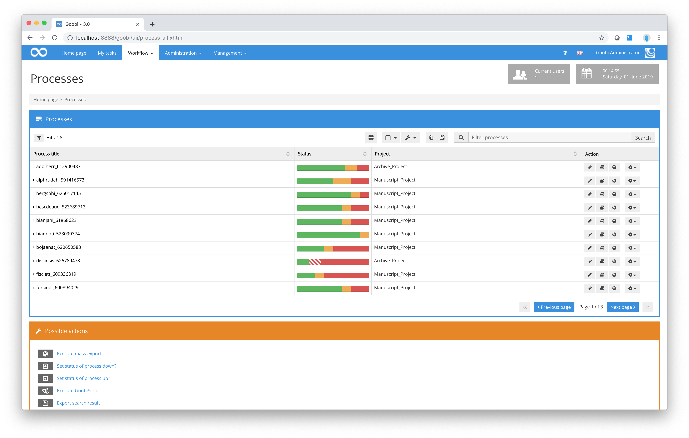
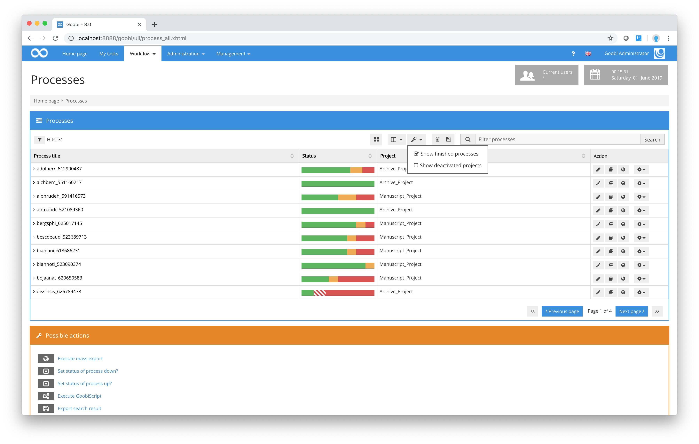
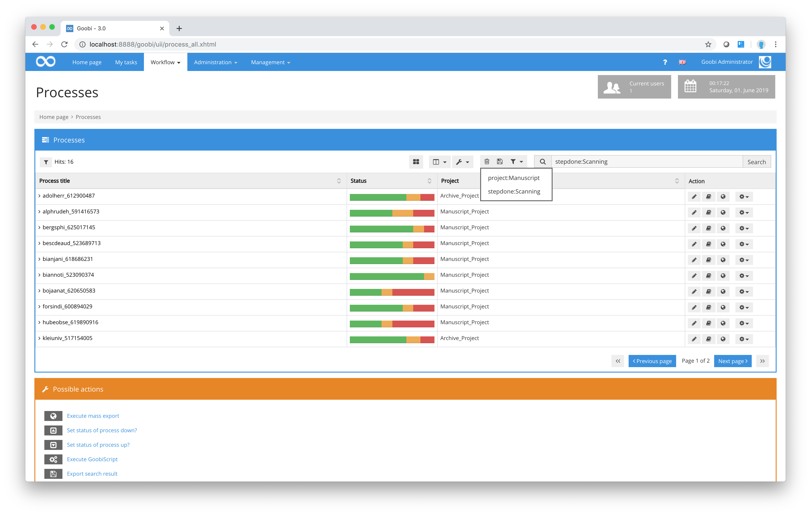
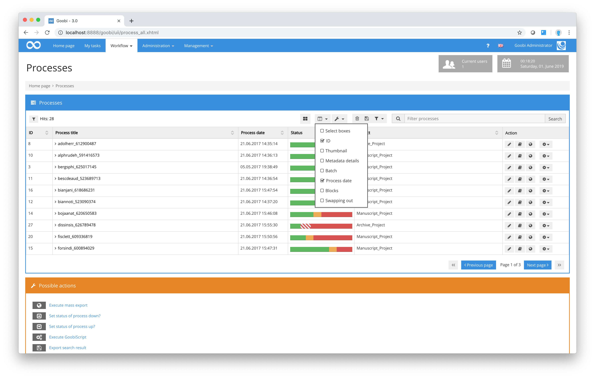
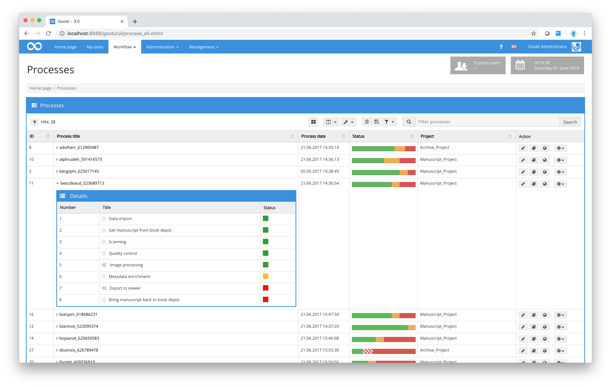

# Processes

All objects that are processed in Goobi as part of the whole range of digitisation workflows, and that as such have their own individual progress status, can be viewed in the `Processes` area. First, click on the menu item `Workflow – Processes` in the menu. Goobi will now display a list of all the processes you are authorised to view. If you are a Goobi administrator (as in the screenshot below), you are authorised to view all the processes being managed in Goobi.

If you are not an administrator but are authorised to Goobi manager level, you will have been assigned to specific projects. In Process view, you will only be able to display those processes you are authorised to access through your membership of those projects.

The number of hits listed in the table of processes is determined by each individual’s user configuration. In the diagram shown above, for example, you can see the number of rows in the table is limited to ten. In order to display more processes, you would need to move to the next page using the page function below the table.

You can use the simple checkbox filters above the table to quickly filter the results displayed by Goobi or to show processes that are hidden by default. By way of example, an administrator can select the checkbox `Show deactivated projects` above the process table to display all the processes that were previously hidden because the corresponding project has been deactivated. Using the checkbox `Show finished processes`, you can display all the processes that belong to active projects but have already completed every step in their workflow. By default, if neither of these checkboxes is selected, Goobi will only show processes that are currently being processed as part of the workflow, i.e. completed processes and deactivated projects are excluded by default.

If you want to filter the list of processes displayed by Goobi still further (e.g. because the list of processes is too large), you can enter your own filter in the `Filter processes` input box. The options available to you here are very comprehensive and are explained in detail in [section Searching processes](01_search/01_search.md). As an alternative to this filter function, you can perform a search by selecting the menu item `Workflow - Find process` in the menu. This will open a detailed filter dialogue box where you can fine-tune your search using a combination of properties, processes, task status, etc. This method of filtering using the `Find process` dialogue box translates your search request into a search filter string as described in [section Searching processes](01_search/01_search.md).

After using a particular filter, if you wish to save it for future use, you can store it in the list of pre-defined filters. To do so, once you have entered the filter string, simply click on the save symbol next to the drop-down list of pre-defined filters. If you wish to reuse any of your pre-defined filters on a future occasion, simply choose it from the drop-down list to enter the filter string automatically in the `Filter` input box. To update the list of results using that filter, press the enter key or click on the reload symbol next to the `Filter` input box. The list of hits is automatically updated in the Processes window.

Each of the different columns in the table can also be sorted, allowing you, for example, to list the processes in ascending or descending order depending on the process name or status or the project to which it belongs.

You can adjust the way how the processes are displayed in tabular form. You can include other columns in the table, e.g. the identifier and the date on which the process was created. You can also add selection boxes that allow the user to select individual processes for batch actions. If you choose this option, you will be able to activate a checkbox in each row of the process table. This means that you can then apply any of the actions to those processes whose checkboxes are activated rather than to the whole set of filtered processes or to the processes listed on the current page.

You can also view the workflow details for each process by clicking on the `Process title`. This allows you to check the current status of individual steps of the workflow. Goobi will display a small summary view of the selected process indicating the current status of each workflow step for that process. If you hold the cursor over the small square coloured symbols to the right of each workflow step, you will see a brief overview indicating which users have previously worked on that step and when.

