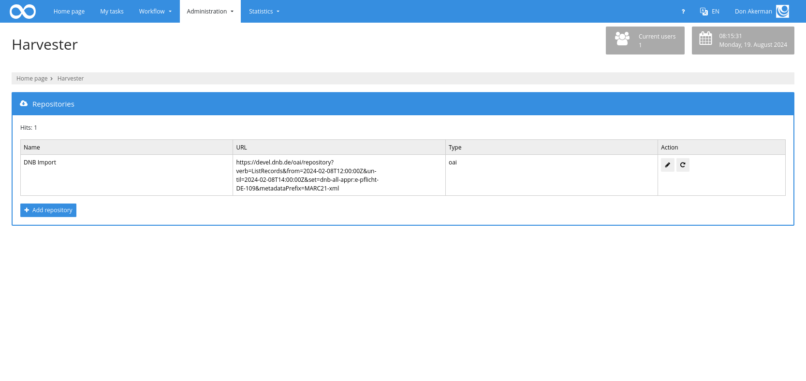
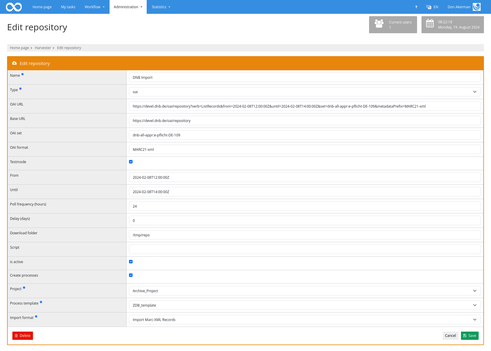

# Harvester

The harvester can be used to automatically import data from external repositories.

## Overview

To be able to access the harvester, the user must have the `Edit harvester repositories` right. The `Harvester` menu entry is then available under the `Administration` menu item. This opens the screen for listing all configured repositories. 

The function `Add repository` opens the editing screen to create a new repository.

## Configuration

The first step is to enter a name and select the protocol type. The following are available: `OAI-PMH`, `Internet Archive Web Search`, `Internet Archive CLI` and the `BACH API`.

For `BACH`, the URL to the BACH server and the authentication token must be specified.

If the `Internet Archive Web Search` is selected, the `URL` to the advanced search interface must be specified. To import only certain works, a search filter must also be specified as part of the URL. This way, only publications that are marked as Open Access and have been published can be imported.

In order to import access-protected publications, the Internet Archive CLI must be used. The CLI must be installed for this, usually under the path `/usr/local/bin/ia`. In addition, the environment variables `IA_USERNAME` and `IA_PASSWORD` must be set. A search filter can also be specified here to narrow down the hit list.

For `OAI-PMH`, the URL to the OAI server must be specified. If the URL contains the parameters `set` and `format`, this information is automatically determined together with the base URL. Otherwise, they must be specified manually.

With OAI, the `From` and `Until` parameter can also be set to limit the query to a specific time period. If the fields are empty, the entire period since the last request is automatically queried.

Test mode can also be activated. In this case, only the first records of the hit list are imported without the resumptionToken being analysed.

The other settings then apply to all types. 

The `Poll frequency` defines the intervals at which the repository should be queried. The specification is in hours.

`Delay` defines a time period up to which new data is to be queried. If a number greater than 0 is entered here, a search will not look for all data up to the current date, but for data published up to the configured number of days before the current date. 

The ‘Download folder’ field is used to specify the folder in which the data is to be downloaded and saved. The folder is created automatically during the first harvesting if it does not yet exist.

Optionally, a script can then be called that is executed on each downloaded file. This can be used, for example, to perform an XSL transformation on each XML file or to write additional information in all JSON files.

If the data is not only to be downloaded but also imported as Goobi processes, the checkbox to `Create processes` must be activated.

The `Project`, `Process template` and `Import format` to be used can then be specified.

## Manual harvesting

To start harvesting manually, you can use the `now run once` button in the Actions column of the overview. If the project is active, harvesting is then started once.

## Automatic Harvesting

Automatic harvesting takes place regularly. The time at which it should run must be defined for this. This is done in the `goobi_config.properties` file using the line `harvesterJob=0 0 */1 * * * ?`. This causes the check to take place every hour on the hour. The configuration is carried out in chron syntax and allows any time periods.

When the check is performed, it is checked for each configured active repository whether the last run was longer ago than the value configured in the poll frequency field. If this is the case, harvesting is started.

## Harvesting

When a new harvest is triggered, the records that have been published or updated in the repository since the last run are determined first. For each record, Goobi checks whether it has already been processed once or is new. New files are then downloaded to the configured folder. If a script has been configured, it is called for each downloaded file.

If configured, the files are now imported. In the case of marc-xml or pica-xml, the document type is determined first. Higher-level data such as journal titles or multi-volume works are skipped. In the case of subordinate documents (journal issues, volumes of a multivolume work), the superordinate work is searched for and also downloaded. The metadata is then parsed on the basis of the ruleset from the configured process template. 

The process title is created on the basis of the identifier.