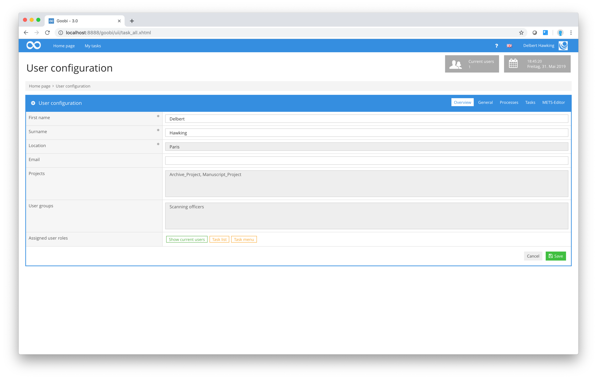

# Settings

Here you can learn more about the settings for users.

## Overview

## Tables
abcdef

[Description of the tables](01_tables/en.md)

## Dashboard
abcdefghi

[Description of the tables](02_dashboard/en.md)

## Lists
abcdefghi

[Description of the lists](03_lists/en.md)