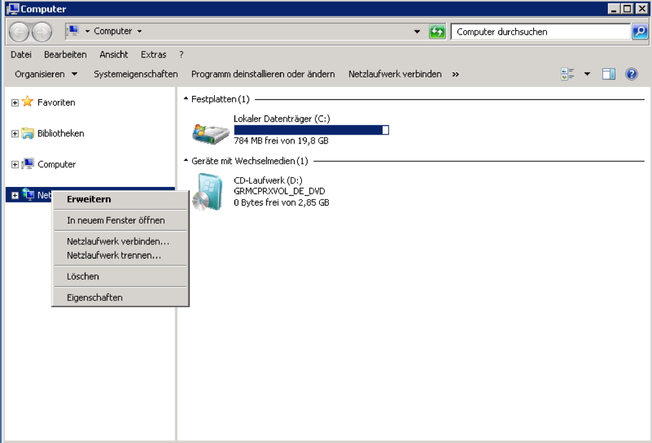
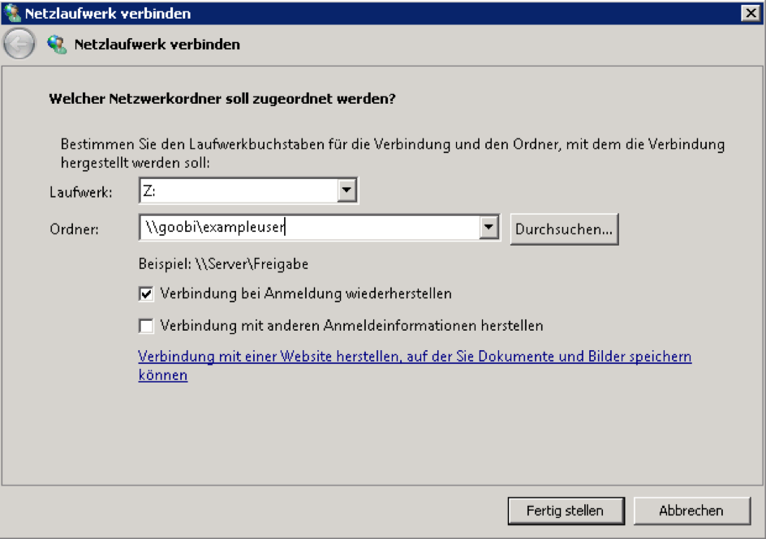
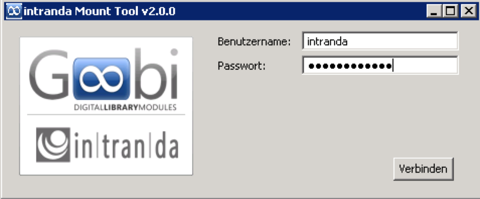

# File system access using Samba

## General

Goobi uses Samba to provide users with directory authorisations to read and write image data. The latest stable version of Samba should be installed from the operating system’s standard repositories.

## Example installation with Ubuntu Linux 14.04 LTS

f you are using Ubuntu Linux 14.04 LTS, you need to use the following command to install Samba from the standard repositories:

```bash
sudo aptitude install samba
```

The service can be stopped and started using the following commands:

```bash
service smbd stop
service smbd start
service nmbd stop
service nmbd start
```

The configuration data is located on the following path:

```bash
/etc/samba/
```

## Access from Windows 7 and more recent versions

If you are using Windows 7 or a later version, the directory can be integrated as a network drive. To set this up, click `Start`, then `Computer`. Next, right click on `Network` and choose the option `Map network drive`.



A free drive letter can now be assigned in the dialogue box. The folder entry should take the form `SERVERNAME\USERNAME` \(with `USERNAME` standing for the Goobi user name\). If the Goobi login data does not match the login data for the Windows PC, you will also need to select `Connect using different credentials`.



You may need to enter the user name and password for the next step. Thereafter, the network drive can be accessed using the selected drive letter.

## Access using the Goobi Mount Tool

The Goobi Mount Tool is an alternative way of connecting the authorised Goobi directories as a network drive.

The Goobi Mount Tool is configured in the file `config.properties` in the same directory as `GoobiMountTool.exe`.

```bash
drive_letter=G
ip_address=192.168.100.1
```

The parameter `drive_letter` defines the drive letter used to integrate the network drive. The parameter `ip_address` is the IP address of the Goobi server that makes the network drives available.

Once it has been configured correctly, the Goobi Mount Tool can be called directly. Thereafter, all you need to do is enter the Goobi login details \(`user name` and `password`\).



Once you have selected `Connect`, the network drive can be accessed using the drive letter assigned in the configuration file.