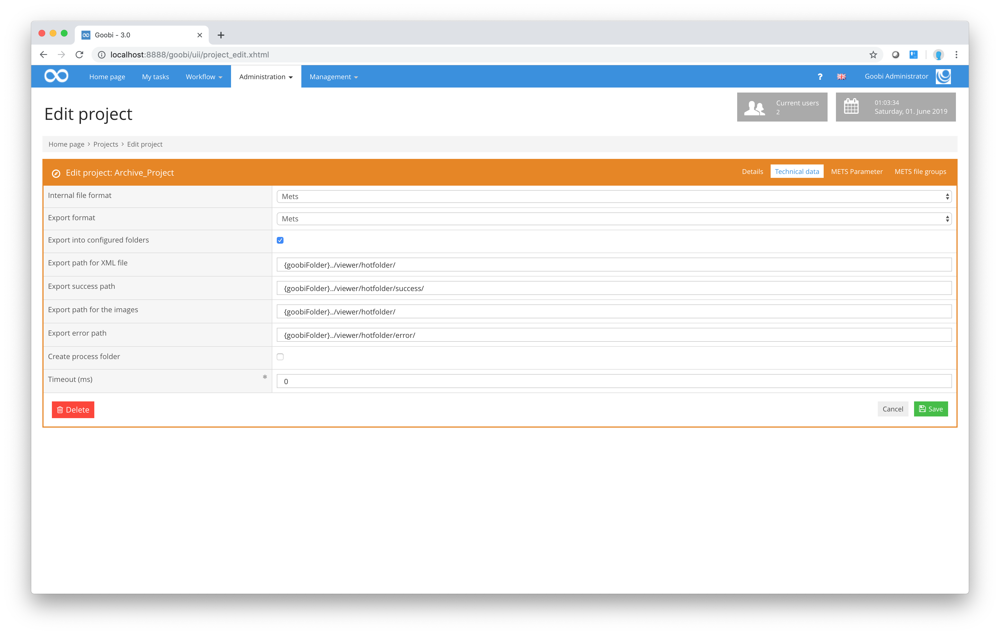

# Technical data

The following screenshot shows the `Technical data` tab from Goobi’s project settings:

The configuration settings are explained below:

_**List of project configuration parameters used to generate METS files**_

| **Name** | **Typical value** | **Explanation** |
| :--- | :--- | :--- |
| `DMS export images folder` | /opt/digiverso/viewer/hotfolder/ | This stipulates the folder to which the images are written when exporting. |
| `DMS export success folder` | /opt/digiverso/viewer/success/ | This stipulates the folder in which Goobi is instructed to search for a success message indicating that the exported XML file has been correctly processed. A check against this value is only made if the parameter `exportWithoutTimeLimit` has been set to false in the configuration file `goobi_config.properties`. At this point, Goobi can communicate with downstream systems in order to establish, for example, whether an item has been successfully exported. |
| `DMS export error folder` | /opt/digiverso/viewer/error\_mets/ | This stipulates the folder in which Goobi is instructed to search for an error message indicating that an error has occurred in processing the exported XML file. A check against this value is only made if the parameter `exportWithoutTimeLimit` has been set to false in the configuration file `goobi_config.properties`. |
| `Create process folder` | no | If this checkbox has been activated, Goobi will create a folder with the corresponding process name in each of the folders specified as the `DMS export folder for XML file` and `DMS export folder for images.` The exported files will then be placed in these folders. If the checkbox is not activated, the files will be placed directly into the stipulated folders. By default, this checkbox is not activated. |
| `Timeout  (ms)` | 36000 | This setting defines the time interval in milliseconds before Goobi removes the exported files from the hotfolder. A check is only made if the parameter `exportWithoutTimeLimit` has been set to false in the configuration file `goobi_config.properties`. The default value is `300000` \(i.e. 5 minutes\). |