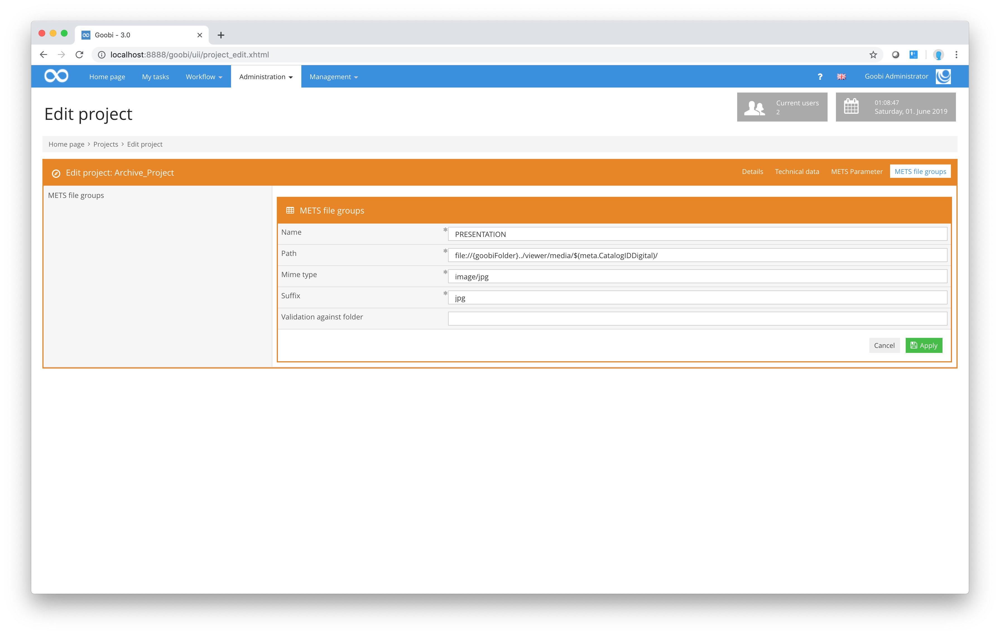

# Mets file groups

In addition to the configuration parameters listed above, the METS file groups can also be specified. The screenshot shows five defined file groups:

* Min
* Max
* Thumbs
* Default
* Presentation

The file groups `Min`, `Max`, `Thumbs` and `Default` are intended to ensure compatibility with the DFG Viewer.

The configuration dialogue box used to configure these METS file groups is shown in the following screenshot:

The configuration settings provided here mean the following::

## Explanation of all parameters for controlling METS file group generation

| Name | Typical value | Explanation |
| :--- | :--- | :--- |
| Name | Default | This setting defines the name of a METS file group. The name can be found in the attribute USE in the fileGrp area within fileSec in the METS file. |
| Path | [http://presentation.example.net/](http://presentation.example.net/viewer/content/$%28meta.CatalogIDDigital%29/800/0/) [viewer/content/](http://presentation.example.net/viewer/content/$%28meta.CatalogIDDigital%29/800/0/)[$(meta.CatalogIDDigital)](http://presentation.example.net/viewer/content/$%28meta.CatalogIDDigital%29/800/0/)[ 800/0/](http://presentation.example.net/viewer/content/$%28meta.CatalogIDDigital%29/800/0/) | This parameter defines the base path in which the digital objects can be located. When exporting, the filename of the files from the _media folder is also written to this path. The file suffix required is defined in the Suffix field. |
| Mime Typ | image/jpeg | This defines the Mime type of the files that are linked in this METS file group. Once the export is complete, this entry can be located in the MIMETYPE attribute for the file objects. |
| Suffix | jpg | This defines the suffix for the files that are linked in this METS file group. |
| Validation against folder | video | This value is optional. If the field is blank, the file group will be generated normally. However, if it contains a value, Goobi will check perform a check within the file system for a directory in the images folder that corresponds to the value or method defined in this setting. If this is the case, the file group will be created using the files from this folder. If there is no such folder, the file group will not be created. |
| Use file extensions and MIME type of files | false | This value can be set to `true` to ignore the default file types set for this project and use the file types of the files present in the `media` folder instead. This can be convenient if files of different types are to be used for a project or if no other conventions exist. If this value is set to `false`, only the file types set for this project will be considered. |
| File extensions to ignore |  | This field can be used to specify mime types that should not be included in the export. For example, `images/jpeg` or `images/*` can be used. Multiple values can be separated with commas, for example: `images/jpeg,images/png`. |

Any of the following methods is possible for the option `Validation against folder`:

## Full list of variables for access to directories when validating file groups

| Name | Example result |
| :--- | :--- |
| getProcessDataDirectory | /opt/digiverso/goobi/metadata/1165/ |
| getImagesDirectory | /opt/digiverso/goobi/metadata/1165/images/ |
| getImagesTifDirectory | /opt/digiverso/goobi/metadata/1165/images/kleiuniv_PPN1234_media/ |
| getImagesOrigDirectory | /opt/digiverso/goobi/metadata/1165/images/master_kleiuniv_PPN1234_media/ |
| getSourceDirectory | /opt/digiverso/goobi/metadata/1165/images/kleiuniv_PPN1234_source/ |
| getOcrDirectory | /opt/digiverso/goobi/metadata/1165/ocr/ |
| getTxtDirectory | /opt/digiverso/goobi/metadata/1165/ocr/kleiuniv_PPN1234_txt/ |
| getWordDirectory | /opt/digiverso/goobi/metadata/1165/ocr/kleiuniv_PPN1234_wc/ |
| getPdfDirectory | /opt/digiverso/goobi/metadata/1165/ocr/kleiuniv_PPN1234_pdf/ |
| getAltoDirectory | /opt/digiverso/goobi/metadata/1165/ocr/kleiuniv_PPN1234_xml/ |
| getImportDirectory | /opt/digiverso/goobi/metadata/1165/import/ |

In addition to the method names given above, it is also possible to specify folder names. A check will then be made for those folders within the `images` folder:

| Name | Example result |
| :--- | :--- |
| mp3 | /opt/digiverso/goobi/metadata/1165/images/kleiuniv_PPN1234_mp3/ |
| mpeg4 | /opt/digiverso/goobi/metadata/1165/images/kleiuniv_PPN1234_mpeg4/ |
| jp2 | /opt/digiverso/goobi/metadata/1165/images/kleiuniv_PPN1234_jp2/ |