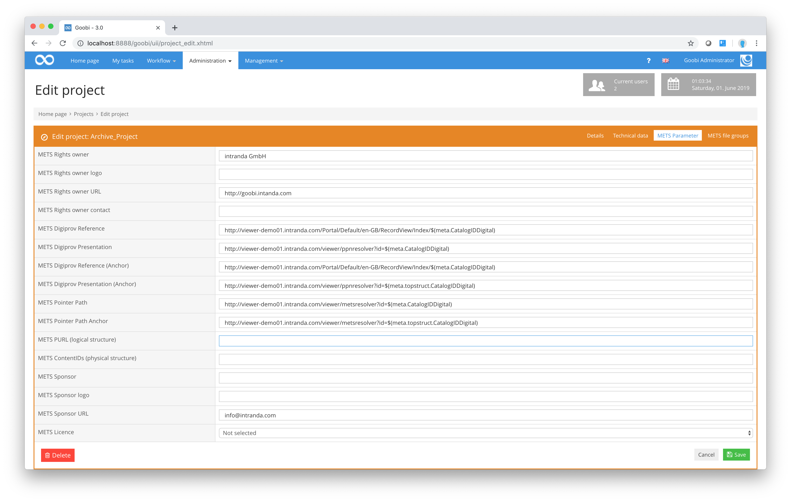

# Mets parameters

The following screenshot shows the `Mets parameters` tab from Goobi’s project settings:

The configuration settings are explained below:

_**List of METS parameters for use when configuring the project**_

| **Name** | **Typical value** | **Explanation** |
| :--- | :--- | :--- |
| METS rights owner | Example Library | Defines the METS rights owner. |
| METS rights owner logo | [http://www.example.net/mylogo.png](http://www.example.net/mylogo.png) | Defines a URL for a logo belonging to METS rights owner. |
| METS rights owner URL | [http://www.example.net](http://www.example.net) | Defines a URL for the METS rights owner. |
| METS rights owner contact | digitisation@example.net | Defines a contact email address for the METS rights owner. |
| METS Digiprov reference | METS Digiprov Referenz | Defines a link to the catalogue entry for the source material. |
| METS Digiprov presentation | [http://presentation.example.net/ppnresolver? id=$\(meta.CatalogIDDigital\)](http://presentation.example.net/ppnresolver?id=$%28meta.CatalogIDDigital%29) | Defines a persistent link to the source material in the digital library. |
| METS Digiprov reference \(anchor\) | [http://catalog.example.net/A? function=search& request=$\(meta.topstruct.CatalogIDDigital\) $REGEXP\(s/PPN=PPN/PPN=/\)](http://catalog.example.net/A?function=search&request=$%28meta.topstruct.CatalogIDDigital%29$REGEXP%28s/PPN=PPN/PPN=/%29) | Defines a link to the catalogue entry for the overarching source item where the material being exported is part of a multi-volume source. |
| METS Digiprov presentation \(anchor\) | [http://presentation.example.net/ppnresolver? id=$\(meta.topstruct.CatalogIDDigital\)](http://presentation.example.net/ppnresolver?id=$%28meta.topstruct.CatalogIDDigital%29) | Defines a link to the overarching source item in the digital library where the material being exported is part of a multi-volume source. |
| METS pointer Path | [http://presentation.example.net/metsresolver? id=$\(meta.CatalogIDDigital\)](http://presentation.example.net/metsresolver?id=$%28meta.CatalogIDDigital%29) | Defines a link to a METS resolver for the source material. This link can be used later to download the METS file. |
| METS pointer path \(anchor\) | [http://presentation.example.net/metsresolver? id=$\(meta.topstruct.CatalogIDDigital\)](http://presentation.example.net/metsresolver?id=$%28meta.topstruct.CatalogIDDigital%29) | Defines a link to a METS resolver for the overarching source item where the material being exported is part of a multi-volume source. This link can be used later to download the METS file. |
| METS sponsor | Deutsche Forschungsgemeinschaft | Contains the name of the digitisation sponsor, e.g. Deutsche Forschungsgemeinschaft \(DFG\). |
| METS sponsor Logo | [https://pbs.twimg.com/profile\_images/ 2269029699/5qf8y4k106b1gvpixq40\_ 400x400.jpeg](https://pbs.twimg.com/profile_images/2269029699/5qf8y4k106b1gvpixq40_400x400.jpeg) | Contains a URL to a logo of the digitisation sponsor. The logo is integrated into the design of the DFG Viewer, where it replaces the DFG logo. |
| METS sponsor URL | [http://intranda.com](http://intranda.com) | Contains the sponsor’s website URL. The URL is linked in the DFG Viewer to the sponsor’s logo. |
| METS licence | CC-BY | Contains details of the licence under which the digitised material was published. |

The information about the `METS rights owner`, `METS rights owner logo`, `METS rights owner URL` and `METS rights owner contact` can be found in the exported METS file in the section `amdSec` in the namespace `dv`. It is intended to ensure compatibility with the DFG viewer.

There follows an explanation of the three variables found in the column of typical values shown above:

* `$(meta.CatalogIDDigital)` is replaced during export by the `CatalogIDDigital` of the source material from the METS file.
* `$(meta.topstruct.CatalogIDDigital)` is replaced during export by the `CatalogIDDigital` of the multi-volume source material from the METS file.
* `$REGEXP(s/PPN=PPN/PPN=/)` applies the defined regular expression to the entire line. In this case, a search is performed for `PPN=PPN`, which is then replaced by `PPN=`.