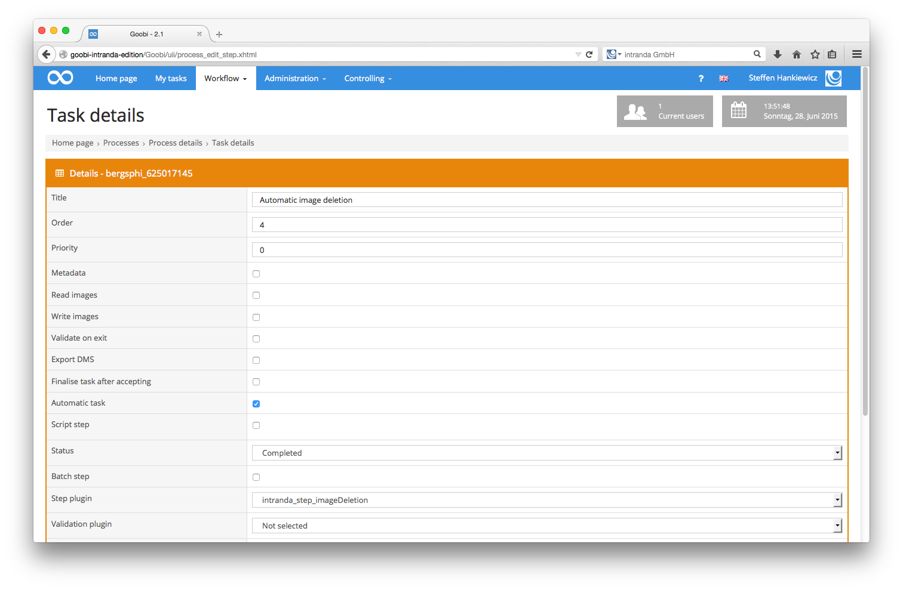

# Automatic image deletion

Since version 1.9.2, Goobi has allowed users to fully automate workflow tasks using plug-ins, e.g. to delete images that are no longer required. This ImageDeletion plug-in should be the last step in the workflow. When configuring this workflow step, it is important to note that it has to be an automated task and must be defined as a `Step plug-in` for the identifier `intranda_step_imageDeletion`.

Once configured, the workflow step plug-in is called automatically from within the workflow. An explanation of how this works is given below.

First, the plug-in starts the validation process for the JP2 derivative that has been generated. A check is then made to confirm the existence and validity of an AMD results file from SDB containing at least one object description. The subsequent final validation ensures that the number of objects in the `master` and `media` directories matches the number of objects described in the AMD file.

The images will not be deleted until these validations have been completed. At this point, the `master` and `media` directories will be deleted.

If the above validations fail, the workflow step will remain open. This will prevent automatic deletion, and the user will have to perform a manual validation before data can be deleted from the corresponding process.