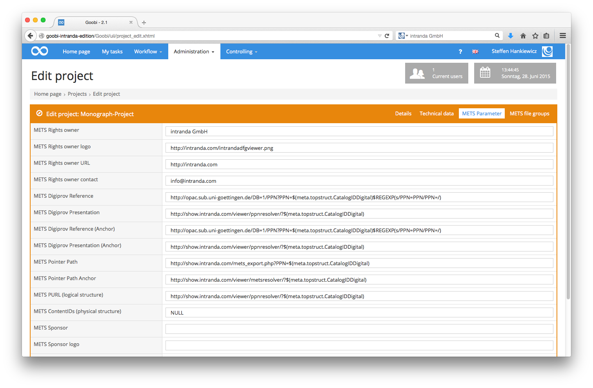
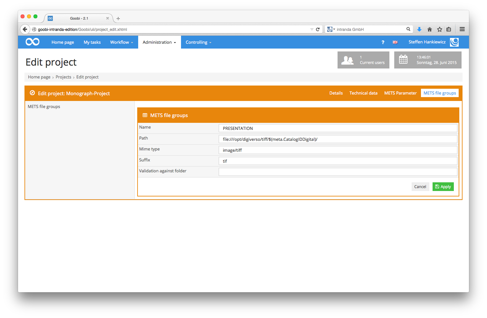

# Automatic workflow steps

Goobi allows you to mark individual tasks as automatic. These tasks are opened and performed automatically once the preceding workflow task has been completed. Whenever an error occurs in such an automatic workflow task, that task will remain paused and will not be processed any further.

To mark a workflow task as automatic, you need to activate the `Automatic task` checkbox. This is located in the Task details box as shown in the following screenshot:

