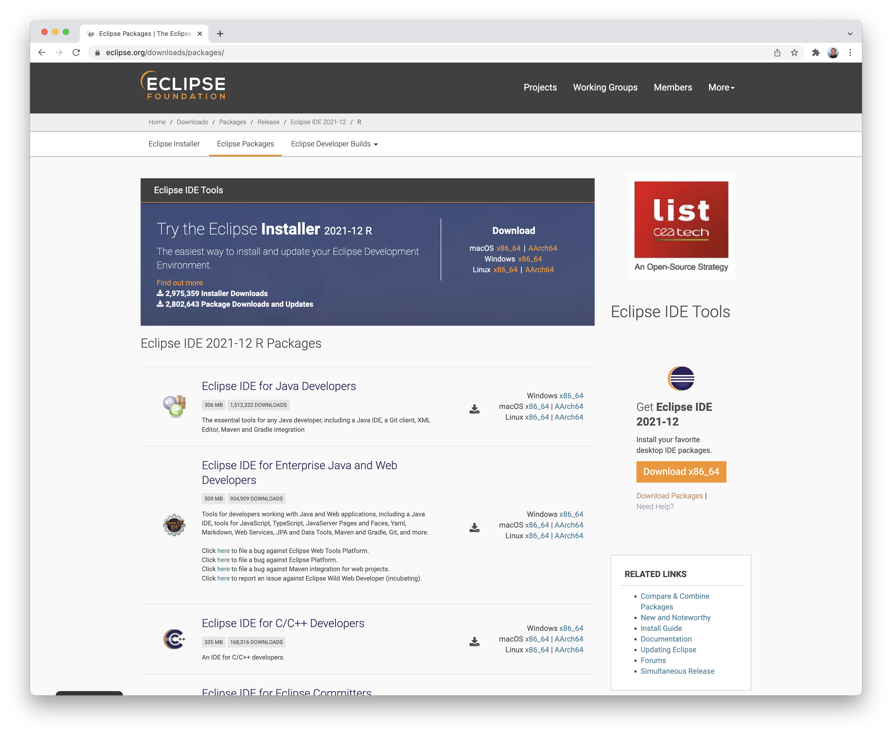
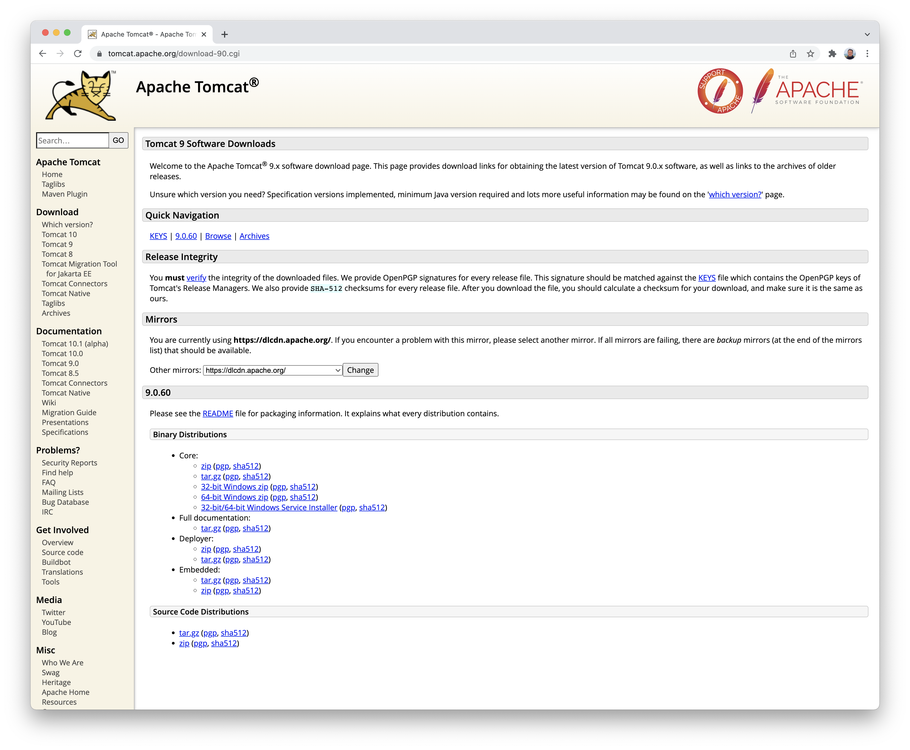
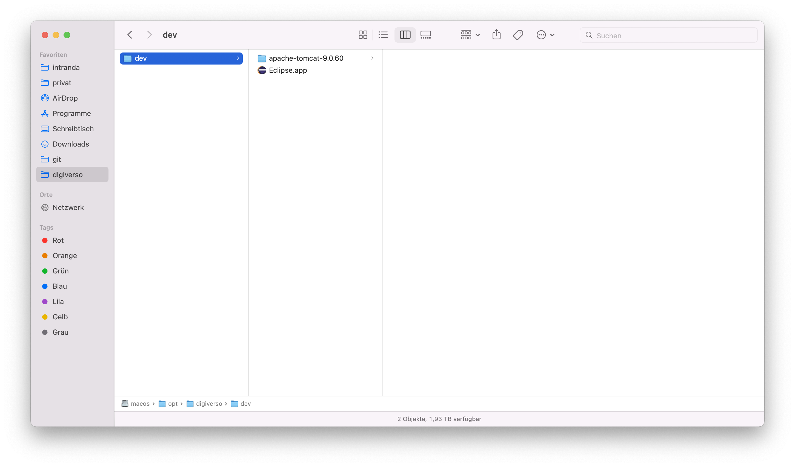
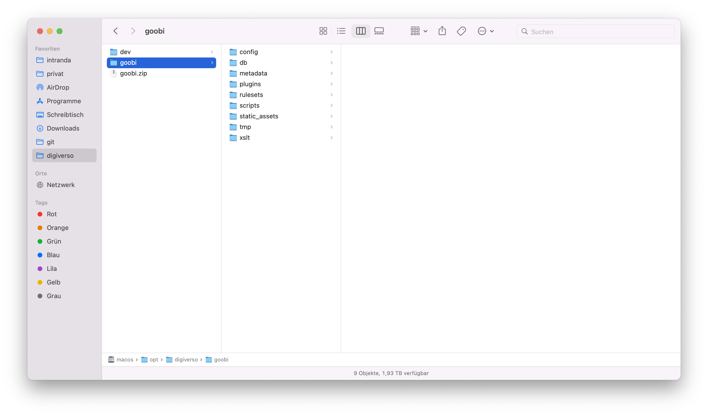

# Preparatory work

## 1.1.1 Installing Java 11
A prerequisite for the development of Goobi workflow and also for the development environment is a successfully installed Java 11. This can be installed differently depending on the operating system.

### Installation under Linux:
The installation under Ubuntu Linux is done via command line as follows:

```bash
sudo apt install openjdk-11-jdk
```

### Installation under Mac:
The installation under Mac is best done using [Homebrew](https://brew.sh/index) from the terminal:

```bash
brew tap adoptopenjdk/openjdk
brew install --cask adoptopenjdk11
```

### Installation under Windows:
For installation under Windows, you can download suitable installers from here: https://adoptopenjdk.net/releases.html


### Checking the installation
After the successful installation, an output like the following should appear on the terminal with the command `java -version`:

```bash
$ java -version
openjdk version "11.0.11" 2021-04-20
OpenJDK Runtime Environment AdoptOpenJDK-11.0.11+9 (build 11.0.11+9)
OpenJDK 64-Bit Server VM AdoptOpenJDK-11.0.11+9 (build 11.0.11+9, mixed mode)
```

## 1.1.2 Installing MariaDB
Goobi workflow uses MariaDB to manage the data. This must be installed on the system accordingly.


### Installation under Linux:
The installation under Ubuntu Linux is done via command line as follows:

```bash
sudo apt install mariadb-server
```

The database can be started and stopped in this way:

```bash
## starten
systemctl start mariadb

## stoppen
systemctl stop mariadb
```


### Installation under Mac:
The installation under Mac is best done using [Homebrew](https://brew.sh/index) from the terminal:

```bash
brew install mariadb
```

Der Start und Stop der Datenbank kann so erfolgen:

```bash
## starten
brew services start mariadb

## stoppen
brew services stop mariadb
```

### Installation under Windows:
The installation under Windows is analogous.


### Creating an empty database for Goobi workflow
In order for Goobi worklow to have data at its disposal, a database must be created. This can be done with the following commands:

```bash
sudo mysql -e "CREATE DATABASE goobi;
USE goobi;
CREATE USER 'goobi'@'localhost' IDENTIFIED BY 'goobi';
GRANT ALL PRIVILEGES ON goobi.* TO 'goobi'@'localhost' WITH GRANT OPTION;
FLUSH PRIVILEGES;"
```

## 1.1.3 Preparing a directory
We usually work in the directory `/opt/digiverso/` for the development of Goobi and also for the operation on the servers. Therefore, the required folders must first be created if they do not already exist. This is done on Linux and Mac as follows:

```bash
sudo mkdir -p /opt/digiverso/dev/
sudo chown -R $(logname): /opt/digiverso
```


## 1.1.4 Download Eclipse
Eclipse must be downloaded and installed as a development environment. This is done from this website: [https://www.eclipse.org/downloads/packages/](https://www.eclipse.org/downloads/packages/)



From there, select the current package of the 'Eclipse IDE for Enterprise Java and Web Developers' for your own operating system and download it. The package can then be unpacked and saved in the previously created directory `/opt/digiverso/dev`.

The directory looks like this:


## 1.1.5 Download Apache Tomcat
For the operation of Goobi workflow we use the Apache Tomcat version 9.x. This can be easily downloaded as a zip file from the following page by downloading the zip file from the `Core` section of the `Binary Distributions` of the current version: [https://tomcat.apache.org/download-90.cgi](https://tomcat.apache.org/download-90.cgi)



This downloaded zip file can then be unpacked and additionally saved in the same directory as Eclipse:

```bash
/opt/digiverso/dev
```

Accordingly, the directory now looks like this:




## 1.1.6 Download demo data
To start using Goobi workflow, you need configurations, data, a database dump and the required plugins in the right directories. A complete database dump can be found on GitHub. The easiest way is to copy the script calls provided there and run them locally:

[https://github.com/intranda/goobi-workflow-dev-data](https://github.com/intranda/goobi-workflow-dev-data)

The directory should now look like this:



The following command should then list the imported database tables:

```bash
mysql -u goobi -pgoobi goobi -e "show tables"
```