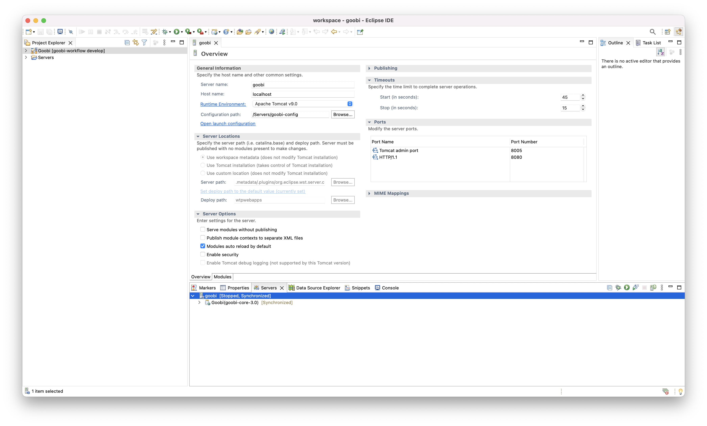

# Best practice for developing Goobi and working with Eclipse

## 1.4.1 Useful software packages
In order to work with the repositories and source code in a meaningful way, additional packages should be installed. These have proven to be useful:

### Linux

```bash
sudo apt install git
sudo apt install maven
```

### Mac

```bash
brew install git
brew install maven
```


## 1.4.2 Avoid Timeout for Tomcat
Under certain circumstances, the start of the Tomcat takes longer than the timeout set by default. Therefore it can be useful to adjust this timeout. This can be done within the 'Server View'. To do this, the settings must be opened by double-clicking on the generated server `goobi`, so that a different value for the start of the Tomcat server can then be specified in the upper right area of the configuration in the `Timeouts` section.




## 1.4.3 Stop Tomcat from persistence or serialisation
To suppress the error messages from Tomcat when the serialisation of the sessions does not work, you can proceed as follows:
  - Open the project `Servers` in Eclipse.
  - open the file `context.xml` for the correct Tomcat.
  - change the following block within the file and save it:
  
```xml
<!-- Uncomment this to disable session persistence across Tomcat restarts -->
<Manager pathname="" />
```

## 1.4.4 HotSwap Agent (JRebel replacement)
The HotSwap Agent allows files to be edited and updated automatically on the fly. This works especially for java and xhtml code in Goobi Workflow and related plugins.

With a successfully set up HotSwap Agent, files only need to be changed and saved later in their local repository and the changes are directly present when a page is reloaded in the web browser.


### General
- The official website of the HotSwap Agent is here: [http://hotswapagent.org/](http://hotswapagent.org/ "Official Website of the HotSwap Agent")
- Tomcat **MUST** be started in `DEBUG` mode, otherwise class-reloading will not work. In Eclipse this is the icon with the bug instead of the normal run button.
- If Tomcat only starts up partially and then stops, it is possible that breakpoints are set somewhere. These can be skipped in Eclipse with `Run` -> `Skip All Breakpoints` or removed with `Run` -> `Remove All Breakpoints`.


### Installation
- Download the appropriate HotSwap JVM (Java 11) from here: [https://github.com/TravaOpenJDK/trava-jdk-11-dcevm/releases](https://github.com/TravaOpenJDK/trava-jdk-11-dcevm/releases "Link to HotSwap-JVM")
- Unpack the downloaded HotSwap JDK and make it known as JRE in the preferences of Eclipse.
- Configure details of the WTP Tomcat, by double-clicking on the server in the server view
  - Click on 'Runtime Environment' to select the announced HotSwap JDK as 'JRE'.
  - Click on `Open launch configuration` to add this VM argument: `-XX:HotswapAgent=fatjar`.
  - Under `Publishing` select the option `Never publish automatically`.
  - On the `Modules` tab, set the `auto-reload` parameter to `false` (or set it in the server.xml in the correct section like this: `reloadable="false"`) **Note:** the tab is at the bottom of the server edit view.


### Configuration
- Before commissioning, a configuration file named `hotswap-agent.properties` must be located inside the Goobi source folder:

```bash
nano ~/git/goobi-workflow/Goobi/src/hotswap-agent.properties
```
​
Detailed information on the configuration can be found here: [http://hotswapagent.org/mydoc_configuration.html](http://hotswapagent.org/mydoc_configuration.html "Seite mit detailierten Informationen zur Konfiguration")

- It must contain content like the following (Important: complete paths, no tilde for home directory):

```bash
extraClasspath=/home/PETER/git/goobi-workflow/Goobi/webapp/WEB-INF/classes/; \
/home/PETER/git/goobi-plugin-administration-snippet-creator/plugin/target/classes; \
/home/PETER/git/goobi-plugin-opac-json/goobi-plugin-opac-json/target/classes; \
/home/PETER/git/goobi-plugin-workflow-aeon-process-creation/plugin/target/classes;

webappDir=/home/PETER/git/goobi-workflow/Goobi/webapp; \
/home/PETER/git/goobi-plugin-administration-snippet-creator/plugin/src/main/resources/GUI/META-INF/resources; \
/home/PETER/git/goobi-plugin-opac-json/goobi-plugin-opac-json/src/main/resources/GUI/META-INF/resources; \
/home/PETER/git/goobi-plugin-workflow-aeon-process-creation/plugin/src/main/resources/GUI/META-INF/resources;
```

### Special feature for plugins
- If plugins are to be included, they must be explicitly named within the configuration file (as visible here in the example configuration).
- Plugins must be copied in compiled form to the typical plugin folders (e.g. `/opt/digiverso/goobi/plugins/workflow/` and `/opt/digiverso/goobi/plugins/GUI/`) before starting Goobi
- the plugins are read and executed from the Eclipse repository.
- The xhtml files of the plugins no longer have to be in the Goobi-uii folder.