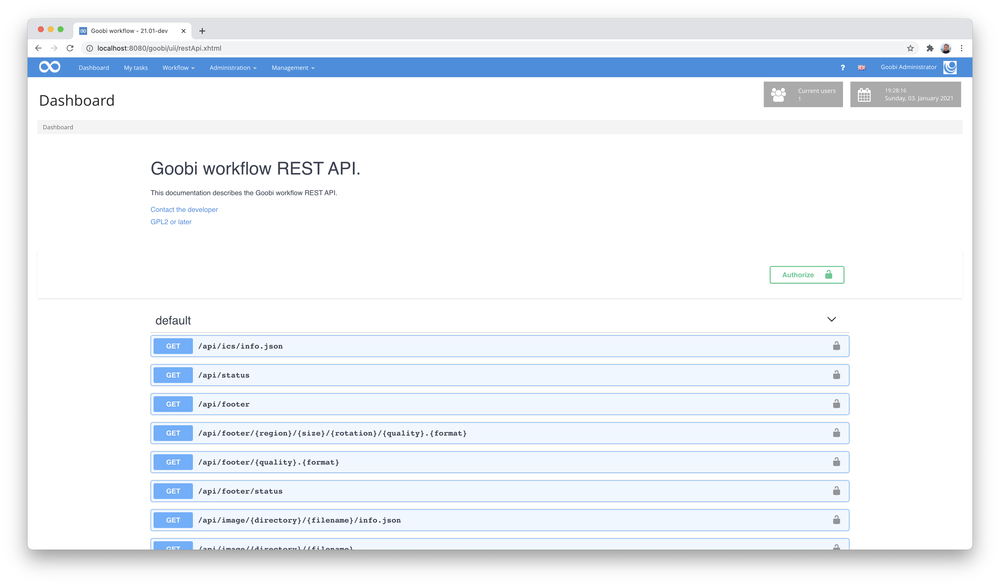

# Using the REST API

Goobi workflow has a very comprehensive REST API that can be used to connect external applications and services to Goobi workflow.

## Configuring the REST API

This configuration of the REST API is already documented in detail here:



For easy testing, it may be helpful to temporarily adjust the configuration within the configuration file `goobi_rest.xml` so that all commands can be called from the desired IP range (e.g. for localhost) with a simple password (`token`). Such an example configuration could look like this:

```xml
<?xml version='1.0' encoding='UTF-8'?>
<config>
    <!-- allow all commands just locally with the token 'test' -->
    <endpoint path=".*">
      <method name="post">
        <allow netmask="0:0:0:0:0:0:0:1/128" token="test"/>
        <allow netmask="127.0.0.0/8" token="test"/>
      </method>
      <method name="get">
        <allow netmask="0:0:0:0:0:0:0:1/128" token="test"/>
        <allow netmask="127.0.0.0/8" token="test"/>
      </method>
      <method name="put">
        <allow netmask="0:0:0:0:0:0:0:1/128" token="test"/>
        <allow netmask="127.0.0.0/8" token="test"/>
      </method>
    </endpoint>
</config>
```

## Swagger UI as interface description

There is an automated documentation for the REST API of Goobi workflow using `Swagger UI`. This is a very common interface description that allows developers to interactively try out Goobi workflow's REST API and thus implement a connection between external applications and Goobi workflow.



More information about the possibilities offered by interface documentation via Swagger can be found here:

[https://swagger.io/](https://swagger.io/)

The interface description can be accessed within Goobi workflow via the menu `Administration` and allows from here the testing of individual commands directly in the web browser:


To illustrate the functional scope of the REST API of Goobi workflow, here is an insight into the interface documentation in JSON format in a highly abbreviated form. The full current scope of the REST endpoints available depends largely on the Goobi version as well as the REST plugins installed and will differ greatly from the example shown here:

```json
{
  "openapi": "3.0.1",
  "info": {
    "title": "Goobi workflow REST API.",
    "description": "This documentation describes the Goobi workflow REST API.",
    "contact": {
      "email": "info@intranda.com"
    },
    "license": {
      "name": "GPL2 or later",
      "url": "https://github.com/intranda/goobi-workflow/blob/master/LICENSE"
    }
  },
  "servers": [
    {
      "url": "/goobi"
    }
  ],
  "security": [
    {
      "query": [],
      "header": []
    }
  ],
  "paths": {
    "/api/ics/info.json": {
      "get": {
        "operationId": "getApplicationInfo",
        "responses": {
          "default": {
            "description": "default response",
            "content": {
              "application/json": {
                "schema": {
                  "$ref": "#/components/schemas/ApplicationInfo"
                }
              }
            }
          }
        }
      }
    },
    "/api/status": {
      "get": {
        "operationId": "getStatus",
        "responses": {
          "default": {
            "description": "default response",
            "content": {
              "application/json": {
                "schema": {
                  "$ref": "#/components/schemas/ResourceStatus"
                }
              }
            }
          }
        }
      }
    },
    "/api/footer": {
      "get": {
        "operationId": "redirectToCanonicalImageInfo",
        "responses": {
          "default": {
            "description": "default response",
            "content": {
              "application/json": {},
              "application/ld+json": {}
            }
          }
        }
      }
    },
    "/api/footer/{region}/{size}/{rotation}/{quality}.{format}": {
      "get": {
        "operationId": "getImage",
        "parameters": [
          {
            "name": "region",
            "in": "path",
            "required": true,
            "schema": {
              "type": "string"
            }
          },
          {
            "name": "size",
            "in": "path",
            "required": true,
            "schema": {
              "type": "string"
            }
          },
          {
            "name": "rotation",
            "in": "path",
            "required": true,
            "schema": {
              "type": "string"
            }
          },
          {
            "name": "quality",
            "in": "path",
            "required": true,
            "schema": {
              "type": "string"
            }
          },
          {
            "name": "format",
            "in": "path",
            "required": true,
            "schema": {
              "type": "string"
            }
          }
        ],
        "responses": {
          "default": {
            "description": "default response",
            "content": {
              "image/jpg": {},
              "image/png": {},
              "image/tif": {}
            }
          }
        }
      }
    },
    "/api/footer/{quality}.{format}": {
      "get": {
        "operationId": "redirectToFullImage",
        "parameters": [
          {
            "name": "quality",
            "in": "path",
            "required": true,
            "schema": {
              "type": "string"
            }
          },
          {
            "name": "format",
            "in": "path",
            "required": true,
            "schema": {
              "type": "string"
            }
          }
        ],
        "responses": {
          "default": {
            "description": "default response",
            "content": {
              "image/jpg": {},
              "image/png": {},
              "image/tif": {}
            }
          }
        }
      }
    },
    "/api/footer/status": {
      "get": {
        "operationId": "getStatus_1",
        "responses": {
          "default": {
            "description": "default response",
            "content": {
              "application/json": {
                "schema": {
                  "$ref": "#/components/schemas/ResourceStatus"
                }
              }
            }
          }
        }
      }
    },
    "/api/image/{directory}/{filename}/info.json": {
      "get": {
        "operationId": "getInfoAsJson",
        "parameters": [
          {
            "name": "directory",
            "in": "path",
            "required": true,
            "schema": {
              "type": "string"
            }
          },
          {
            "name": "filename",
            "in": "path",
            "required": true,
            "schema": {
              "type": "string"
            }
          }
        ],
        "responses": {
          "default": {
            "description": "default response",
            "content": {
              "application/ld+json": {
                "schema": {
                  "$ref": "#/components/schemas/ImageInformation"
                }
              },
              "application/json": {
                "schema": {
                  "$ref": "#/components/schemas/ImageInformation"
                }
              }
            }
          }
        }
      }
    },
    "/api/image/{directory}/{filename}": {
      "get": {
        "operationId": "redirectToCanonicalImageInfo_1",
        "parameters": [
          {
            "name": "directory",
            "in": "path",
            "required": true,
            "schema": {
              "type": "string"
            }
          },
          {
            "name": "filename",
            "in": "path",
            "required": true,
            "schema": {
              "type": "string"
            }
          }
        ],
        "responses": {
          "default": {
            "description": "default response",
            "content": {
              "application/json": {},
              "application/ld+json": {}
            }
          }
        }
      }
    },
    "/api/image/{directory}/{filename}/{region}/{size}/{rotation}/{quality}.{format}/{cacheCommand}": {
      "get": {
        "operationId": "isInCache",
        "parameters": [
          {
            "name": "directory",
            "in": "path",
            "required": true,
            "schema": {
              "type": "string"
            }
          },
          {
            "name": "filename",
            "in": "path",
            "required": true,
            "schema": {
              "type": "string"
            }
          },
          {
            "name": "region",
            "in": "path",
            "required": true,
            "schema": {
              "type": "string"
            }
          },
          {
            "name": "size",
            "in": "path",
            "required": true,
            "schema": {
              "type": "string"
            }
          },
          {
            "name": "rotation",
            "in": "path",
            "required": true,
            "schema": {
              "type": "string"
            }
          },
          {
            "name": "quality",
            "in": "path",
            "required": true,
            "schema": {
              "type": "string"
            }
          },
          {
            "name": "format",
            "in": "path",
            "required": true,
            "schema": {
              "type": "string"
            }
          },
          {
            "name": "cacheCommand",
            "in": "path",
            "required": true,
            "schema": {
              "type": "string"
            }
          }
        ],
        "responses": {
          "default": {
            "description": "default response",
            "content": {
              "text/plain": {
                "schema": {
                  "type": "boolean"
                }
              }
            }
          }
        }
      }
    },
    "/api/image/{directory}/{filename}/info.xml": {
      "get": {
        "operationId": "getInfoAsXml",
        "parameters": [
          {
            "name": "directory",
            "in": "path",
            "required": true,
            "schema": {
              "type": "string"
            }
          },
          {
            "name": "filename",
            "in": "path",
            "required": true,
            "schema": {
              "type": "string"
            }
          }
        ],
        "responses": {
          "default": {
            "description": "default response",
            "content": {
              "application/xml": {
                "schema": {
                  "$ref": "#/components/schemas/ImageInformation"
                }
              }
            }
          }
        }
      }
    }
  },
  "components": {
    "securitySchemes": {
      "query": {
        "type": "apiKey",
        "name": "token",
        "in": "query"
      },
      "header": {
        "type": "apiKey",
        "name": "token",
        "in": "header"
      }
    }
  }
}
```